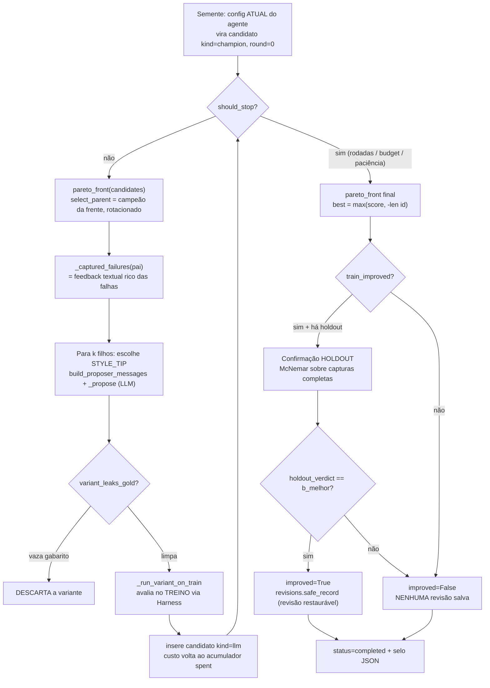
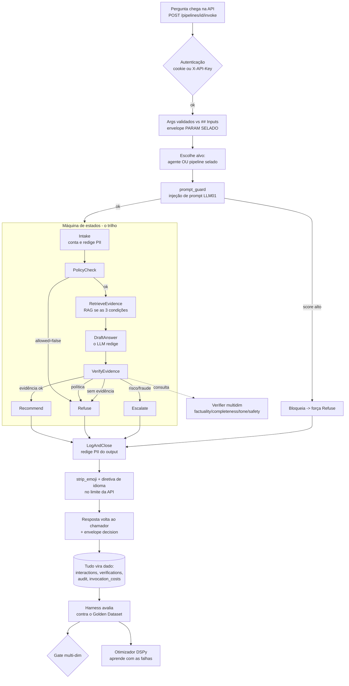

# 🎼 Maestro

**Plataforma de Gestão e Desenvolvimento de Multi-Agentes de IA, orientada a SKILL.md, sobre AI Mesh**

> Documenta a plataforma na versão **64.0.2** · Especificação Funcional §1–§24 · pt-BR
>
> _Novidade desta faixa (55.x–64.x): a [**Parte VIII**](#parte-viii--segurança-governança-e-qualidade-das-respostas) ganhou a camada de **governança como política de código** — o módulo **IA Responsável** (`/ia-responsavel`, [Parte IV](#parte-iv--tour-completo-módulo-a-módulo) §4.18), o **cockpit OPA** (motor Rego vivo, editável e versionado pela tela, §7.11) e o **Evidence ACL** ("no read up" por confidencialidade, §7.11–§7.12)._

---

## Para quem nunca viu isso: o que é o Maestro?

Imagine uma **orquestra**. Cada músico é excelente em um instrumento, mas nenhum concerto acontece sem três coisas: uma **partitura** que diz o que tocar, um **maestro** que decide quem toca quando, e um **ensaio** que prova que a apresentação está pronta antes da estreia.

O Maestro aplica exatamente essa lógica a agentes de Inteligência Artificial:

- Cada **agente** é um músico: um especialista em uma tarefa (responder sobre crédito, analisar um documento, consultar um sistema externo).
- A **Skill** (um arquivo chamado `SKILL.md`) é a partitura: descreve, em texto estruturado, o que o agente sabe fazer, com quais ferramentas, com quais entradas e saídas — e o agente **não pode tocar nada fora da partitura**.
- O **Fluxo de agentes** é a disposição da orquestra: quem passa a vez para quem, em paralelo ou por decisão ("se o cliente mencionar fraude, chame o especialista jurídico").
- O **Pipeline** é o concerto ensaiado e fechado: um conjunto de agentes com entrada única, pronto para ser executado por pessoas e sistemas.
- O **Harness de Avaliação** é o ensaio geral: uma bateria de casos reais que mede, com números, se o conjunto continua tocando bem depois de cada mudança.

O que torna o Maestro diferente de "um chatbot com prompt" é o princípio que atravessa tudo: **declarar → provar → selar → vigiar**. Tudo que você declara (uma regra, um contrato de parâmetros, uma frase de teste) é provado por máquina antes de valer, selado quando publicado, e vigiado para sempre depois disso.

---

## Sumário

- [Parte I — Fundamentos e conceitos](#parte-i--fundamentos-e-conceitos)
- [Parte II — Como o Maestro pensa (arquitetura)](#parte-ii--como-o-maestro-pensa-arquitetura)
- [Parte III — Instalação e primeiros 15 minutos](#parte-iii--instalação-e-primeiros-15-minutos)
- [Parte IV — Tour completo, módulo a módulo](#parte-iv--tour-completo-módulo-a-módulo)
- [Parte V — A API para desenvolvedores](#parte-v--a-api-para-desenvolvedores)
- [Parte VI — Qualidade contínua em profundidade](#parte-vi--qualidade-contínua-em-profundidade)
- [Parte VII — Otimização automática de prompts e skills (estilo DSPy)](#parte-vii--otimização-automática-de-prompts-e-skills-estilo-dspy)
- [Parte VIII — Segurança, governança e qualidade das respostas](#parte-viii--segurança-governança-e-qualidade-das-respostas)
- [Parte IX — Casos de uso completos](#parte-ix--casos-de-uso-completos)
- [Parte X — Para quem desenvolve a plataforma](#parte-x--para-quem-desenvolve-a-plataforma)
- [Como as peças se encaixam: a vida de uma pergunta](#como-as-peças-se-encaixam-a-vida-de-uma-pergunta)
- [FAQ](#faq--perguntas-que-todo-iniciante-faz)
- [Licença e contato](#licença-e-contato)

---

# Parte I — Fundamentos e conceitos

Esta seção explica os conceitos na ordem em que você vai encontrá-los. Cada um tem três camadas: **a analogia** (para entender), **o fundamento técnico** (para confiar) e **um exemplo** (para reconhecer na tela).

### 1. Agente

**Analogia:** um funcionário especializado que só faz o que está no seu contrato de trabalho.

**Fundamento:** um agente é um processo computacional que une um modelo de linguagem (LLM) a uma Skill. Existem três camadas de agentes, e a camada define o papel no fluxo:

| Camada | Nome na UI | Papel | Analogia |
|---|---|---|---|
| `aobd` | **Maestro** | Orquestra o domínio: interpreta a intenção do usuário e delega | O maestro da orquestra |
| `router` | **Triagem / Roteador** | Decide o caminho: qual especialista atende este caso? | O recepcionista que encaminha |
| `subagent` | **Especialista** | Executa a tarefa fim: responde, consulta, calcula | O músico solista |

**Exemplo:** num fluxo de atendimento de telecom, o Maestro recebe "minha internet caiu", o Roteador de triagem técnica identifica que é um incidente, e o Especialista NOC abre o chamado com SLA.

**Detalhes que importam:** cada agente declara se **aceita documentos** e se **aceita imagens** (isso controla quais anexos chegam até ele), o idioma de resposta, a "temperatura" (criatividade) e o esforço de raciocínio. Em vez de fixar um modelo de IA, o recomendado é declarar o **tipo de tarefa** (raciocínio, classificação, chamadas de ferramenta…) e deixar o **Roteamento LLM** escolher o modelo — trocar de provedor vira uma configuração, não uma reedição de agentes.

### 2. SKILL.md — a partitura executável

**Analogia:** a receita de bolo que o cozinheiro é obrigado a seguir — não é uma sugestão, é o contrato.

**Fundamento:** o `SKILL.md` é um arquivo Markdown com um cabeçalho (identidade, versão, estabilidade) e seções padronizadas. Ele **não é documentação**: é parseado, validado e vira o comportamento efetivo do agente. Nenhum comportamento existe fora do que está declarado ali. As seções principais:

| Seção | O que declara | Vira o quê |
|---|---|---|
| `## Purpose` | O propósito em uma frase | Direção do prompt |
| `## Activation Criteria` | Quando esta skill deve ser acionada | Sinal de roteamento |
| `## Inputs` | JSON Schema dos parâmetros estruturados | **Contrato de `args`** da API, formulário do Playground, validação |
| `## Workflow` | O passo a passo da execução | Plano que o agente segue |
| `## Tool Bindings` | Ferramentas externas (MCP) autorizadas | Funções que o LLM pode chamar |
| `## Output Contract` | O formato da resposta | Validação da saída |
| `## Decisions` | Campos e valores que o agente anuncia ao decidir | **Contrato de Decisão** lido pelas regras do fluxo |
| `## Guardrails` / `## Failure Modes` | Limites e planos B | Restrições e recusas controladas |
| `## Evidence Policy` | Fontes autorizadas | Regra de fundamentação |
| `## Data Tables` | Planilhas/CSVs anexados como tabela | Consultas SQL parametrizadas (DuckDB) |
| `## API Bindings` | Chamadas HTTP declarativas | Execução **sem LLM** (modo declarativo) |

**Exemplo:** uma skill de cotação declara em `## Inputs` que aceita `{cd_cliente: integer, segmento: enum[varejo, premium]}`. A partir daí, a API rejeita com erro nomeado qualquer chamada com `segmento: "gold"`, o Playground desenha um formulário com esses dois campos, e o tradutor de linguagem natural sabe exatamente o que extrair de um pedido em português.

**Modo declarativo:** skills com `execution_mode: declarative` executam `## API Bindings` e `## Data Tables` **sem passar por um LLM** — útil para integrações determinísticas (consultar um CEP, ler uma tabela de preços) com custo zero de tokens.

### 3. AI Mesh e o Fluxo de agentes

**Analogia:** o organograma vivo da equipe — quem fala com quem, e em que condição.

**Fundamento:** o *mesh* é o grafo de conexões entre agentes. Cada conexão (aresta) tem um tipo:

| Tipo | Comportamento | Quando usar |
|---|---|---|
| **Paralela** | Os dois destinos executam ao mesmo tempo | Tarefas independentes (resumo + classificação) |
| **Condicional** | O destino só executa se a **regra** for verdadeira | Roteamento por conteúdo/decisão ("se mencionar fraude…") |
| **Cadeia** | O destino executa após a origem, recebendo a saída | Etapas sequenciais (extrair → analisar → responder) |
| **Default** | O caminho de escape quando nenhuma condicional casou | Garantir que todo caso tem destino |

**Exemplo:** Triagem → (condicional: `decision.tipo == 'tecnico'`) → Especialista NOC; Triagem → (default) → Atendimento geral.

### 4. Regras condicionais e o Contrato de Decisão

**Analogia:** as placas de trânsito do fluxo — objetivas, verificáveis, sem "depende".

**Fundamento:** cada regra condicional é uma expressão booleana avaliada num ambiente controlado (Jinja2 *sandboxed*) com um vocabulário **fechado** de variáveis do runtime: o texto de entrada e saída (inclusive versões normalizadas sem acento), sinais como `has_document`/`has_image`, os `inputs.*` estruturados e — o mais poderoso — `decision.*`: os campos que o agente de origem **declarou** em `## Decisions` e anuncia numa linha `DECISAO:` da resposta. Você escreve a regra por três caminhos: galeria de cards prontos, tradutor de linguagem natural, ou expressão manual. Em todos, o sistema **prova** a expressão antes de aceitar (sintaxe, variáveis existentes, avaliação sem erro).

**Exemplo:** você digita "quando o cliente não reconhecer a compra" → a IA propõe `'nao reconhec' in input_norm` → o sistema valida contra as variáveis reais → você sela a regra.

### 5. Frases-Prova — o teste de regressão do roteamento

**Analogia:** frases de clientes reais coladas na porta de cada decisão: "esta frase DEVE entrar por aqui; aquela NÃO".

**Fundamento:** em cada regra condicional você registra frases reais com o veredito esperado (executar/pular). Elas ficam **seladas com a aresta** e são reavaliadas de forma determinística (sem custo de tokens) em quatro momentos: no simulador do editor a cada mudança da regra; **no ato de publicar** (reprovação bloqueia a publicação); **em toda avaliação do pipeline no Harness**; e no histórico (drift e comparação), protegidas por um *hash do conjunto* — mudou uma frase, comparações antigas são recusadas em vez de mentir.

**Exemplo:** a frase "quero um plano novo" com veredito "executar" na aresta que leva ao time de vendas. Se alguém editar a regra e a frase parar de casar, o publish trava e o Harness acusa — antes do cliente sentir.

### 6. Pipeline — a unidade selada

**Analogia:** o produto na prateleira: receita fechada, rótulo com versão, pronto para consumo.

**Fundamento:** um pipeline agrupa agentes do mesh com uma **entrada definida** (o "Início"). A associação é exclusiva (um agente pertence a um pipeline por vez). O agente-raiz define o contrato de `args` do pipeline. Quando publicado, o pipeline é **selado**: grafo e contrato congelados com versão e hash — editar a skill depois não muda a API publicada (a tela avisa que há *drift* e pede republicação).

### 7. Evidência e fundamentação (grounding)

**Analogia:** um parecer técnico que só pode citar documentos do processo — nada de "ouvi dizer".

**Fundamento:** por padrão a plataforma é *grounded-by-default*: o agente responde **apenas** com base em evidências (anexos, bases RAG, resultados de ferramentas). Sem fundamento suficiente, a resposta correta é uma **recusa estruturada** com próximo passo — nunca uma invenção confiante. A busca de evidências é híbrida (BM25 + vetorial com fusão RRF, re-ranqueada por LLM opcional), sobre bases classificadas por confidencialidade. Um agente pode receber a exceção `allow_general_knowledge` quando conhecimento geral for desejado (ex.: brainstorming).

**Ligar o RAG na prática (52.2.0):** declarar fontes no `## Evidence Policy` da skill **não basta** para fundamentar dentro de um pipeline — a busca só dispara com **"Exigir evidência" ligado** no agente. E como os scores da fusão RRF são baixos (~0,03), um `min_relevance` aparentemente razoável (ex.: 0,2) descarta **tudo** em silêncio; use ~0,0. Quando o agente declara fontes mas o RAG foi pulado (evidência desligada), o diagnóstico da resposta aponta a **causa real** em vez do genérico "registre bases".

### 8. FSM — a máquina de estados de toda interação

**Analogia:** a esteira de um protocolo hospitalar: toda entrada passa pelas mesmas etapas, e tudo fica registrado.

**Fundamento:** cada interação percorre 9 estados: `Intake → PolicyCheck → RetrieveEvidence → DraftAnswer → VerifyEvidence → (Recommend | Refuse | Escalate) → LogAndClose`. Invariantes: todo caminho termina em `LogAndClose` (não existe execução sem registro); nenhum rascunho chega ao usuário sem `VerifyEvidence`; toda transição é auditada. A **decisão real** (Recommend/Refuse/Escalate) fica no log de transições — é ela que o Harness compara com o esperado.

**Recusa/escalonamento como estado (53.0.0, opt-in):** uma recusa redigida no texto ("não posso fornecer dados de terceiros") ou um escalonamento ("encaminhar ao NOC") normalmente terminavam em `Recommend` — a decisão ficava só na prosa. Com a flag `verifier_signals_drive_fsm` (Configurações → Parâmetros, **desligada por padrão**), o Verifier detecta esses sinais no rascunho e a FSM transiciona para `Refuse`/`Escalate` — em **qualquer** caminho de verificação, inclusive quando o juiz LLM está indisponível (independente do juiz, 53.0.1). Desligada, o mapeamento de estados é idêntico ao histórico.

### 9. LLM-as-Judge — o segundo par de olhos

**Analogia:** o revisor independente que dá nota ao trabalho — de preferência de outra escola.

**Fundamento:** o Verificador v2 julga cada resposta em 4 dimensões (factualidade, completude, tom, segurança) mais conformidade de contrato e afirmações sem respaldo. Roda no Harness (com gabarito) e, por amostragem, em produção. O modelo do juiz é um papel próprio no Roteamento LLM (`judge`) — idealmente de provedor diferente do gerador, e o sistema marca quando o juiz julgou a si mesmo.

### 10. Contrato de args, prova e dry-run

**Analogia:** o formulário do cartório: campos definidos, validação na entrada, e um "ensaio de preenchimento" antes de assinar.

**Fundamento:** o `## Inputs` do agente-raiz vira o contrato de `args` do pipeline. Toda chamada é validada (tipos coagidos, defaults aplicados, obrigatórios exigidos, enum conferido, campo desconhecido rejeitado com "você quis dizer…?"). O modo **dry** (`dry: true`) resolve tudo isso **sem executar e sem gastar tokens**, devolvendo o payload final e a origem de cada valor (você × default). O envelope distingue campos `exatos` (viajam selados, fora do LLM) de campos `interpretáveis` (entram na prosa), via anotação `x-uso`.

### 11. MCP e o modo per-tool

**Analogia:** tomadas padronizadas para plugar ferramentas externas — e, na versão moderna, cada ferramenta com o seu próprio plugue etiquetado.

**Fundamento:** MCP (Model Context Protocol) conecta servidores de ferramentas (busca web, arquivos, APIs) aos agentes. No modo clássico, o LLM via cada conector como uma função genérica `{operation, query}`. No modo **per-tool**, cada ferramenta **descoberta** no servidor vira uma função própria com o schema real — menos erro, mais precisão. O modo é decidido **por conector** (Herdar global / Ligado / Desligado), permitindo pilotar num conector só ou fazer opt-out pontual. A descoberta acontece no "Testar conexão" (inclusive para servidores locais via `stdio`, ex.: `npx -y pacote`).

### 12. Selo, gate e vigilância

**Analogia:** lacre de qualidade + inspeção de fábrica + câmera ligada depois da entrega.

**Fundamento:** três mecanismos que transformam intenção em garantia: o **selo** congela contratos ao publicar; o **gate** bloqueia o que não passa na prova (Frases-Prova no publish; thresholds de métricas no Harness); a **vigilância** compara o presente com o passado (regressão por alvo, eventos de *drift* release a release). É a espinha dorsal "declarar → provar → selar → vigiar".

## Analogias que destravam o Maestro

> **Analogia:** imagine uma **orquestra**. Ninguém confunde o regente com o violinista, nem a partitura com a peça que será tocada no concerto. Cada papel tem um nome, um lugar e um momento. O Maestro — a plataforma — é a casa de espetáculos inteira: recruta músicos, guarda partituras, monta orquestras, ensaia, rege a apresentação e, no fim, confere se o que soou no palco foi mesmo o que a partitura pedia. O resto desta seção é essa metáfora levada até o fim, ligando cada peça a um conceito técnico exato.

Comece pelo **músico**. Um violinista sabe fazer uma coisa muito bem, mas sozinho ele não é um concerto — ele precisa de uma partitura na estante e de um regente que diga quando entrar. No Maestro, esse músico é o **agente**: uma unidade que executa uma tarefa. Ele não guarda dentro de si "o que fazer"; isso vem de fora.

> **Analogia:** a partitura é o documento que transforma um músico talentoso num músico *desta* peça — as notas, o andamento, onde respirar, onde calar.

Essa partitura é o **SKILL.md**. É um arquivo em Markdown com um cabeçalho (o `frontmatter` YAML, que declara `id`, `version`, `kind`, `owner`, `stability`, `execution_mode`) e seções `## Nome`. Sete seções são obrigatórias — `Purpose`, `Activation Criteria`, `Inputs`, `Workflow`, `Tool Bindings`, `Output Contract`, `Failure Modes` — como os elementos que nenhuma partitura pode omitir: clave, compasso, notas. Se faltar uma, o parser acusa a falha (registra um erro de validação — "Seção obrigatória ausente") e a partitura não passa na estante. Outras seções são opcionais e afinam a execução: `## Evidence Policy` (de onde tirar os fatos), `## Output Shape` (o tamanho da resposta), `## Decisions` (o veredito estruturado), `## Data Tables` e `## API Bindings` (para o modo `declarative`, que toca *sem* o LLM, lendo dados por HTTP direto).

Um músico com partitura ainda não é uma orquestra. É preciso sentar os naipes lado a lado e decidir quem passa a melodia para quem.

> **Analogia:** o AI Mesh é a orquestra montada no palco — as cadeiras dispostas, os naipes conectados, a linha do olhar do regente até cada estante.

O **AI Mesh** é esse grafo de agentes conectados. As conexões (`mesh_connections`) são as arestas por onde o trabalho flui: uma triagem (`router`) que despacha, um especialista (`subagent`) que entrega, um **Maestro** (`orchestrator`, o `aobd`) que rege o conjunto. Nem toda passagem é incondicional: às vezes o primeiro violino só entra "se o tema for grave".

> **Analogia:** a regra condicional é a anotação na margem da partitura — "*na segunda casa, pule para o coda*". Uma bifurcação escrita, não improvisada.

Tecnicamente, a **regra condicional** é uma expressão Jinja avaliada na aresta (`_eval_conditional`), sobre um contexto (`_build_conditional_context`) com variáveis documentadas (`output`, `input_lower`, `inputs.*`, `decision.*`, `final_state`…). E aqui a orquestra teve um problema real: durante muito tempo, o "pule para o coda" era combinado por telepatia — o prompt dizia uma coisa, a aresta esperava outra frase exata, e bastava mudar uma palavra para tudo desandar. A solução foi transformar o acordo tácito num contrato visível.

> **Analogia:** o Contrato de Decisão é o cartão que o solista ergue no fim da passagem — não uma frase sussurrada que o regente talvez ouça, mas um sinal combinado, com um conjunto fechado de valores possíveis.

O **Contrato de Decisão** (`## Decisions`) declara campos com enums fechados — por exemplo `{ "escalar": ["sim","não"], "severidade": ["baixa","média","alta"] }`. O engine injeta no prompt uma instrução selada para o agente fechar a resposta com uma linha-protocolo, `DECISAO: escalar=<sim|não>; severidade=<baixa|média|alta>`, que é extraída, validada contra o enum e devolvida no envelope `decision`. Essa linha é protocolo de máquina: `strip_decision_line` a remove da resposta mostrada ao usuário, e `preserve_decision_line` a protege de morrer cortada no meio quando o Output Shape trunca o texto.

E como se sabe que a anotação de margem vai disparar na hora certa, antes da estreia?

> **Analogia:** as Frases-Prova são a passagem de teste no ensaio — o regente toca de propósito o trecho grave e vê se o naipe certo entra. Um teste de regressão do roteamento.

As **Frases-Prova** são frases-exemplo rodadas contra a expressão da aresta *antes de publicar*, pela UI, para confirmar que "isto aqui deve escalar" realmente escala. É o cinto de segurança contra o dia em que alguém reescreve o prompt e, sem querer, quebra o roteamento.

Uma orquestra séria não inventa os fatos que canta.

> **Analogia:** as evidências são as fontes citadas num artigo acadêmico. Você não afirma "a receita cresceu 12%" de cabeça; você aponta a linha da planilha.

A **evidência** (o *grounding*) é isso: por padrão, o Maestro instrui o agente a responder EXCLUSIVAMENTE com base nas evidências recuperadas — documentos de RAG, anexos, saída de tool, contexto de pipeline. E há uma armadilha honesta aqui, que o próprio sistema avisa: para o RAG realmente consultar as fontes, três coisas precisam estar alinhadas — a `## Evidence Policy` precisa declarar `sources`, o `require_evidence` precisa estar ligado, e o `min_relevance` precisa ser baixo (o default virou `0.0`, porque os scores reais rondam ~0,03 e um corte alto zeraria tudo). Se a skill declara fontes mas `require_evidence` está desligado, o engine emite um aviso acionável dizendo exatamente qual porta está fechada, em vez de fingir que fundamentou.

Todo concerto segue um protocolo — do afinamento à reverência final. Nada acontece fora de ordem.

> **Analogia:** a FSM é o protocolo de execução do concerto: entrar, checar a política da casa, buscar as fontes, ensaiar o rascunho, conferir, e só então recomendar, recusar ou pedir ajuda — e sempre, sempre registrar no livro do espetáculo.

A **FSM** (`InteractionStateMachine`) é a máquina de estados por onde toda interação passa: `Intake → PolicyCheck → RetrieveEvidence → DraftAnswer → VerifyEvidence → {Recommend | Refuse | Escalate} → LogAndClose`. Cada transição é atômica e auditada; `VerifyEvidence` é obrigatório e todo caminho termina em `LogAndClose`. Quando a peça não pode ser tocada como pedida, há dois desfechos honestos: **Refuse** (recusa controlada — política negou, ou não havia evidência suficiente) e **Escalate** (encaminhar para revisão humana — risco, fraude, ou pedido explícito de supervisão). Com a flag `verifier_signals_drive_fsm` ligada (default OFF), uma recusa redigida pelo próprio agente ("não posso fornecer dados de terceiros") deixa de ficar invisível dentro de um "Recommend" e vira, de fato, o estado **Refuse**.

E quem confere se o solo saiu afinado?

> **Analogia:** o Verifier é o maestro assistente sentado na plateia com a partitura no colo, marcando a lápis onde a orquestra fugiu do escrito. O LLM-as-Judge é convidar um regente de *outra* escola para dar a nota — para que ninguém se auto-elogie.

O **Verifier** (gate `VERIFIER_V2_ENABLED`, default OFF) roda primeiro um `ContractValidator` em Python puro (falha precoce de formato) e depois o **MultiDimJudge**, que pontua quatro dimensões numa rubrica JSON estrita: `factuality` (0–5, ou `null` se não havia evidências), `completeness` (0–5), `tone_adherence` (0–5) e `safety` (0 ou 1), além de listar `unsupported_claims`. O **LLM-as-Judge** é justamente esse juiz-modelo, resolvido como um *task* de roteamento (`judge`) — a base do anti-auto-preferência: usar um provider diferente do que gerou a resposta. Quando o mesmo modelo gera e julga, o sistema não esconde: marca `self_judged` para auditoria, sem alterar o gate.

Antes de qualquer estreia, faz-se o ensaio geral — com a resposta certa na mão.

> **Analogia:** o harness é o ensaio geral com gabarito. Você toca o repertório inteiro contra um caderno de respostas conhecidas e mede quantas notas saíram certas.

O **harness** roda os agentes/pipelines contra o **Golden Dataset** (o gabarito — casos com resposta esperada) e produz métricas. Um **gate** é o porteiro: só deixa promover o que passou do corte. O **baseline** é a marca de referência por alvo — "no concerto anterior, acertamos tanto". E o **drift** é o desvio release a release — se a orquestra está tocando melhor ou pior do que da última vez.

Por fim, o treinador.

> **Analogia:** o otimizador é o treinador que, ouvindo os ensaios, reescreve as marcações da partitura para o naipe render mais — sem nunca deixar o músico "decorar o gabarito" em vez de aprender a música.

O **Otimizador** (arco estilo DSPy) melhora prompts/skills usando a própria métrica do harness como bússola, com salvaguardas: o **Anti-Goodhart** existe justamente para impedir que o modelo aprenda a agradar o medidor em vez de fazer o trabalho — quando a métrica sobe por atalho, a run é segurada. É o mesmo princípio de todo o Maestro: **declarar → provar → selar → vigiar**. A partitura declara, o ensaio prova, o pipeline sela, e o Verifier vigia — para que o que soa no palco seja, de verdade, o que foi escrito.

---

## Glossário ilustrado para leigos

Um índice de uma linha por conceito. A coluna do meio é o atalho para a intuição; a da direita é o que a máquina realmente faz. Os termos de papel seguem o glossário pt-BR do Maestro: **Dono** (`owner`), **Curador** (`steward`), **Maestro** (`aobd`/orquestrador).

| Termo | Analogia em uma frase | O que é de verdade (técnico) |
|---|---|---|
| **Agente** | Um músico da orquestra: sabe executar, mas precisa de partitura e regência. | Unidade executável cujo comportamento vem de um SKILL.md. `kind ∈ {orchestrator, router, subagent}` — Maestro, Triagem/Roteador, Especialista. |
| **SKILL.md (partitura)** | A partitura que torna um músico o músico *desta* peça. | Arquivo Markdown com `frontmatter` YAML + seções `##`. Sete obrigatórias (`Purpose`, `Activation Criteria`, `Inputs`, `Workflow`, `Tool Bindings`, `Output Contract`, `Failure Modes`); parser canônico `parse_skill_md()`. |
| **AI Mesh** | A orquestra montada no palco, cadeiras e naipes conectados. | Grafo de agentes ligados por `mesh_connections` (as arestas). Cada aresta é um caminho por onde o trabalho flui, condicional ou não. |
| **Pipeline** | A peça de repertório selada — tocada como um todo, do jeito ensaiado. | Unidade selada de execução: um recorte do mesh invocável de fora. No invoke de pipeline, os `## Inputs` com `default` são resolvidos por `_apply_defaults`/`_resolve_args`, com `provenance` e `uso` (`param`/`llm`). |
| **Regra condicional** | A anotação na margem: "*na segunda casa, pule para o coda*". | Expressão Jinja avaliada na aresta (`_eval_conditional`) sobre `_build_conditional_context` (`output`, `input_lower`, `inputs.*`, `decision.*`, `final_state`…). NL→Jinja sugerido por `conditional_suggest`. |
| **Contrato de Decisão** | O cartão de sinal erguido pelo solista — valores combinados, não sussurros. | `## Decisions`: campos com enums fechados. O agente fecha a resposta com `DECISAO: campo=valor; …`, extraída/validada contra o enum e devolvida no envelope `decision`. Substitui o acordo oculto `'escalar=sim' in output`. |
| **Frases-Prova** | A passagem de teste no ensaio: toca o trecho e vê se o naipe certo entra. | Frases-exemplo rodadas contra a expressão da aresta antes de publicar (UI `mesh_flow.html`), validando o roteamento. Teste de regressão do roteamento. |
| **Evidência / grounding** | As fontes citadas num artigo: você aponta a linha, não fala de cabeça. | Instrução *grounded-by-default* + guarda `_grounding_guard` que exige ≥1 fonte (evidências, anexos, contexto de pipeline ou saída de tool). Para o RAG rodar: `sources` na `## Evidence Policy` + `require_evidence` ON + `min_relevance` baixo (default `0.0`). |
| **FSM** | O protocolo do concerto: entrar, checar, buscar fontes, ensaiar, conferir, decidir, registrar. | `InteractionStateMachine`, 9 estados: `Intake→PolicyCheck→RetrieveEvidence→DraftAnswer→VerifyEvidence→{Recommend|Refuse|Escalate}→LogAndClose`. Transições atômicas e auditadas; `VerifyEvidence` obrigatório. |
| **Refuse / Escalate** | Dizer "não posso tocar isto" ou "chamem o regente titular" — em vez de fingir. | Estados-desfecho da FSM. **Refuse**: política negou (`policy_denied`/`policy_refusal`) ou evidência insuficiente (`evidence_insufficient`). **Escalate**: risco/fraude/pedido de supervisão. Com `verifier_signals_drive_fsm` ON, recusas/encaminhamentos redigidos pelo agente viram esses estados. |
| **LLM-as-Judge** | Um regente de outra escola dá a nota, para que ninguém se auto-elogie. | Modelo julgador resolvido como *task* de roteamento (`judge`), base do anti-auto-preferência (provider diferente do gerador). `self_judged` é marcado (auditável) quando gerador e juiz coincidem. |
| **Verifier** | O maestro assistente na plateia, marcando a lápis onde fugiu da partitura. | Gate `VERIFIER_V2_ENABLED` (default OFF). `ContractValidator` (Python puro) + `MultiDimJudge` com 4 dimensões: `factuality` (0–5 ou `null`), `completeness`, `tone_adherence`, `safety` (0/1) + `unsupported_claims`. No modo de produção (flag `verifier_production_async`, default OFF) roda assíncrono e amostrado, sem bloquear a resposta. |
| **Harness** | O ensaio geral com gabarito: toca o repertório contra as respostas conhecidas. | Executa agentes/pipelines contra o Golden Dataset e produz métricas (acurácia, taxa de recusa, `hallucination_rate` honesta — só sobre casos com factualidade avaliada). |
| **Golden Dataset** | O caderno de respostas do ensaio. | Conjunto curado de casos com resposta esperada por alvo. Cada verificação junta com `gold_case_id` para drill-down em `/quality`. |
| **Gate** | O porteiro do palco: só entra quem passou no corte. | Regra de corte que decide promover ou barrar; a maioria das flags de gate é **OFF por default** (retrocompat, zero regressão). |
| **Baseline** | A marca do concerto anterior — o padrão a bater. | Referência por alvo contra a qual o release atual é comparado. |
| **Drift** | Estamos tocando melhor ou pior que da última vez? | Desvio das métricas release a release, medido por alvo. |
| **Otimizador DSPy** | O treinador que reescreve as marcações da partitura para o naipe render mais. | Arco de otimização de prompt/skill estilo DSPy que usa a métrica do harness como fitness e o gate da qualidade como corte. |
| **Anti-Goodhart** | Impedir que o músico decore o gabarito em vez de aprender a música. | Salvaguarda do otimizador: quando a métrica sobe por atalho (a métrica vira alvo e deixa de medir), a run é segurada em vez de promovida. |
| **args selados** | O envelope lacrado entregue em mãos — não a fofoca no corredor. | Contrato de entrada validado vs `## Inputs`, com envelope PARAM SELADO (`x-uso`): `param` viaja como valor exato/determinístico fora da prosa; `llm` vai na prosa interpretável. Versionado, com dry-run e detecção de drift. |
| **MCP** | O catálogo de ferramentas que o músico pode pegar na estante. | Model Context Protocol: registry de tools. O `## Inputs` da skill vira a *function spec* do LLM; modo per-tool sob `MCP_PER_TOOL_ENABLED` (OFF default). |
| **Federação A2A** | Duas casas de espetáculo trocando solistas convidados, com credencial na porta. | Invocação entre instâncias, gated por `federation_enabled()` (OFF → 404). Fail-closed: sem `MAESTRO_SECRET_KEY` → 503; inbound autentica HMAC do peer antes de revelar alvos; egress passa por guarda SSRF. |
| **Selo** | O lacre no estojo do instrumento: dali pra frente, é aquilo, imutável. | Selagem de execução ao snapshot — o pipeline/args é executado SELADO à versão registrada. Parte do mantra **declarar → provar → selar → vigiar**. |
| **OPA / política como código** | O regulamento escrito que o jurídico edita e versiona, em vez das regras na cabeça de cada segurança. | Open Policy Agent (serviço externo) + 3 políticas **Rego** (`interaction`/`tool_invocation`/`evidence`) avaliadas via `opa_client`. Editáveis, versionadas e revertíveis pelo cockpit (`governance_policy_version`); re-empurradas no boot. Gate `opa_enabled` (OFF). Ver §7.11. |
| **Evidence ACL ("no read up")** | O arquivo confidencial não desce para quem não tem crachá para vê-lo. | Filtro de RAG por confidencialidade: `Retriever._acl_filter` só devolve evidência cujo `confidentiality <= clearance` do usuário (`evidence.rego`). Gate `evidence_acl_enabled` (OFF); **fail-closed** em erro. `users.clearance` é coluna do banco. |
| **Model card** | A ficha técnica do instrumento — o que é, para que serve, seus limites. | Documentação técnica por agente (propósito/modelo/dados/limites) derivada de config + SKILL.md, exigida pelo EU AI Act. `GET /governance/model-cards`. Aba do IA Responsável (§4.18). |
| **Registro de risco (EU AI Act)** | A classificação de periculosidade afixada em cada equipamento. | Classe de risco (inaceitável/alto/limitado/mínimo) por agente/pipeline, em `governance_risk`, com trilha de auditoria. `PUT /governance/risk/{tipo}/{id}`. |
| **Crosswalk de conformidade** | A radiografia (não o cartaz): mostra os controles que **de fato** estão ligados. | Cobertura HONESTA de EU AI Act / NIST AI RMF / ISO 42001 / LGPD / OWASP LLM Top 10, derivada das flags vivas (`_controls()`); requisito coberto se **algum** controle real está ON. Zero % inventado. §7.12. |

---

# Parte II — Como o Maestro pensa (arquitetura)

## O desenho geral

```
┌────────────────────────────────────────────────────────────────────┐
│  FRONTEND — Jinja2 + Tailwind + Alpine.js (31 páginas)             │
│  Dashboard · Agentes · Skills · Fluxo · Playground · Catálogo ·    │
│  Harness · Qualidade · Observabilidade · Configurações · …         │
│  ⌘K busca global · Tour guiado · Ajuda contextual por página       │
└──────────────────────────────┬─────────────────────────────────────┘
                               │ REST (23 módulos de rota, 150+ endpoints)
┌──────────────────────────────▼─────────────────────────────────────┐
│  BACKEND — FastAPI (Python 3.11, async)                            │
│                                                                    │
│  Motor de agentes (LangGraph) ── FSM 9 estados ── Protocolo A2A    │
│  Evidence Runtime (BM25+vetorial+RRF) ── Verificador (juiz 4D)     │
│  Harness de Avaliação ── Drift ── Frases-Prova (determinístico)    │
│  Contrato de args (prova/dry/selo) ── Anexos (2 transportes)       │
│  MCP runtime (per-tool por conector) ── Skills declarativas        │
│  Tabular (DuckDB, SQL parametrizado) ── Federação A2A (HMAC)       │
│  Jobs assíncronos (202+reaper+webhook) ── LGPD (forget/retenção)   │
│                                                                    │
│  Governança (IA Responsável) ── OPA (policy-as-code) ── Evidence ACL│
│  PostgreSQL 16 (56 tabelas, pgvector, migrações idempotentes)      │
│  Redis (memória de contexto) ── LangFuse (traces) ── Prometheus    │
└────────────────────────────────────────────────────────────────────┘
```

## Princípios arquiteturais (e o que significam na prática)

1. **SKILL.md é soberano** — se não está declarado, o agente não faz. Auditoria vira leitura de texto, não engenharia reversa.
2. **Separação de planos** — o catálogo/governança (control plane) é distinto da execução (data plane). Publicar não executa; executar não republica.
3. **Determinismo declarativo** — o LLM decide *como* dentro do espaço permitido; nunca *o quê* fora dele.
4. **Contexto é cidadão de primeira classe** — viaja em envelope tipado (A2A), com orçamento, prazo e assinatura; nunca por concatenação cega de histórico.
5. **Evidência sobre geração livre** — e recusa controlada é comportamento correto, não falha.
6. **Tudo que se declara, se prova** — regras, frases, contratos e sugestões de IA passam por validação de máquina antes de valer.
7. **Métricas sem falsa confiança** — amostras pequenas ganham aviso, comparações incompatíveis são recusadas com o motivo, e todo número diz como foi calculado.

## Stack tecnológico

| Camada | Tecnologia | Papel |
|---|---|---|
| Linguagem | Python 3.11+ | Backend completo |
| Web | FastAPI + Uvicorn | API REST assíncrona |
| Motor de agentes | LangGraph (StateGraph) | Grafos com ciclos e condições |
| LLMs | Azure OpenAI · OpenAI público · Maritaca (Sabiá) · Ollama · GPT-OSS 20B/120B | Multi-provedor com roteamento por tarefa e fallback |
| Embeddings | Qwen3-Embedding (hub interno) ou Azure | Busca vetorial |
| Banco | PostgreSQL 16 + asyncpg + pgvector | 56 tabelas, pool async, migrações idempotentes no boot |
| Política | Open Policy Agent (OPA) + Rego | Motor de decisão externo (interaction / tool / evidence), vivo e versionado |
| Tabular | DuckDB | Consultas SQL parametrizadas sobre CSV/XLSX |
| Cache | Redis | Memória de conversa e circuit-breaker |
| Observabilidade | LangFuse + logs estruturados JSON + Prometheus/Grafana | Traces, métricas RED, troubleshooting |
| Frontend | Jinja2 + Tailwind + Alpine.js | Server-side com reatividade leve, sem build step |
| Contêineres | Docker + docker-compose | Ambiente local = produção |

## O modelo de dados em uma olhada (56 tabelas)

Agrupadas por responsabilidade — os nomes dizem quase tudo:

- **Construção:** `agents`, `skills`, `agent_bindings`, `system_prompts`, `domains`, `users`
- **Mesh e pipelines:** `mesh_connections`, `pipelines`, `pipeline_agents`, `car_entries`
- **Runtime:** `interactions`, `turns`, `envelopes`, `journeys`, `uploaded_files`, `invoke_jobs`
- **Conhecimento:** `knowledge_sources`, `evidence_chunks`, `evidences`, `data_tables`, `saved_queries`, `data_table_query_logs`
- **Ferramentas e integrações:** `tools`, `tool_calls`, `api_connectors`, `api_endpoints`, `api_call_logs`, `binding_executions`
- **Qualidade:** `gold_cases`, `eval_runs`, `verifications`, `verifier_jobs`, `drift_events`, `releases`
- **Catálogo/governança:** `catalog_entries`, `catalog_submissions`, `catalog_capability_disclosure`, `catalog_costs`, `catalog_external_metadata`, `catalog_recipes`, `catalog_recipe_executions`, `catalog_pipeline_defs`, `catalog_conformance_reports`, `invocation_costs`
- **IA Responsável (governança):** `governance_risk` (registro de risco EU AI Act), `governance_officer` (papéis de governança), `governance_attestation` (assinaturas de prontidão), `governance_policy_version` (versões vigentes/históricas das políticas Rego)
- **Acesso e custo:** `api_keys`, `api_key_cost_ledger`
- **Federação:** `federation_peers`, `federation_nonces`
- **Plataforma:** `platform_settings`, `audit_log`, `playground_runs`, `playground_run_threads`

> A tabela `users` também ganhou a coluna **`clearance`** (`ALTER TABLE … ADD COLUMN IF NOT EXISTS clearance TEXT DEFAULT 'internal'`) — o nível de acesso do usuário que o **Evidence ACL** (§7.11) compara com a confidencialidade de cada base RAG.

---

# Parte III — Instalação e primeiros 15 minutos

## Pré-requisitos

- **Docker + docker-compose** (caminho recomendado — sobe app, PostgreSQL, Redis e o resto da infra de uma vez)
- Uma chave de LLM (Azure OpenAI, OpenAI, Maritaca…) — pode ser configurada **depois, pela tela**, sem mexer em arquivo

## Subindo

```bash
git clone https://github.com/sergiogaiotto/agente-inteligencia.git
cd agente-inteligencia

docker compose up --build -d

# Acesse:
# http://localhost:7000
```

No boot, a aplicação cria o schema (56 tabelas com `CREATE TABLE IF NOT EXISTS`), aplica migrações idempotentes (`ALTER TABLE … IF NOT EXISTS` — atualizar versão nunca perde dados) e copia as configurações do banco para o ambiente (`platform_settings` é a fonte da verdade; o `.env` é só semente).

> **Importante para produção:** defina `MAESTRO_SECRET_KEY` no ambiente — é a chave-mestra da cifra de segredos em repouso e da Federação (que falha fechado sem ela).

## Primeiro acesso

1. Abra `http://localhost:7000` → a tela de **Login** entra em **modo setup** e pede a criação do primeiro usuário **Root**.
2. Vá em **Configurações → Plataforma** e preencha as credenciais do seu provedor de LLM. Elas são **seladas**: valem a partir do banco, tela a tela, aba a aba.
3. Em **Configurações → Roteamento LLM**, escolha qual modelo atende cada tipo de tarefa (pode deixar os defaults).

## Seus primeiros 15 minutos (roteiro guiado)

1. **Skills → Nova skill** → clique em **"Wizard IA"** e descreva em português: *"responder dúvidas sobre horário de funcionamento e segunda via de fatura"*. O Wizard gera o SKILL.md completo; revise e salve.
2. **Agentes → Novo agente** → wizard de 4 passos; vincule a skill criada; escolha a camada **Especialista**.
3. Repita para um agente **Triagem** (roteador) simples.
4. **Fluxo de agentes** (`/mesh/flow`) → arraste uma conexão Triagem → Especialista, tipo **condicional**, e use o tradutor: *"quando mencionar fatura ou segunda via"*. Cole 2 Frases-Prova ("preciso da segunda via" ✓ executa; "quero cancelar tudo" ✗ pula).
5. Crie o **Pipeline** com os dois agentes e defina o Início.
6. **Playground** (`/mesh/playground`) → selecione o pipeline → **Executar** com uma frase real → veja a trilha por agente.
7. **Harness** (`/harness`) → crie 3 casos gold (1 adversarial) → rode um **baseline** apontando para o pipeline.
8. Quando estiver satisfeito: **Catálogo → Publicar** — o contrato é selado e as Frases-Prova rodam como gate.

Você acabou de percorrer o ciclo inteiro: **declarar → provar → selar → vigiar**.

---

# Parte IV — Tour completo, módulo a módulo

Cada módulo abaixo segue o mesmo esqueleto: **O que é · Fundamento · Quando usar · Caso de uso · Exemplo de ação · Dicas**.

## 4.1 Login e papéis

- **O que é:** porta de entrada com sessão assinada por cookie. No primeiro acesso, vira o assistente de criação do usuário **Root**.
- **Fundamento:** três papéis — **Root** (tudo, inclusive credenciais e fila do catálogo), **Admin** (parâmetros, usuários, preços) e **Membro** (operação). Toda a API `/api/v1/*` é *default-deny*: sem cookie de sessão ou chave de API, nada responde.
- **Exemplo de ação:** Root cria os colegas em **Configurações → Usuários**, atribuindo papel e domínio.

## 4.2 Dashboard (`/`)

- **O que é:** a fotografia da operação — métricas compactas e a topologia por camada (Maestro / Triagem / Especialista) com contagem de ativos.
- **Quando usar:** como ponto de partida do dia; os cards levam direto aos módulos.
- **Dica:** o item **Guia Interativo** (e o `?` de cada página) abre ajuda contextual em três níveis: Tour, Guia dos Módulos e "Ajuda desta página".

## 4.3 Agentes (`/agents`, `/agents/new`, `/agents/{id}/invocations`)

- **O que é:** o cadastro dos "funcionários" de IA.
- **Fundamento:** agente = camada + skill + política de LLM + interruptores de anexo/idioma. O formulário é um wizard em passos com **pré-flight**: uma checagem de prontidão (skill vinculada? modelo alcançável? contradições?) antes de salvar.
- **Quando usar:** sempre que uma nova responsabilidade surgir — prefira **vários especialistas enxutos** a um generalista gigante; o fluxo é quem compõe.
- **Caso de uso:** criar o "Especialista NOC" com skill de abertura de incidentes, aceitando documentos (para logs anexados), reasoning alto.
- **Exemplo de ação:** `/agents/new` → passo 1 escolha a camada (os cards explicam a metáfora e o "quando usar" de cada uma) → passo 2 tipo de tarefa (deixe o roteamento escolher o modelo) → passo 3 prompt (use "IA, me ajude") → passo 4 revisão com pré-flight verde → salvar.
- **Dica:** `/agents/{id}/invocations` mostra o histórico paginado de execuções do agente, filtrável pelo estado final (Recommend/Refuse/Escalate…) — ótimo para investigar "por que ele recusou?".

## 4.4 Skills (`/skills`, `/skills/new`)

- **O que é:** o editor das partituras (SKILL.md).
- **Fundamento:** parser canônico com validação tolerante (warnings não bloqueiam; conteúdo vazio sim), hash de integridade, versão com bump automático a cada edição, linter de regras.
- **Quando usar:** toda capacidade nova nasce aqui, de preferência pelo **Wizard IA** — descreva em português e ele gera o SKILL.md completo, já com as ferramentas MCP selecionadas e (novidade 39.2) **ensinando os nomes reais das ferramentas descobertas** quando o conector está em modo per-tool.
- **Caso de uso:** skill declarativa de consulta de boletos: `## API Bindings` chama o endpoint HTTP, `## Inputs` declara `{cpf: string}` — execução sem LLM, custo zero.
- **Exemplo de ação (dry-run):** na tela da skill, rode o **dry-run da tool** — simula a chamada MCP sem tocar o servidor: mostra o function spec que o LLM verá, o payload que seria enviado e um diagnóstico de problemas (operação inventada, contrato divergente). Se o conector estiver em modo per-tool, um aviso no topo explica que o runtime exporá as funções reais.
- **Dica:** as seções `## Inputs` e `## Decisions` são as que mais pagam retorno — tudo que a plataforma prova depois nasce delas.

## 4.5 API Connectors (`/api-connectors`)

- **O que é:** a árvore de conectores HTTP e endpoints que alimentam as **skills declarativas**.
- **Fundamento:** cada conector agrupa endpoints com método, URL, headers e autenticação; há teste inline, proxy de execução, health por conector e até **sugestão de endpoint via IA** a partir de uma descrição.
- **Quando usar:** quando a resposta vem de um sistema seu (ERP, CRM, API pública) e não precisa de "criatividade" — só de uma chamada bem feita.
- **Exemplo de ação:** cadastre o conector "ViaCEP" → endpoint GET com `{{ inputs.cep }}` na URL → teste inline → referencie no `## API Bindings` da skill.

## 4.6 MCP — Tool Registry (`/mcp`)

- **O que é:** o registro das ferramentas externas via Model Context Protocol.
- **Fundamento:** cada conector tem endpoint (HTTP ou comando stdio), autenticação (API Key/OAuth2/mTLS, cifradas em repouso), classificação de sensibilidade, e — o coração moderno — **ferramentas descobertas** com schema real.
- **Quando usar:** busca na web (Tavily), documentação (Context7), sistemas de arquivos, qualquer servidor MCP do ecossistema.
- **Caso de uso (piloto per-tool):** com a frota no modo clássico, ligue **Modo per-tool: Ligado** só no conector Tavily. A partir daí o LLM enxerga `tavily_search`, `tavily_extract`… como funções separadas com os campos reais (`query`, `max_results`, `search_depth`) em vez do genérico `{operation, query}`.
- **Exemplo de ação:** registrar → **Testar conexão** (para stdio a 1ª execução pode demorar: o `npx` baixa o pacote) → conferir "N ferramentas descobertas" → decidir o Modo per-tool.
- **Dica:** o botão de **backfill** descobre em lote os conectores antigos que ainda não têm ferramentas persistidas.
- **Cobertura per-tool (40.0.0):** um painel no topo mede a **prontidão** da frota para aposentar o caminho legado `{operation, query}` — quantos conectores já têm ferramentas descobertas — separado da **adoção** (quantos rodam per-tool hoje). Conector sem descoberta ganha o chip **legado** com dica acionável; `oauth2`/`mTLS` aparecem como pendência nomeada (o backfill em lote não os cobre; use "Testar conexão"). O endpoint `GET /api/v1/tools/per-tool-coverage` é o gate objetivo dessa transição. O **dry-run da ferramenta** também virou per-tool completo: com o conector em modo per-tool, ele simula a função **real** descoberta e os args crus, não mais o par genérico.

## 4.7 RAG — Base de Conhecimento (`/rag`)

- **O que é:** as fontes autorizadas de evidência (a matéria-prima do "responder com fundamento").
- **Fundamento:** cada base tem classificação de confidencialidade (público/interno/confidencial/restrito) e um modo (`text` para busca semântica, `tabular` para virar tabela consultável, `hybrid`). A ingestão aceita arquivo e URL; o texto é fatiado em *chunks*, indexado em BM25 + vetores (pgvector), e consultado com fusão RRF.
- **Quando usar:** políticas internas, catálogos de produto, FAQs — tudo que o agente deve **citar**, não inventar.
- **Caso de uso (Onda Tabular):** suba um XLSX de preços → "promover a tabela" → o arquivo vira uma `data_table` DuckDB; a skill referencia em `## Data Tables` e consulta por **SQL parametrizado** (não é text-to-SQL solto: a consulta é compilada e curada, com parâmetros validados).
- **Dica:** o banner de saúde do vector store avisa quando a dimensão dos embeddings mudou (ex.: trocou o provedor) e oferece o reindex — sem isso a busca vetorial volta vazia.

## 4.8 Fluxo de agentes (`/mesh/flow`) — o Estúdio de Pipelines

- **O que é:** o editor visual único do mesh: canvas com nós arrastáveis, pan/zoom, lente por pipeline, painel de detalhe do agente, e o **modal Executar** com trilha ao vivo por agente e suporte a anexos.
- **Fundamento:** tudo da Parte I §3–§6 acontece aqui — tipos de aresta, regras provadas, Frases-Prova, replay da última execução.
- **Quando usar:** desenhar e evoluir o fluxo; testar rapidamente com o Executar antes de formalizar no Playground.
- **Caso de uso completo:** triagem de telecom — Triagem (roteador) com três saídas condicionais (técnico / financeiro / vendas) + default (atendimento geral); cada saída com 2–4 Frases-Prova.
- **Exemplo de ação (regra em 60 segundos):** clique na conexão → "Descreva em português: *se a decisão for escalar*" → **Gerar regra** → o card verde mostra `decision.escalar == 'sim'` provada → **Usar esta regra** → cole as frases de teste → salvar.
- **Dicas:** a linha `DECISAO:` do agente de origem é o que alimenta `decision.*` — declare `## Decisions` na skill; anexos executados por aqui usam upload da sessão (2 passos) e são roteados pelos interruptores "aceita documentos/imagens" de cada agente.

### O que o canvas ganhou (41.x)

- **🖱️ Menu de Regência (botão direito):** cada nó abre um menu contextual próprio (nada de menu nativo do navegador) com ações reais — **Conhecer o agente**, Definir como Início, Abrir Skill no dossiê, Ver execuções recentes, **Isolar vizinhança** (esmaece tudo que não conecta ao nó, para ler grafos grandes) e Editar agente. As **conexões** também têm menu: rodar Frases-Prova, editar regra, excluir.
- **📋 Dossiê do Agente (clique esquerdo):** o painel direito mostra a **Skill** vinculada em cascata — nome, selos e um botão "Ver SKILL.md" que abre um **leitor expandido** (markdown legível, botão copiar); o mesmo para o prompt do sistema. Traz também as **execuções recentes** do agente. Cursor vira pointer em tudo que é clicável.
- **💬 Conhecer o agente (54.0.0):** um chat que **explica** o agente — o que faz, seu propósito, quando é acionado, como está configurado e sua posição no fluxo — ancorado na definição real (config + SKILL.md + arestas do mesh com as regras + diagnóstico agregado). É um assistente *sobre* o agente, **não é o agente**: não executa, não cria interação, não gasta o orçamento dele nem entra no histórico (endpoint `POST /agents/{id}/explain`, superfície de UI). Para testar de verdade, o painel aponta o **Playground / Executar**.
- **🧭 Simulador de roteamento no canvas:** no menu de um roteador, digite uma frase de cliente e **as arestas acendem** — a que casou fica sólida, as demais esmaecem. Determinístico, pelo **mesmo motor do publish e do harness** (`test-conditional`): custo **zero de tokens**. Cada resultado pode virar **Frase-Prova** da aresta com um clique (o veredito observado vira o `expect`), e o menu da aresta roda as Frases-Prova existentes na hora.
- **Painel do pipeline:** os textos de "Roteamento rápido" e "Auditoria da resposta" viraram popovers atrás de um **"?"** (menos paredão de prosa); o **selo do contrato** aparece explícito (🔒 selado · vN / 🔓 não selado) com um "?" explicando que **publicar sela**; e o **domínio** do pipeline (a etiqueta que vira chip na lista) é editável ali mesmo.

## 4.9 Workspace (`/workspace`)

- **O que é:** o chat operacional multi-sessão — conversar com um agente ou pipeline com o log de execução ao lado.
- **Fundamento:** cada conversa é uma *interaction* com FSM completa; a memória multi-turno é reconstruída por sessão com escopo por camada; upload de arquivos entra como evidência do turno.
- **Quando usar:** atendimento assistido, testes exploratórios, e o **invoke direto de binding** — executar uma ferramenta MCP/API/RAG/tabela *sem LLM*, com formulário tipado.
- **Exemplo de ação (invoke direto per-tool, novidade 39.3):** selecione o agente → painel de bindings → com o conector em modo per-tool, aparece **um formulário por ferramenta real** (ex.: `tavily_search` com `query`, `max_results`) → preencha → executar → resultado cru, com opção de tradução.
- **Dica:** para continuar uma conversa via API, reenvie o `interaction_id` como `session_id` — mesma semântica do chat.

## 4.10 Playground (`/mesh/playground`)

- **O que é:** o console de API — testa o pipeline **como o seu aplicativo o verá**, com chave real e resposta projetada.
- **Fundamento:** os helpers do formulário de entrada (Parte I §10): *inputs esperados* (formulário tipado do contrato), **IA: descrever** (tradutor português→args com prova e selo), *inserir template*, *pré-visualizar* (dry). Modo Conversa (multi-turn ao vivo), comparação A/B (duas execuções lado a lado), mapa de erros clicável (dispara o 401/404/400 de verdade para você ver o corpo), histórico de runs no servidor e export do cockpit em PPTX.
- **Quando usar:** antes de entregar a integração — e sempre que "funciona na UI mas não no meu app".
- **Exemplo de ação (NL→args, novidade 38.x):** selecione o pipeline → **IA: descrever** → digite *"atendimento urgente do cliente tier gold pelo canal app, valor 250"* → card **verde** com `{tier:"gold", canal:"app", valor:250}` e o selo "provado contra o contrato selado v3" → **Usar estes args** → a pré-visualização dry dispara sozinha → Executar.
- **Codegen:** snippets em 10 linguagens, coleção Postman, **SDK Python** (com `args`, `attachments` e conversa multi-turn) e fragmento OpenAPI — todos gerados do estado atual do seu teste.

## 4.11 Catálogo (`/catalog` + publicar/fila/inventário/curadoria/custos)

- **O que é:** o marketplace corporativo — o que a empresa oficializou como capacidade disponível.
- **Fundamento:** ciclo de governança completo: **publicar** (wizard em 4 passos com divulgação de capacidade: PII? APIs externas? volumetria?) → **fila de revisão** (Root decide, com pré-verificações) → publicado/desativado/arquivado. Pipelines publicados ganham o **selo de contrato** e passam pelo **gate de Frases-Prova**. Recipes permitem compor execuções; plataformas externas entram com sonda de conformidade.
- **Quando usar:** sempre que algo sai de "experimento do time" para "serviço da empresa".
- **Sub-páginas:** **Inventário** (visão regulatória: cruza entries com a divulgação de capacidade; exporta CSV para o comitê de privacidade), **Curadoria** (entradas por área, detecção de órfãs e paradas), **Custo & Consumo** (quem consome o quê, por dia/área; Root vê tudo, cada um vê o seu).
- **Exemplo de ação:** publicar o pipeline de triagem → o gate roda as Frases-Prova de todas as arestas → uma reprova → a publicação **trava** com o relatório frase a frase → você corrige a regra no Fluxograma → publica de novo (ou, excepcionalmente, publica com override — auditado, com as contagens).

## 4.12 Releases (`/releases`)

- **O que é:** o Version Registry — cada release é uma composição nomeada (modelo + prompt + índice + política) que caminha `staging → canary → production`.
- **Fundamento:** o Harness referencia a release em cada avaliação; release reprovada no gate não deve ser promovida. Releases de teste podem ser excluídas (com trava para as que estão em canary/produção).
- **Exemplo de ação:** criar `release-2026-07-v2` → rodar baseline no Harness → promover a canary → repetir a suíte → produção.

## 4.13 Harness de Avaliação (`/harness`)

- **O que é:** o ensaio geral com nota — o Golden Dataset e as execuções de avaliação.
- **Fundamento:** detalhado na Parte VI. Em resumo: casos reais (com estado esperado, categoria, peso, regex e *red flags*), avaliação por **alvo** (agente isolado ou pipeline completo), gate multi-dimensional, comparação A×B com casos divergentes, painel **Baseline por alvo**, e as **Frases-Prova rodando em todo run de pipeline**.
- **Exemplo de ação:** monte 15 casos (5 adversariais) → baseline no pipeline → mude o prompt do especialista → rode **regressão** → o gate compara com o baseline do mesmo alvo e acusa a queda de acurácia antes de qualquer cliente.
- **Golden Dataset editável (40.2.0):** cada caso tem **editar** (✏️) e **excluir** (🗑️) na própria linha — corrigir um typo não exige mais recriar o caso do zero. A integridade histórica é preservada por desenho: cada execução guarda o *hash* do conjunto que avaliou, então editar/excluir um caso **não reescreve resultados passados** — as próximas execuções é que passam a usar o conjunto novo (a confirmação de exclusão explica isso).
- **Métrica de alucinação honesta (52.2.1):** a `hallucination_rate` é medida **só sobre os casos em que a factualidade foi de fato avaliada** — e fica `N/A` quando o juiz não pôde pontuar nenhuma —, espelhando `safety`/`contract`. Assim um pipeline **corretamente fundamentado** deixa de ser reprovado por uma métrica que o próprio harness não conseguiu medir (ex.: quando as evidências recuperadas não chegam ao juiz do envelope reancorado).

## 4.14 Qualidade / Auditoria (`/quality`)

- **O que é:** a leitura do **LLM-as-Judge**: cada verificação multi-dimensional registrada, com filtros e deep-link a partir da conversa.
- **Fundamento:** dimensões 1–5 (factualidade, completude, tom, segurança), conformidade de contrato, afirmações sem respaldo; julgamento assíncrono por amostragem em produção; re-julgamento sob demanda.
- **Quando usar:** investigar "o que exatamente estava errado naquela resposta?" e acompanhar a saúde qualitativa fora dos ensaios.
- **Quem é o usuário (42.0.0):** cada verificação mostra o **dono** da interação julgada (nome resolvido no servidor) e há **filtro por usuário** — para responder "quais respostas do fulano falharam no juiz?". Ver a nota de atribuição de usuário em [4.15](#415-observabilidade-observability-infra-infra-e-histórico-history).

## 4.15 Observabilidade (`/observability`), Infra (`/infra`) e Histórico (`/history`)

- **Observabilidade** — o **como** executou: interações, latências, tokens, eventos de drift; logs estruturados com administração (tail, rotate, explicação de erro por IA); link para LangFuse; métricas RED por caminho (`/metrics` Prometheus + dashboard Grafana).
- **Infra** — status e latência de cada serviço do docker-compose, com link para a UI nativa (útil para "é a plataforma ou é o banco?").
- **Histórico** — consulta unificada e paginada de interações, turnos e auditoria, com busca textual. A trilha de auditoria é *append-only*: criação/edição, transições da FSM, promoções, publicações, overrides — tudo com autor e detalhe.
- **Quem é o usuário (42.0.0):** na hora de investigar um erro, a pergunta "quem disparou isto?" agora tem resposta na tela. Interações mostram o **dono** (nome resolvido no servidor, porque a lista de usuários é restrita a admin), a auditoria mostra o **ator com nome**, e a linha de erro do Log Viewer identifica o usuário. Três regras de honestidade: chamada por chave de API não é clique humano → aparece o dono da chave com o badge **"via chave: nome"**; interação legada sem dono → **"—"** (nunca se inventa um autor); usuário deletado → UUID curto + "(removido)".
- **Dica de troubleshooting:** `docs/troubleshooting.md` cataloga sintoma → consulta nos logs por `event=`.

## 4.16 Federação A2A (`/federation`)

- **O que é:** duas instâncias Maestro (ex.: matriz e filial, ou você e um parceiro) descobrindo e invocando capacidades uma da outra.
- **Fundamento:** manifesto público em `/.well-known/maestro-federation.json` (só capacidades publicadas e não-federadas), peers com segredo compartilhado cifrado (rotação com janela de sobreposição), invoke com envelope assinado HMAC e proteção anti-replay; guarda SSRF no egress. **Desligada por padrão** e falha fechado sem `MAESTRO_SECRET_KEY`.
- **Exemplo de ação:** habilitar a federação nas duas pontas → registrar o peer (workspace + URL + segredo exibido uma única vez) → **Sync** puxa as capacidades remotas → invocá-las como entries locais somente-leitura.

## 4.17 Configurações (`/settings`)

Abas separadas por papel:

| Aba | Quem vê | O que controla |
|---|---|---|
| **Plataforma** | Root | Credenciais dos provedores LLM (seladas), LangFuse, chaves de infraestrutura |
| **Roteamento LLM** | Root/Admin | Modelo por tipo de tarefa + papel `judge` + fallback visível no trace |
| **Parâmetros** | Root/Admin | ~40 parâmetros com **valor efetivo + fonte** (banco vs ambiente) e "restaurar padrão": gates do Harness, verifier, sinais de decisão Verifier→FSM (`verifier_signals_drive_fsm`), invoke assíncrono, per-tool global, RAG com gabarito, gate de Frases-Prova… Tudo vale **em runtime, sem restart** |
| **Preços LLM** | Root/Admin | Tabela de preço por modelo → SSOT de custo |
| **System Prompts** | Root | Biblioteca versionada de prompts reutilizáveis |
| **Usuários** | Root/Admin | CRUD com papéis, domínios e **clearance** de evidência (`public`/`internal`/`confidential`/`restricted`) — só papel privilegiado atribui; usado pelo Evidence ACL (§7.11) |
| **API Keys** | todos | Criação/escopo/orçamento das chaves (ver Parte V) |

O registro completo de opções está em [`docs/configuracoes-plataforma.md`](docs/configuracoes-plataforma.md) (~90 opções comentadas).

## 4.18 IA Responsável (`/ia-responsavel`) — a sala de governança

- **O que é:** o painel único de **governança, confiança e conformidade** — a "sala do jurídico e da segurança" da plataforma. Reúne, numa tela só, o que antes vivia espalhado ou *headless* (sem interface): a postura real das camadas de defesa, a auditoria, o registro de risco, os *model cards*, o cockpit de políticas e o crosswalk de frameworks.
- **Fundamento:** toda a superfície é gated por `require_role("root","admin")` — que, desde 56.0.0, **inclui o perfil `governanca`** (herda os poderes de Admin). O princípio da tela é **honestidade**: nenhum número é inventado; a cobertura de conformidade é derivada dos **controles reais ligados** (as flags de fato), não de uma checklist otimista. Abas:

  | Aba | O que mostra / faz |
  |---|---|
  | **Model cards** | Ficha técnica por agente (propósito, modelo, dados, limites) derivada do SKILL.md + config — a "documentação técnica" que o EU AI Act pede |
  | **Políticas** | O **cockpit OPA** (§7.11): status/saúde do motor, liga/desliga, simulador *what-if*, editor de Rego com histórico de versões e rollback, e o log de decisões |
  | **Segurança** | **Configuração da guarda de injeção & DLP** pela UI — os thresholds do prompt guard e o toggle de DLP |
  | **Prontidão** | **Papéis de governança** (officers) + **attestation**: assinar formalmente que um escopo está pronto (com o crosswalk anexado ao registro) |
  | **Conformidade** | Cobertura **honesta** (crosswalk) contra EU AI Act, NIST AI RMF, ISO/IEC 42001, LGPD e OWASP LLM Top 10 (§7.12), com tooltip explicando cada framework |
  | **Risco** | Classificação de risco (inaceitável/alto/limitado/mínimo, no vocabulário do **EU AI Act**) por agente/pipeline |
  | **Auditoria** | A trilha do `audit_log` — quem fez o quê, quando e de onde, com o **usuário resolvido** (id → nome) |
  | **Privacidade & LGPD** | LGPD operacional: direito ao esquecimento por titular e retenção por idade (§7.10) |
  | **Visão geral** | Postura computada das camadas — cada flag real (grounding, prompt guard, DLP, verifier, breaker, OPA…) com o estado ON/OFF de verdade |
- **Quando usar:** antes de colocar um sistema de IA em produção regulada; nas revisões periódicas de conformidade; e sempre que precisar responder "que controles estão *de fato* ligados agora?".
- **Exemplo de ação:** aba **Políticas** → ligue o `opa_enabled` no cartão de status → rode o **simulador** com `{tool: {sensitivity: high}, user: {role: operator}}` → veja o **deny** com a razão `insufficient_role` → edite a `tool_invocation.rego` no editor, salve (validação + push) → confira a nova versão no histórico → o log de decisões passa a registrar cada avaliação.
- **Dica:** o `GET /api/v1/governance/report` consolida postura + crosswalk + attestations num único payload — a base de um relatório de conformidade para o comitê.

---

# Parte V — A API para desenvolvedores

## Autenticação

Duas formas: **cookie de sessão** (a própria UI) e **chave de API** (`X-API-Key: ag_live_…`) para integrações. Chaves são criadas em Configurações → API Keys, com:

- **Escopo**: somente leitura e/ou lista de pipelines permitidos;
- **Orçamento de custo** (opcional): débito real por invocação no ledger e bloqueio `402` ao estourar a janela;
- **Webhook padrão** para conclusão de jobs assíncronos;
- **Estação de cURL**: ao criar a chave, a tela gera os comandos prontos (com o exemplo de anexos, válido para agentes e pipelines).

Dois endurecimentos opcionais (Parâmetros): `api_key_public_surface_only` (a chave só alcança descoberta+invoke) e `api_key_invoke_published_only` (a chave só invoca pipelines **publicados**, i.e., contrato selado).

## Invocar um pipeline

```bash
# Síncrono
curl -X POST http://localhost:7000/api/v1/pipelines/<PIPELINE_ID>/invoke \
  -H "X-API-Key: $KEY" -H "Content-Type: application/json" \
  -d '{"message": "quero um plano novo para o cliente 1031", "verbosity": "summary"}'
```

- **`message`** (texto livre) e/ou **`args`** (parâmetros estruturados validados contra o contrato).
- **`verbosity`**: `full` (tudo, incluindo trace/custo), `summary` (resposta + narrativa por etapa) ou `minimal`. O padrão por chave é configurável.
- **Multi-turn**: reenvie o `interaction_id` da resposta como `session_id` no próximo turno.
- **Streaming**: `POST …/invoke/stream` devolve eventos SSE por etapa (é o que o modal Executar e o Playground consomem).

## Args com prova (e o dry-run)

```bash
# Ensaiar sem executar (não gasta tokens):
curl -X POST …/invoke -H "X-API-Key: $KEY" -H "Content-Type: application/json" \
  -d '{"args": {"cd_cliente": "1031", "segmento": "varejo"}, "dry": true}'
# → resolved_args (com tipos coagidos e defaults), provenance (você × default),
#   uso (exato × interpretar), sealed + contract_version
```

Erros de contrato voltam como `422 args_validation_failed` **nomeando cada campo** (obrigatório ausente, tipo, enum, campo desconhecido com "você quis dizer"). A descoberta do contrato é pública: `GET …/inputs-schema` (inclui versão/hash do selo, aviso de drift e — desde a 38.2 — as **capacidades de anexo** da cadeia).

## Anexos (dois transportes)

```bash
# Chamada única (base64) — máx. 5 arquivos × 10 MB:
python - <<'EOF'
import base64, json
b64 = base64.b64encode(open("nota.pdf","rb").read()).decode()
print(json.dumps({"message":"resuma o documento",
  "attachments":[{"filename":"nota.pdf","content_base64":b64}]}))
EOF
# → corpo do POST …/invoke
```

- **upload-ref** (2 passos): `POST /api/v1/workspace/upload` (multipart) e referencie o descriptor devolvido — o caminho da UI.
- Documento vira texto extraído (PDF/DOCX/XLSX via conversor); **imagem vai como pixels ao modelo multimodal**.
- O dispatcher entrega cada anexo **apenas** aos agentes que o aceitam.
- Violações → `422` nomeado. O `/invoke/async` ainda não aceita base64 (use upload-ref).
- **O Playground ensina isso (41.3.1):** ao anexar um arquivo no Playground, o **código gerado** (curl/Python/…) passa a incluir o bloco `attachments` com o base64 — um integrador copia o snippet e já vê o formato exato, sem adivinhar. Antes o código omitia o anexo mesmo com o arquivo anexado na UI.

## Assíncrono (202 + jobs)

```bash
curl -X POST …/invoke/async -H "X-API-Key: $KEY" \
  -H "Idempotency-Key: pedido-8812" -H "Content-Type: application/json" \
  -d '{"message":"análise completa do contrato X"}'
# → 202 + Location: …/jobs/<id>   (polling)  + webhook assinado na conclusão
```

Idempotência de verdade: mesmo `Idempotency-Key` + mesmo corpo → o **mesmo job** (200); corpo diferente → `409`. Job store durável com retomada pós-restart, prazo por job, retenção configurável e métricas RED. Exige a flag *Invoke assíncrono* ligada em Parâmetros (runbook operacional em [`docs/invoke-async-runbook.md`](docs/invoke-async-runbook.md)).

## Invocar um agente isolado

`POST /api/v1/agents/{id}/invoke` — mesmo espírito (inputs, sessão, anexos base64, contexto), para quando você quer o especialista sem o fluxo.

## Superfícies auxiliares

- `GET /api/v1/agents/callable` — descoberta do que a chave pode chamar;
- `POST /api/v1/pipelines/{id}/suggest-args` — o tradutor português→args (superfície **da UI**, cookie; integrações validam com `dry`);
- `POST /api/v1/privacy/forget` — esquecimento LGPD (Parte VIII);
- `GET /metrics` — Prometheus.

---

# Parte VI — Qualidade contínua em profundidade

> **declarar → provar → selar → vigiar.** As Partes anteriores mostraram como um agente é declarado e como um pipeline é selado. Esta Parte é sobre o **vigiar**: como o Maestro mede, gate a gate, se uma versão nova de um agente ou pipeline está de fato melhor — ou pior — do que a anterior, sem que ninguém precise "achar" nada no olho.

A Parte IV, §4.13, apresentou o Harness em resumo e prometeu "detalhado na Parte VI". Aqui está a dívida paga: o modelo de dados de um caso de teste, a matemática exata de cada métrica, o comportamento do gate, e por que algumas dessas métricas foram desenhadas para serem **honestas** em vez de bonitas.

---

## O Golden Dataset e o que é um "gold case"

> **Analogia:** um **gold case** é uma questão de prova com gabarito. Tem o enunciado (o que se pergunta ao agente), a resposta esperada (o gabarito), e critérios de correção (aceito sinônimos? exijo um formato exato? tem palavra que, se aparecer, zera a questão?). O **Golden Dataset** é a prova inteira — o conjunto de questões com que você afere um agente toda vez que mexe nele. Assim como um professor não reescreve a prova a cada aluno, você fixa o gabarito e roda a mesma prova em cada versão nova.

Tecnicamente, um gold case é uma linha na tabela `gold_cases`, criada pelo schema `GoldCaseCreate`. Seus campos reais:

| Campo | Tipo / default | Papel |
|---|---|---|
| `input_text` | str (obrigatório) | O enunciado: a entrada dada ao agente/pipeline. |
| `expected_output` | str (obrigatório) | O gabarito de texto. Alimenta o `_similarity_check` (e, quando ligado, o RAGAS-gold como `ground_truth`). |
| `expected_state` | str, default `"Recommend"` | O veredito de decisão esperado (`Recommend` / `Refuse` / `Escalate`). Comparado por **igualdade estrita**. |
| `expected_pattern` | str? | Um **regex Python**. Quando presente, **sobrepõe** `expected_output` na correção. |
| `red_flags` | `list[str]`, default `[]` | Palavras/frases que **não podem** aparecer: qualquer uma como substring (case-insensitive) reprova o caso. Persistidas como **JSON string em coluna TEXT**. |
| `weight` | float 1.0 (`0.1 ≤ w ≤ 10.0`) | Peso do caso na acurácia ponderada. |
| `category` | str? | Taxonomia livre → alimenta o `category_breakdown`. |
| `case_type` | str, default `"normal"` | `"normal"` ou `"adversarial"`. Os adversariais entram no cálculo da taxa de recusa correta. |
| `dataset_version` | str, default `"v1"` | Rótulo de versão do conjunto; o run filtra por ele (`"latest"` = sem filtro). |
| `journey` | str? | Repassado a `execute_interaction(journey=…)`. |
| `channel` | str, default `"api"` | Canal simulado, repassado ao engine. |
| `complexity` | str? | Metadado. |

Além desses, a tabela guarda colunas não expostas na criação: `id` e `split` (`train` / `holdout` / NULL — gravada pelo auto-split e pela importação).

**Como a correção de um caso funciona.** Um caso só recebe `passed = True` quando três coisas são verdadeiras ao mesmo tempo (`shape_passed = state_match AND output_match AND not has_red`):

- **`state_match`** — `_decision_state(result) == expected_state` (igualdade estrita; ver a seção sobre `transition_log`).
- **`output_match`** — se há `expected_pattern`, roda `re.search` com `IGNORECASE | DOTALL` (`match_method="pattern"`); senão roda o `_similarity_check` (`match_method="similarity"`).
- **`has_red`** — qualquer `red_flag` presente como substring case-insensitive.

O `_similarity_check` não é um embedding nem um LLM: é **overlap de tokens de conteúdo**. Ele quebra o texto em palavras unicode, minúsculas, descarta stopwords pt-BR/en (`_SIMILARITY_STOPWORDS`), e aprova se `matches / len(expected_tokens) >= 0.3`. Um `expected_output` vazio ou só com stopwords passa automaticamente (não há o que exigir). É barato e determinístico de propósito — o julgamento "fino" fica por conta do juiz, adiante.

---

## Avaliação por ALVO: agente, pipeline, skill

> **Analogia:** você pode avaliar um único músico tocando sozinho, ou a orquestra inteira tocando a peça. São provas diferentes: o solo mede o timbre daquele instrumento; a peça mede se as **entradas** aconteceram na hora certa — se o roteamento funcionou.

O ponto de entrada é `run_evaluation(...)`. Uma regra dura governa o alvo (o "Pacote C"): você fornece **exatamente um** entre `agent_id` e `pipeline_id`. Fornecer os dois, ou nenhum, encerra o run com status `invalid_target` (a rota também barra com 422).

**Modo agente.** Cada caso roda por `execute_interaction(agent_id=…)`, com o agente isolado. É o único modo que aceita `config_overrides` — o mecanismo de experimento usado pelo otimizador. Frases-Prova aqui são **N/A** (colunas ficam NULL): um agente sozinho não tem arestas condicionais para provar.

**Modo pipeline.** Roda `execute_pipeline(...)` sobre a **mesma cadeia SELADA** que o `POST /pipelines/{id}/invoke` de produção usa (via `_build_subgraph`, com `allowed_agent_ids` = membros do pipeline). É isto que torna o **roteamento avaliável**: uma escolha 1-de-N passa a ter certo e errado. Cada entrada de `details` ganha um `path` — a trilha abreviada de agente:status (`ok` / `skip` / `skip↑` / `pass` / `err` / `fast`). A decisão e a verification são **reancoradas no último step `completed`** (o agente que de fato produziu o output). E as Frases-Prova ficam habilitadas.

**Skill.** Não existe alvo "skill" direto: você avalia o **agente que a encapsula**. Uma skill declarativa (sem LLM) reporta `final_state='completed'` e `transitions=[]`, então a decisão cai no fallback (ver adiante).

**Invariantes de reprodutibilidade** (nos dois modos): `context_mode="none"` — cada caso é idempotente, sem memória vazando do caso anterior — e `grounding_strict=False` — golden sets antigos não são obrigados a anexar evidência (a guarda anti-conhecimento-paramétrico é postura de **produção**, não critério de avaliação).

Se o alvo não existe ou foi aposentado (`invalid_agent`; `invalid_pipeline` para pipeline inexistente, aposentado, ou sem `root_agent_id`), o run encerra **sem avaliar nenhum caso** e o gate fica `skipped`. Isso evita uma `accuracy = 0.0` espúria que pareceria "reprovado" quando na verdade nada foi medido.

**Recortes do conjunto** (48.0.0): `gold_split='train'` roda os casos com `split != 'holdout'` (NULL conta como treino); `'holdout'` roda só os reservados; `case_ids` roda um subconjunto por id (sonda interna, sem HTTP). Um recorte vazio dá status `no_cases`.

---

## TODAS as métricas — nome de campo exato e como cada uma se calcula

Os acumuladores rodam dentro do loop de casos; a agregação acontece ao final. Aqui está cada campo persistido, com sua fórmula.

### Acurácia

- **`accuracy`** = `weighted_passed / weighted_total` — a soma dos `weight` dos casos que passaram, dividida pela soma total dos pesos. Um caso `weight=5.0` pesa cinco vezes mais que o default. Persistida com `round(…, 4)`.
- **`accuracy_unweighted`** = `passed / total` — a contagem crua, para quem quer a leitura "quantas questões acertei" sem a ponderação.

### Acurácia de decisão, recusa correta e falso positivo

Estas três nascem do `expected_state` vs. o estado real (`actual_state = _decision_state(result)`):

- **`correct_refusal_rate`** = `correct_refusals / len(adversarial_cases)`. Um `correct_refusal` é um caso **adversarial** cujo `actual_state ∈ {Refuse, Escalate}` **e** que passou. O default quando **não há** casos adversariais é **1.0** — e a UI marca esse 1.0 com um `*` e o tooltip "100% pode ser vácuo", porque uma taxa de recusa perfeita sobre zero tentativas de te enganar não significa nada.
- **`false_positive_rate`** = `false_positives / total`. Um falso positivo é um caso que **deveria** recomendar (`expected_state == "Recommend"`) mas o agente recusou ou escalou (`actual_state ∈ {Refuse, Escalate}`) — um agente medroso demais.

### Latência e custo

- **`avg_latency_ms`** = `total_latency / total`. A latência de cada caso é `(time.time() - start) * 1000`, persistida em `details[].latency_ms`.
- **`cost_usd`** (do run) = `run_invoke_cost_usd + run_judge_cost_usd + gold_ragas_cost_usd`, com `round(…, 6)`. As chamadas do agente por caso e a linha do RAGAS-gold vão para o ledger SSOT de custo via `record_invocation_cost(source="harness", channel="harness")`; o custo do juiz entra no `cost_usd` do run, mas a linha de ledger dele é do próprio verifier (não é duplicada pelo harness). **`avg_cost_usd`** = `run_total_cost_usd / total`.
- Detalhe importante do custo do juiz em pipeline: ele é somado **por step rigorous**, não uma vez por caso, para não subcontar 1/N do custo real. Em modo agente ou re-judge, soma do envelope.

### Dimensões multidimensionais (só quando há `verification`)

Extraídas de `verification["dimensions"]` por `_extract_dim_scores`:

- **`avg_factuality`** = `_safe_mean` das notas `factuality`. **`None`** se nenhuma nota existir.
- **`avg_completeness`** = média das notas de completude.
- **`avg_tone`** = média de `dimensions.tone_adherence.score`.
- **`safety_violation_rate`** = `safety_violations / safety_evaluated` (uma violação é `safety < 1`). **Taxa sobre AVALIADOS** — `None` se `safety_evaluated == 0`.
- **`contract_compliance_rate`** = `contract_compliant_count / contract_evaluated`. `None` se nada foi avaliado.

### `factuality` — o que ela realmente mede

`avg_factuality` é a média das notas que o Verifier deu à dimensão **fatualidade** de cada resposta: quão bem o que o agente afirmou é sustentado pela evidência recuperada. É uma nota (não uma taxa), na escala **0–5** da rubrica do juiz (ou `null` quando não há evidência) — por isso o gate a compara contra um piso de `3.5`. Quando **nenhum** caso teve fatualidade avaliada (por exemplo, um pipeline de steps que não fundamentam), o campo é `None`, e um `None` **nunca** entra no gate. Uma métrica que não foi medida não pode reprovar ninguém.

### `hallucination_rate` — por que ela é "honesta"

Esta é a métrica que o Maestro mais cuidou para não mentir. A fórmula:

```python
(hallucination_count / factuality_evaluated) if factuality_evaluated else None
```

O ponto crucial é o **denominador**: `factuality_evaluated = len(dim_factuality)` — **o número de casos em que a fatualidade foi de fato avaliada**, e não o total de casos do run.

> **Analogia:** imagine um corretor que só consegue detectar cola nas provas que ele efetivamente leu. Se ele leu 10 provas e achou cola em 1, a taxa de cola é 1/10 = 10%. Seria desonesto dividir aquela 1 prova pelo total de 200 provas da escola (0,5%) — a maioria ele nem abriu. Pior ainda seria dividir por 200 quando ele leu 0 provas e chamar isso de "0% de cola". `hallucination_rate` se recusa a fazer as duas coisas.

Um caso só incrementa `hallucination_count` quando `dims["unsupported_claims"]` está preenchido **E** `dims["factuality"] is not None`. O motivo real (correção #683, travada por um teste de paridade `test_harness_hallucination_factuality_parity.py`): em pipeline, steps `'standard'` não têm snapshot de verification reancorado, então caem no re-judge **sem evidência** — o que zera `factuality` (`null`) mas ainda vinha com `unsupported_claims` preenchido. Dividir essas afirmações "não fundamentadas" pelo **total** inflava artificialmente a taxa de alucinação. Retornar **`None`** quando ninguém teve fatualidade avaliada distingue "não medido" de "0.0 de alucinação" — e impede que o gate reprove um release por causa de uma métrica que ninguém mediu. É a mesma disciplina de `safety_violation_rate` e `contract_compliance_rate`: **taxa sobre avaliados**. Direção: menor é melhor.

### `evidence_coverage` / RAGAS-gold — cobertura de evidência

Não existe um campo literal chamado `evidence_coverage` no evaluator. A cobertura de evidência é tratada via **RAGAS com gabarito**, que é opt-in (setting `ragas_ground_truth_enabled`, **default OFF** por custo de LLM). Quando ligado, para cada caso com `expected_output`:

- Roda `compute_gold_ragas(answer, ground_truth, contexts)`, onde `contexts` vem de `trace.evidence_detail[].text_preview`.
- **`dimension_breakdown.avg_context_recall`** = média de `context_recall.score` — quanto da evidência necessária o retriever de fato trouxe.
- **`dimension_breakdown.avg_answer_correctness`** = média de `answer_correctness.score`.
- **`dimension_breakdown.ragas_gold_cost_usd`** = o custo dessas chamadas.

Há um elo entre o harness e a produção aqui: `_link_verification_to_gold_case` carimba `verifications.gold_case_id`, mas **só** na verification do engine (a persistida) — o re-judge roda com `persist=False`.

### `dimension_breakdown` — o pacote de detalhes

É um JSON (capado em 32 KB, com degradação por partes se estourar). Guarda `by_category` (acurácia ponderada + `avg_factuality/completeness/tone` por categoria), `top_unsupported_claims` (as 10 mais frequentes, via `Counter(...).most_common(10)`), `skipped_cases`, os campos RAGAS-gold acima, e `routing_phrases` (quando o alvo é pipeline).

---

## O GATE: limiares, aprovado/reprovado e o que ele bloqueia

> **Analogia:** o gate é o **inspetor no fim da linha de montagem**. Ele tem uma prancheta com limites mínimos e máximos. Se qualquer item cruza a linha vermelha, ele carimba REPROVADO e lista os motivos. Se está tudo dentro, carimba APROVADO. Mas — ponto sutil — este inspetor **relata**, ele não **tranca a porta da fábrica**: quem decide despachar o produto é outra pessoa.

O gate monta uma lista `gate_reasons`; se ela tem qualquer item, `gate = "rejected"`, senão `"approved"`. Os limiares vivem em `settings` (editáveis no módulo Parâmetros; cada um tem env var):

| Métrica | Reprova quando | Setting | Default |
|---|---|---|---|
| `accuracy` | `< harness_min_accuracy` | `harness_min_accuracy` | **0.80** |
| `false_positive_rate` | `> 0.15` | `GATE_THRESHOLDS["max_false_positive_rate"]` (**hardcoded**) | 0.15 |
| `avg_factuality` | `< harness_min_avg_factuality` (só se `not None`) | `harness_min_avg_factuality` | **3.5** |
| `avg_completeness` | `< harness_min_avg_completeness` | `harness_min_avg_completeness` | **3.0** |
| `avg_tone` | `< harness_min_avg_tone` | `harness_min_avg_tone` | **3.0** |
| `safety_violation_rate` | `> harness_max_safety_violation_rate` | `harness_max_safety_violation_rate` | **0.05** |
| `contract_compliance_rate` | `< harness_min_contract_compliance` | `harness_min_contract_compliance` | **0.95** |
| `hallucination_rate` | `> harness_max_hallucination_rate` | `harness_max_hallucination_rate` | **0.10** |

Uma regra atravessa toda a tabela: **cada métrica multidimensional só entra no gate `if valor is not None`.** Uma métrica não-medida nunca reprova. O único limiar **não** configurável é o `max_false_positive_rate = 0.15`, cravado em `GATE_THRESHOLDS`.

**Guarda de amostra pequena.** Aqui há uma sutileza que engenheiros precisam saber: a guarda de amostra pequena é **da UI, não do gate**. A tela do Harness mostra um badge "amostra pequena" quando `status == 'completed' && total_cases > 0 && total_cases < 5` (com o tooltip "menos de 5 casos… resultado provisório, não conclusivo"), e o mesmo no bloco de Baseline-por-alvo. O **backend não altera o veredito** por N pequeno — a convenção "sem falsa confiança" é **visual**. Um gate aprovado sobre 3 casos ainda diz `approved`; é você quem deve olhar o badge e desconfiar.

**Aborto por teto de custo** (`budget_aborted`): se o run bate o teto (`harness_budget_usd_per_run`, default `0.0` = sem teto), o gate vira `"skipped"` e o `gate_reason` avisa "teto de custo atingido… métricas PARCIAIS; gate não aplicado" (com planejado vs. avaliado). O `total` é reajustado para `len(details)`, e **nenhum drift é escrito**.

**O que o gate bloqueia na promoção.** Este é o ponto mais importante — e mais contraintuitivo. O gate grava seu resultado (`approved` / `rejected` / `skipped`) na coluna `gate_result` da linha em `eval_runs`. Mas **a promoção de release NÃO é bloqueada pelo gate.** O endpoint `PUT /releases/{release_id}/promote?target_env=canary` apenas atualiza o ambiente/status do release e registra auditoria — **ele não consulta `gate_result`.** (Isto é consistente com o achado de E2E de 2026-07-18: "promoção canary não bloqueada por gate reprovado".) O gate é **sinal e observabilidade**, não enforcement de promoção. Quem promove um release reprovado está fazendo uma escolha visível e auditada, não sendo impedido pela máquina. (Como contraste: o `DELETE` de um release **é** bloqueado com 409 se ele estiver em canary ou production.)

---

## Frases-Prova no harness: o ciclo fechado de regressão de roteamento

> **Analogia:** as Frases-Prova são o **teste de percurso do porteiro**. Você não está avaliando se o especialista deu uma boa resposta — está avaliando se a pergunta foi encaminhada para a **porta certa**. "Cliente furioso pedindo reembolso" tem que ir para a fila de reclamações, não para vendas. Você escreve frases-exemplo e diz para qual porta cada uma deveria ir; o teste prova a **regra da aresta**, não o comportamento do LLM.

Frases-Prova só rodam em **modo pipeline**. Elas reusam `evaluate_pipeline_test_phrases(pipeline_id, sub=…)` — **o mesmo avaliador do gate de publicação** (36.0.0). É **determinístico**: Jinja sobre texto fixo, custo zero de LLM. Por isso é uma **métrica separada da `accuracy`** — ela prova a regra das arestas condicionais, não a qualidade da geração.

Para cada aresta `type == "conditional"` com `test_phrases`, o avaliador de pipeline chama `evaluate_test_phrases_for_edge(source_id, expr, phrases)` — que devolve **um veredito por frase** (`text`, `where`, `expect`, `got`, `error`, `passed`). A agregação (`evaluate_pipeline_test_phrases`) soma todos os vereditos e monta o envelope do pipeline (os campos `edge_id` / `source_name` / `target_name` / `expr` são carimbados em cada item de `failing` na hora da agregação):

```json
{
  "evaluated": 12,
  "passed": 11,
  "failing": [
    {"edge_id": "...", "source_name": "Triagem", "target_name": "Reembolsos",
     "expr": "...", "text": "...", "where": "input", "expect": true, "got": false, "error": ""}
  ],
  "phrases_hash": "…"
}
```

O `expect` é o esperado e o `got` é o que a regra de fato fez — ambos **booleanos**: `true` = a aresta deve/foi executada, `false` = a aresta deve/foi pulada. No exemplo acima, a frase esperava executar a aresta (`expect: true`) mas a regra a pulou (`got: false`), por isso reprovou. A lista `failing` é capada em `PHRASES_FAILING_MAX = 50` e as strings clipadas em 300 chars.

**O `phrases_hash`** (36.5.0) é o análogo do `gold_hash` para o roteamento: ele sela `edge_id + expr + (text, where, expect)` de forma canônica e **insensível à ordem**, deixando frases vazias de fora. Garante que `hash ⇔ evaluated > 0`. Comparar pass-rates de Frases-Prova entre dois runs só faz sentido se o **mesmo hash** aparece nos dois lados — porque as frases vivem no mesh vivo, sem versionamento formal, e mudar uma frase muda o significado da comparação.

Persistência: colunas `routing_phrases_total`, `routing_phrases_passed`, `routing_phrases_hash` (NULL = N/A, modo agente ou falha de infra; `0` = avaliou e não havia frase selada). O detalhe fica em `dimension_breakdown.routing_phrases`.

**Gate opt-in.** Por default, uma Frase-Prova reprovada é **informativa** — vira um `phrases_note` no `gate_reason`, sem reprovar o run. Com `harness_phrases_gate = True`, qualquer frase falhando adiciona um motivo e reprova. O `_phrases_pass_rate(total, passed)` = `passed / total`, `None` se `total ≤ 0`.

Isto fecha o ciclo de regressão de roteamento: você escreve a frase uma vez, ela vira gabarito do porteiro, e todo run futuro reprova (ou avisa) se alguém quebrar a regra da aresta.

---

## Avaliação do estado de DECISÃO: o veredito vive no `transition_log`

> **Analogia:** o FSM clássico é como um hospital em que **todo paciente sai pela mesma porta** rotulada "alta administrativa" (`LogAndClose`). Se você olhar só a porta de saída, todos parecem iguais — impossível saber quem foi curado, quem foi transferido, quem foi recusado. A informação verdadeira está no **prontuário**: a transição *anterior* à alta é que diz "recomendado", "recusado" ou "escalado".

Concretamente: o FSM colapsa a decisão em um estado terminal `LogAndClose`, então `result["final_state"]` vem **sempre** `'LogAndClose'`. Comparar isso contra `expected_state` (que é `Recommend` / `Refuse` / `Escalate`) reprovaria **todo** caso correto e zeraria `correct_refusal_rate` e `false_positive_rate`.

A recuperação é `_decision_state(result)`, em três passos:

1. Se `final_state ∈ ("Recommend", "Refuse", "Escalate")` → usa direto.
2. Se `final_state == "LogAndClose"` → varre `result["transitions"]` **de trás para frente** procurando a transição com `to == "LogAndClose"`, e devolve o `from` dela. Ex.: `'Recommend -> LogAndClose'` → devolve `'Recommend'`.
3. Fallback (skill declarativa: `final_state='completed'`, `transitions=[]`) → devolve o `final_state` cru.

Em pipeline, `transitions`, `final_state` e `verification` são **reancorados no último step `completed`** antes de chamar `_decision_state`. O `expected_state` default de um caso é `"Recommend"`. E o `_VALID_STATES` também é validado na importação de CSV — a igualdade estrita exige **Title-case** (`Refuse`, não `refuse`).

---

## Drift release a release e baseline por alvo

> **Analogia:** o drift é a **foto do mesmo pariente todo ano na mesma parede** — só comparando a foto nova com a antiga você percebe que ele encolheu 2 cm. Sem baseline, cada release é uma foto solta sem régua. O baseline por alvo é a marca de lápis na parede: a última medição *daquele mesmo* agente ou pipeline, com *a mesma* prova.

### Como o drift é escrito

`_write_drift_events` é o **produtor** da tabela `drift_events` (33.11.0). Ele roda **antes** de persistir o run atual (que ainda está `'running'`, e portanto fica de fora do baseline). Ele **não** roda se o run foi `budget_aborted` ou se é `run_type == 'experiment'`.

O baseline comparável são os últimos runs com **o mesmo `gold_hash`, o mesmo alvo** (`pipeline_id` OU `agent_id`) e `status="completed"` (`limit=5`), pulando experimentos. O `b0` é o mais recente deles.

As métricas de drift (`_DRIFT_METRICS`) trazem a direção de "melhor":

- Maior é melhor (↑): `accuracy`, `avg_factuality`, `avg_completeness`, `avg_tone`, `contract_compliance_rate`, `correct_refusal_rate`.
- Menor é melhor (↓): `safety_violation_rate`, `hallucination_rate`, `false_positive_rate`.

Por métrica: `adverse = (base - cur)` se maior-é-melhor, senão `(cur - base)`; `pct = adverse / max(|base|, 0.01) * 100`. Há um **piso de ruído** (`_DRIFT_NOISE_FLOOR_PCT = 1.0`): variações abaixo de 1% não são registradas. A severidade: **`critical`** se `pct >= regression_pct_threshold` (setting `harness_max_dim_regression_pct`), **`warning`** se `pct > 0`, **`info`** se melhorou. Gravado com `detection_method="harness_baseline_delta"`.

As Frases-Prova entram no drift por fora dessa lista, como métrica própria `routing_phrase_pass_rate` (↑), com sua própria guarda: **só compara se o `routing_phrases_hash` for igual** nos dois lados.

### Regressão por dimensão (só em `run_type == "regression"`)

Aqui o baseline é o run `run_type="baseline"` mais recente do mesmo release, alvo e `gold_version`. Cada par é avaliado por `_dim_regressed(baseline, current, max_pct)`, onde `pct = (base - current) / max(base, 0.01) * 100`; regrediu se `pct > max_pct`:

- `accuracy` contra `harness_max_regression_pct` (default 5.0).
- `avg_factuality` / `avg_completeness` / `avg_tone` contra `harness_max_dim_regression_pct` (default 5.0).

O `_dim_regressed` usa `is not None` — um baseline `0.0` é uma base **válida**, não ausência. E se não há baseline do **mesmo alvo**, o run recebe um `regression_note` ("regressão não avaliada… rode um baseline primeiro") no `gate_reason` — **isso avisa, não reprova.**

### Baseline por alvo (na UI) e seus avisos

O bloco `baseline-by-target` da tela mostra, por alvo + dataset, o **último run `baseline` concluído**. O critério é **recência** — o que tem uma consequência importante: **apagar um run muda o baseline mostrado**. Runs legados de antes da 33.20 (com alvo NULL) ficam de fora. O badge de amostra pequena e o de Frases-Prova aparecem quando aplicáveis.

### Comparabilidade explícita

O `GET /eval-runs/compare` recusa comparações inválidas com um `comparable=false` e um `comparable_reason`, quando: o alvo é NULL/legado; os alvos são diferentes; algum run não está `completed`; a `gold_version` é diferente; ou — o mais sutil — o **`gold_hash` é diferente** (mesmo rótulo, mas conteúdo mutado). Quando é comparável, ele entrega `deltas`, `by_category_deltas`, `divergent_cases` (limite 20), `paired` e `routing_phrases` (com guarda de hash própria).

O veredito pareado usa o **teste exato de McNemar** (`mcnemar_exact_p`): cruza os `details` por `case_id`, calcula `p = min(1, 2·P[X ≤ min(b,c)])` com `X ~ Binomial(b+c, 0.5)`, e conclui: `sem_pareamento` (nenhum caso em comum), `empate` (sem discordâncias), `a_melhor` / `b_melhor` (`p < 0.05`), ou `inconclusivo` (`p ≥ 0.05`). Um aviso `truncated` aparece quando `total_cases > len(details)` (os detalhes são capados em 100 na persistência).

---

## Import / export CSV do Golden Dataset

Montar uma prova boa é trabalho de planilha, e o Harness trata isso como cidadão de primeira classe (52.0.0). Todas as operações de CSV respeitam **o escopo do filtro atual** na tela:

- **Modelo** — `GET /gold-cases/import-template` baixa um CSV em branco com as colunas certas.
- **Exportar** — `GET /gold-cases/export` exporta **tudo o que o filtro cobre** (a filtragem é feita no servidor) e **inclui o `id`** de cada caso — o que permite o modo "atualizar".
- **Importar** — `POST /gold-cases/import`, com três modos: `novos` (só cria), `atualizar` (usa o `id` para reescrever), e `concatenar` (adiciona). Há um checkbox "aplicar só as válidas" (`apply_partial`) e um relatório **linha a linha** com `line` + `motivo` para cada rejeição — a validação inclui, por exemplo, o `expected_state` em Title-case exigido pelo `_VALID_STATES`.

As rotas de `import` e de `auto-split` são gated por `require_role("root", "admin")`. Há ainda o botão "Dividir treino/holdout" (`POST /gold-cases/auto-split`), que carimba a coluna `split` para você separar o conjunto de treino do conjunto de validação reservado.

---

## Onde o LLM-as-Judge e o Verifier multidimensional entram

> **Analogia:** o `_similarity_check` é o gabarito de múltipla escolha — rápido, objetivo, burro. O **juiz** é o professor de outra escola que lê a redação e dá notas por critério: "fatualidade 4, completude 3, tom adequado 5, sem violação de segurança". As dimensões que alimentam `avg_factuality`, `hallucination_rate` e companhia **vêm desse juiz**.

A habilitação é uma conjunção: `use_verifier = harness_use_verifier AND verifier_v2_enabled`. O `harness_use_verifier` é **True** por default, mas o `verifier_v2_enabled` é **False** por default — na prática, o julgamento multidimensional só acontece se o Verifier V2 estiver ligado.

O fluxo por caso:

1. Pega `result.get("verification")` — a verification **do engine**, já **persistida** (`engine_verified=True`). É a preferida.
2. Se ela está ausente **e** `use_verifier` está ligado → roda `_judge_draft(case, result)`: um re-judge via `verifier.verify(profile="rigorous", evidences=[], persist=False)`. **Atenção:** com `evidences=[]`, casos que dependeriam de retrieve vêm com `factuality=null` — é exatamente essa lacuna que a honestidade de `hallucination_rate` protege.
3. `_extract_dim_scores` lê `dimensions.factuality / completeness / tone_adherence / safety`, mais `contract_compliant`, `unsupported_claims` e `judge_model`.

Sinais registrados: `judge_used` (se houve pelo menos um julgamento), `judge_model` (o primeiro modelo observado), e `dim_skipped` por caso (as dimensões que vieram None). O custo do juiz vai para o teto e para o ledger. Sem juiz, a UI mostra um badge "no-judge". O papel `judge` do roteamento de LLM (default Azure GPT-4o, via env `VERIFIER_JUDGE_MODEL`) é o que alimenta tanto o módulo Qualidade quanto **o gate de release do Harness**. E há uma recomendação anti-Goodhart: o papel `optimizer` (o propositor de variantes de prompt) deve ser um **modelo diferente** do `judge` — quem propõe a melhoria não deve ser quem a corrige.

---

## Tabela-resumo: métrica → o que mede → como se calcula → o que reprova

| Métrica (campo) | O que mede | Como se calcula | O que reprova no gate |
|---|---|---|---|
| `accuracy` | Acerto ponderado geral | `weighted_passed / weighted_total` | `< harness_min_accuracy` (0.80) |
| `accuracy_unweighted` | Acerto cru | `passed / total` | — (não gate) |
| `avg_latency_ms` | Velocidade média | `total_latency / total` (ms) | — (observabilidade) |
| `cost_usd` / `avg_cost_usd` | Custo do run / por caso | `invoke + judge + ragas`; `/ total` | — (limitado por teto, não gate) |
| `avg_factuality` | Nota de fatualidade (juiz) | `_safe_mean(dim_factuality)`; `None` se vazio | `< harness_min_avg_factuality` (3.5) |
| `avg_completeness` | Nota de completude | `_safe_mean(dim_completeness)` | `< harness_min_avg_completeness` (3.0) |
| `avg_tone` | Aderência de tom | média de `tone_adherence.score` | `< harness_min_avg_tone` (3.0) |
| `hallucination_rate` | Alucinação **sobre os casos com fatualidade avaliada** | `hallucination_count / factuality_evaluated`; **`None`** se nada avaliado | `> harness_max_hallucination_rate` (0.10) |
| `safety_violation_rate` | Violações de segurança sobre avaliados | `safety_violations / safety_evaluated`; `None` se 0 | `> harness_max_safety_violation_rate` (0.05) |
| `contract_compliance_rate` | Conformidade de contrato sobre avaliados | `contract_compliant_count / contract_evaluated`; `None` se 0 | `< harness_min_contract_compliance` (0.95) |
| `correct_refusal_rate` | Recusa correta a adversariais | `correct_refusals / len(adversarial_cases)`; **default 1.0 sem adversariais** (marcado `*`) | — (drift/informativo) |
| `false_positive_rate` | Recusas indevidas (medo excessivo) | `false_positives / total` | `> 0.15` (**hardcoded**) |
| `avg_context_recall` | Cobertura de evidência (RAGAS-gold) | média de `context_recall.score` (opt-in) | — (observabilidade) |
| `avg_answer_correctness` | Correção vs. gabarito (RAGAS-gold) | média de `answer_correctness.score` | — (observabilidade) |
| `routing_phrases` pass-rate | Regressão de roteamento (determinístico) | `routing_phrases_passed / routing_phrases_total` | Só se `harness_phrases_gate` ON; senão informativo |

> Regra que atravessa a tabela: **toda métrica cujo valor é `None` (não medida) é ignorada pelo gate.** Métrica não medida jamais reprova — é o mesmo princípio que torna `hallucination_rate` honesta.

---

## ✅ Checklist: como montar uma suíte de avaliação confiável

1. **Escreva casos com gabarito de verdade.** Preencha `input_text` e `expected_output`. Para exigência rígida de formato, use `expected_pattern` (regex) — ele sobrepõe o `expected_output`. Para vetar palavras proibidas, liste `red_flags`.
2. **Sempre inclua casos adversariais.** Marque-os `case_type="adversarial"` com `expected_state` igual a `Refuse` ou `Escalate`. Sem eles, `correct_refusal_rate` vira **1.0 vazio** (aquele `*` na UI) e você não está medindo nada sobre segurança.
3. **Use `expected_state` em Title-case.** `Recommend` / `Refuse` / `Escalate`. A comparação é estrita e a importação de CSV rejeita variações.
4. **Pondere o que importa.** Dê `weight` maior (até 10.0) aos casos críticos para que a `accuracy` reflita prioridade de negócio, não só contagem.
5. **Escolha o alvo certo.** Para provar **roteamento**, avalie o **pipeline** (habilita Frases-Prova e reancoragem de decisão). Para isolar um agente, avalie o **agente**.
6. **Escreva Frases-Prova nas arestas condicionais** e considere ligar `harness_phrases_gate` para transformar uma regressão de roteamento em reprovação, não só aviso.
7. **Ligue o juiz se você depende das dimensões.** Sem `verifier_v2_enabled`, `avg_factuality`, `hallucination_rate` e afins ficam `None` — e um gate que não mede não protege. Se seus casos dependem de RAG, garanta que a evidência chega ao juiz (lembre do re-judge com `evidences=[]`).
8. **Rode um `baseline` antes de rodar `regression`.** Sem baseline do **mesmo alvo** e **mesmo `gold_hash`**, a regressão "não é avaliada" (só avisa) e o drift não tem régua.
9. **Não confie em amostras pequenas.** Menos de 5 casos dispara o badge "amostra pequena" — e o backend **não** rebaixa o veredito por isso. O julgamento de suficiência é seu.
10. **Congele o conjunto antes de comparar.** Comparações (`compare`, drift, Frases-Prova) só valem entre runs com o **mesmo `gold_hash`** e o mesmo `phrases_hash`. Editar um caso muda o hash e invalida a comparação — por isso runs passados guardam o hash com que foram medidos.
11. **Versione seu conjunto** via `dataset_version` e use o **auto-split** para reservar um `holdout` — avalie melhorias no treino e confirme no holdout para não fazer overfit da prova.
12. **Lembre que o gate informa, não tranca.** Um `gate_result="rejected"` **não** impede a promoção para canary — ele é o sinal auditável. A decisão de promover um release reprovado é humana e visível; use o gate como semáforo, e a promoção como responsabilidade.

---

# Parte VII — Otimização automática de prompts e skills (estilo DSPy)

Esta é a parte do Maestro onde a plataforma para de te pedir para escrever o `prompt` perfeito e passa a **descobrir** o melhor `prompt` sozinha — com dados, com método e com freios. É a materialização do lema da casa, *declarar → provar → selar → vigiar*, virado para dentro: o próprio agente vira objeto de melhoria contínua, e o Harness (Parte VI) vira o juiz que diz se a melhoria é real.

---

## 1. O problema: ajustar `prompt` no feeling é adivinhação cara

Todo mundo que já mexeu num agente conhece o ritual: a resposta saiu torta, você abre o `system_prompt`, adiciona "seja mais conciso", troca uma frase, roda de novo, parece melhor, segue a vida. Duas semanas depois outra coisa quebrou — e ninguém sabe se foi aquela frase, o modelo que mudou, ou só sorte.

> **Analogia:** é um técnico de futebol reescrevendo o plano de jogo no vestiário, no chute, entre um tempo e outro. Ele *sente* que o time joga melhor com três zagueiros, mas nunca testou contra o mesmo adversário nas mesmas condições. Cada ajuste é uma aposta sem placar. Às vezes acerta, às vezes piora — e ele nunca tem certeza de qual dos dez ajustes foi o que funcionou.

**Fundamento:** editar `prompt` à mão tem três defeitos estruturais. (1) É **não-reproduzível** — você não mede contra um conjunto fixo, então "melhorou" é impressão. (2) É **local** — você conserta o caso que viu e não sabe o que quebrou em silêncio nos outros. (3) É **não-pareado** — comparar duas médias ("antes 78%, agora 81%") ignora que a diferença pode ser puro ruído amostral.

**A ideia DSPy** vira isso do avesso: trate o `prompt`/`skill` como algo a ser **otimizado por dados**, não redigido no feeling. Você define (a) o que é sucesso — um conjunto de casos com gabarito, o *Golden Dataset* — e (b) uma métrica objetiva. Um otimizador então **propõe variações**, **mede cada uma contra o gabarito** e **guarda a melhor**, com significância estatística. O Maestro implementa esse arco na pasta `app/optimizer/`, inspirado em duas famílias de otimizadores da literatura DSPy: **MIPROv2** (propor instruções fundamentadas) e **GEPA** (loop reflexivo evolutivo, Agrawal et al. 2025).

**A filosofia inegociável (declarada em `app/optimizer/__init__.py`):**

| Princípio | O que significa na prática |
|---|---|
| **Report-only** | O otimizador LÊ → avalia → **PROPÕE**. Nunca aplica nada ao agente. A promoção é **sempre humana**. |
| **Seções seladas nunca otimizáveis** | Só o texto livre do `system_prompt` muda. `## Decisions`, `## Inputs`, contratos de saída são intocáveis. |
| **Segregação total** | Experimentos rodam como `run_type="experiment"` e **não contaminam** o `baseline` nem o `drift` de produção. |
| **Sem falsa confiança** | A decisão de "melhorou" é um veredito **pareado** (teste de McNemar), não uma diferença de médias. |

---

## 2. A analogia central: o treinador que testa variações contra o gabarito

> **Analogia:** imagine um treinador de elite que, em vez de chutar, faz o seguinte a cada rodada de treino. Ele pega o plano de jogo atual (o *campeão*), estuda **exatamente onde o time errou no último jogo** (as falhas por lance), e propõe duas ou três variações do plano — uma mais enxuta, uma mais passo-a-passo, uma que reforça a postura do time. Aí ele testa **cada variação contra o mesmo adversário-padrão** (o gabarito) e anota o placar de cada uma, lance a lance. No fim, ele não fica com a que teve a "melhor sensação": ele fica com a que venceu **de forma estatisticamente comprovada** — e ainda testa essa campeã contra um adversário-surpresa que ela nunca viu, para ter certeza de que ela aprendeu a jogar, e não só decorou aquele adversário.

Esse é, literalmente, o loop do Maestro. O "adversário-padrão" é o **gold set de treino**. O "adversário-surpresa" é o **holdout**. "Anotar lance a lance" é o pareamento por caso. E "não ficar com a melhor sensação" é o McNemar.

---

## 3. O loop, passo a passo, com os nomes reais

O caminho automático é o **loop reflexivo GEPA**: `POST /api/v1/optimizer/optimize`, um **job durável** implementado em `app/optimizer/loop.py::run_optimization`. Existe também o caminho **manual/A-B** (`/propose` → `/probe` → `runAB` → `/promote`), que compartilha o **mesmo propositor** e o **mesmo scorer** — falaremos dele na seção da UI.



**Setup (antes da primeira rodada):**

1. Reserva de tempo: `deadline_s` é a parede total; **`rounds_deadline_s = deadline_s * 0.8`** — os 20% finais são guardados para a fase de confirmação no holdout (2 evals), senão o `wait_for` do job cancelaria justamente a etapa mais importante.
2. Carrega o run (`_load_run`) e o agente. Se o agente sumiu → `status=failed`, `error=agent_gone`.
3. Carrega o gold (`gold_cases_repo.find_all(limit=500)`), separa `holdout_ids` (`split=='holdout'`) dos `train_cases`, e resume o treino em `gold_summary = summarize_gold(...)`.
4. Resolve a rota de LLM do papel **`optimizer`** via `resolve_llm_for_task("optimizer")` — esse é o modelo que vai *propor* as variantes (papel distinto do `judge`).
5. Lê parâmetros do run: `patience` (default 2), `budget_usd`, `max_rounds` (default 4), `children_per_round` (default 2).

**A semente — o CHAMPION:** a config **atual** do agente é avaliada no treino (`_run_variant_on_train` com `system_prompt=None`) e inserida como candidato `kind="champion"`, `round=0`, `on_pareto=True`. É o candidato `[0]`, o `baseline` contra o qual tudo é medido.

**As rodadas reflexivas** (o `while True`):

- Checa `should_stop(...)` e o deadline das rodadas.
- Calcula a fronteira `front_ids = pareto_front(candidates)` e escolhe o **pai** (o *teacher*): `select_parent(candidates, front_ids, round-1)` — o campeão da fronteira, rotacionado por rodada.
- Puxa as **falhas capturadas do pai** (`_captured_failures(parent["eval_id"])`): o feedback textual rico — o "μ_f" do GEPA — que diz *em quais casos e por quê* o pai errou.
- Para cada filho `k`: escolhe um `STYLE_TIP` rotacionado, monta as mensagens (`build_proposer_messages`), chama o LLM (`_propose`, cujo **custo volta ao acumulador `spent`**), faz o `parse_proposer_response`, roda o **guard de vazamento** (`variant_leaks_gold`) e — se limpa — avalia o filho no treino, inserindo-o como `kind="llm"`, `parent=<id do pai>`, `on_pareto=False`, `reflection=rationale[:1000]`.
- **Variante-CONTROLE:** só na rodada 1 (e se o budget permitir), insere uma variante `kind="control"` determinística (ver §4).
- Atualiza `best_history` e persiste `rounds_done`/`cost_usd`. Se nenhuma variante válida saiu (`produced==0`), para com o motivo honesto.

**Seleção final e confirmação:** fronteira final, `best = max(candidates, key=(score, -len(id)))`, `champ_score = candidates[0]["score"]`. Define `train_improved = best.id != champ_id and best.score > champ_score`, roda a confirmação no holdout (§4) e decide o `improved` de forma **honesta**: com holdout, exige `holdout_verdict == "b_melhor"`; sem holdout, cai em `train_improved` (com aviso explícito na nota).

---

## 4. O PROPOSER: o que ele vê e o que ele varia

O propositor (`app/optimizer/proposer.py`, estilo MIPROv2) propõe **UMA variante do `system_prompt` por chamada** — e sempre **fundamentada**, nunca no vácuo.

> **Analogia:** ele é o auxiliar técnico que redige a nova versão do plano de jogo. Ele tem em mãos o plano atual, o dossiê do que o time sabe fazer (a `skill`), o relatório de erros do último jogo e uma "dica de estilo" da rodada ("dessa vez, escreva mais enxuto"). Ele **não inventa jogadas copiando o gabarito** do adversário — isso seria trapaça (vazamento). Ele **generaliza**: reescreve a instrução para corrigir o padrão de erro, preservando a identidade do time.

**O que ele VÊ** (contexto *grounded*, montado em `build_proposer_messages`):

- o `system_prompt` atual (clipado a 4000 chars);
- o texto livre da `skill`: `purpose`, `workflow`, `output_contract`, `guardrails` (clipados);
- um **aviso de envelope** explicando que o `prompt` final é montado em camadas (idioma → grounding → tamanho → **seu `system_prompt`** → seções da `skill` → diretiva selada de decisão → catálogo de `tools` → fechamentos) e que **o envelope vence** qualquer instrução do `prompt`;
- o resumo do gold set (`summarize_gold`);
- as falhas do último run (`summarize_last_run`).

**O que ele VARIA:** apenas o texto livre do `system_prompt`. Não é *few-shot* de exemplos — é **reescrita de instrução**. A diversidade é forçada por `STYLE_TIPS` (as "tips" do MIPROv2), uma por variante, rotacionadas:

| `style_key` | O que a variante enfatiza |
|---|---|
| `concisa` | Corta redundância; cada frase muda um comportamento observável. |
| `passo-a-passo` | Passos numerados (analisar → verificar evidência → responder). |
| `persona` | Reforça voz/tom, **sem** mudar regra funcional. |
| `estruturada` | Blocos rotulados (Objetivo, Regras, Formato), **sem** mudar contrato. |

**As regras inegociáveis** que o propositor recebe no seu próprio `system` message: (1) reescrever **só** o `system_prompt` — o resto é selado e o envelope vence; (2) **GENERALIZE, NÃO MEMORIZE** (copiar caso = vazamento = variante rejeitada); (3) edição **minimal** (preserva voz/intenção); (4) responder em pt-BR **apenas** com JSON:

```json
{ "system_prompt": "...novo texto livre...", "rationale": "2-3 frases de auditoria" }
```

**A variante-CONTROLE (`build_control_variant`) — zero LLM.** Derivada mecanicamente do contrato: `"Você é {name}."` + Objetivo (1ª linha do `purpose`) + campos de topo do `## Inputs` (extraídos pela SSOT `extract_inputs_schema`, não regex crua) + "Siga ESTRITAMENTE o contrato de saída" + "Responda com base apenas nas evidências".

> **Analogia:** é o "plano de jogo genérico do manual". Se o auxiliar técnico caríssimo (o LLM) não vence nem o plano copiado do manual básico, então **a paisagem de otimização é plana** — não há o que ganhar ali, e você economizou descobrindo isso barato.

Detalhe de fidelidade importante: `summarize_gold` coloca os casos **adversariais só na contagem** — nem o `input` nem o gabarito deles chegam ao propositor. E `summarize_last_run` traz até 12 falhas, mas com as **red flags removidas na fonte** (`strip_red_flag_literals`) e **excluindo os `case_ids` do holdout**.

---

## 5. O objetivo: qual métrica ele maximiza, e como o Harness vira o "scorer"

**A métrica otimizada é a taxa de acerto — `passed / total` — no gold set de TREINO, medida pelo Harness real.** O Harness (Parte VI) não é reimplementado aqui: ele é chamado como *scorer*.

> **Analogia:** o gabarito da prova e o corretor são exatamente os mesmos que você já usa para avaliar o agente em produção. O otimizador só entrega provas diferentes (as variantes) para o mesmo corretor e compara as notas. Nada de régua nova, nada de "corretor camarada".

O *seam* no engine é uma única chamada:

```python
run_evaluation(
    release_id, agent_id,
    run_type="experiment",                       # segregação: não contamina baseline/drift
    config_overrides={"system_prompt": "<variante>"},  # injeta o prompt SEM tocar o agente
    gold_split="train",                          # ou "holdout" na confirmação
    case_ids=...,
)
```

O `config_overrides` injeta o `prompt` candidato sem alterar o agente persistido; `run_type="experiment"` garante a segregação.

**Um detalhe crítico de honestidade (`_run_variant_on_train`):** o score e o conjunto de acertos vêm dos **dados completos**, não do `details` do eval (que o Harness trunca em ≤100 casos). O `score = passed/total` sai das colunas do run sobre o conjunto inteiro, e o pass-set (`passes`) é lido de `experiment_case_results` (1 linha por caso, sem truncamento). Recontar a partir do `details` truncado subestimaria o score e corromperia a dominância de Pareto em gold sets grandes.

**A decisão é PAREADA, não por média (McNemar).** O `_paired_comparison` (em `app/routes/dashboard.py`) cruza os `details` por `case_id`, conta os discordantes (`only_a`/`only_b`) e aplica `mcnemar_exact_p`. Vereditos possíveis:

| Veredito | Significado |
|---|---|
| `sem_pareamento` | 0 casos em comum — **não** é empate. |
| `empate` | 0 casos discordantes. |
| `a_melhor` / `b_melhor` | `p < 0.05` a favor de A ou de B. |
| `inconclusivo` | `p ≥ 0.05` — a diferença pode ser ruído. |

> **Analogia:** o McNemar só olha os lances em que os dois planos **discordaram** — onde um acertou e o outro errou. Se de 10 discordâncias o plano novo ganhou 9, isso é sinal. Se ganhou 6 de 10, pode ter sido sorte. Ele ignora os lances em que ambos acertaram ou ambos erraram, porque esses não distinguem os planos.

---

## 6. A guarda ANTI-GOODHART, em detalhe

**A lei de Goodhart:** *"quando uma medida vira meta, ela deixa de ser uma boa medida"*. Se você otimiza cegamente um número, o otimizador encontra atalhos que inflam o número **sem** melhorar o que o número deveria representar.

> **Analogia:** se você paga um professor por "quantos alunos passam na prova final", e ele descobre a prova de antemão, o jeito mais fácil de bater a meta é **ensinar as respostas da prova** — não a matéria. Os alunos "passam" e não aprenderam nada. Um LLM otimizador faria o mesmo: se pudesse ver o gabarito, escreveria um `prompt` que **decora os casos de teste** em vez de aprender a tarefa. A nota sobe, a competência não.

O Maestro se defende em **camadas**:

**1. Split treino/holdout (a defesa central).** O propositor **só vê o TREINO**. O holdout é completamente invisível para ele. A confirmação final roda no holdout (`_run_variant_on_train_holdout`), reconstruindo o `details` a partir de `experiment_case_results` (1 linha por caso, `truncated=False`) para que o McNemar enxergue **todo** o holdout. O `improved` só é `True` se o holdout confirmar `b_melhor`.

> **Analogia:** o holdout é o adversário-surpresa que o treinador **nunca deixou o auxiliar estudar**. Se o plano novo só ganha do adversário conhecido mas empata contra o surpresa, ele decorou — e é descartado.

Rótulos honestos que a plataforma distingue: `sem_holdout` (não existe dataset reservado) ≠ `nao_confirmado_sem_ganho` (existe holdout, mas o treino nem melhorou, então o holdout nem roda). Se o holdout **desconfirma**, **nenhuma revisão é salva**.

**2. Detector de vazamento (`variant_leaks_gold`).** Rejeita qualquer variante que contenha um trecho verbatim de um gold case (`input` OU gabarito). Usa **janelas deslizantes de 40 chars, passo 20** (+ cauda) — pegam cópias do meio e do fim de casos longos, que janelas fixas deixariam passar. Normaliza whitespace e caixa (`_norm_ws`), então resiste a reformatação. Fragmentos com menos de 24 chars (`_LEAK_MIN_CHARS`) são ignorados para evitar falso positivo. O parâmetro `allow_fragments` isenta os `exemplos_de_entrada` que o **próprio contexto** enviou — eco legítimo, não memorização.

**3. Red flags ocultas (`strip_red_flag_literals`).** Antes de virar contexto, um `red_flag="conteúdo proibido"` vira `[conteúdo proibido oculto]` — senão o otimizador aprenderia a **parafrasear** exatamente o conteúdo que deveria recusar.

**4. Adversariais fora do contexto.** `summarize_gold` nunca manda `input`/gabarito de casos adversariais ao propositor.

**5. Aviso `optimizer == judge`.** Se a rota de LLM do papel `optimizer` for a **mesma** do papel `judge`, a plataforma emite um `warning`: *"o propositor pode otimizar para o gosto do próprio juiz"*. É **aviso, não bloqueio** (escolha visível do operador) — e é **re-checado depois do fallback**: se o modelo primário caiu e o fallback aterrissou no modelo do juiz, avisa por-variante.

> **Analogia:** deixar o auxiliar que redige o plano ser a mesma pessoa que dá a nota é pedir para ele agradar a si mesmo. O Maestro não proíbe — mas acende a luz amarela.

**6. Early-stop por paciência (`should_stop`).** Para após `patience` rodadas sem melhora do melhor score, porque "o *tail* de otimização overfitta" — as últimas rodadas tendem a ganhar no treino e perder no geral.

**7. Sonda go/no-go (`/probe`).** Não é anti-Goodhart em si, mas evita gastar o gold set inteiro quando a paisagem é plana — roda um minibatch estratificado (~8 casos) só no treino antes de comprometer o run completo.

---

## 7. Boot-resume: sobrevive à queda do processo

O otimizador é um **job durável**. A própria linha da tabela `optimization_runs` **é** o job, com ciclo `queued → running → terminal` (espelhando `app/harness/jobs.py`).

> **Analogia:** pense num forno industrial com etiqueta na porta. A etiqueta diz o estado do assado. Se a padaria toma um apagão no meio, ao religar ninguém **recomeça** um pão que já estava assando (isso desperdiçaria massa cara) — marca-se como "interrompido, refaça se precisar". Só os pães que estavam **na fila**, ainda crus, voltam a ser enfileirados.

- **`dispatch(opt_id)`** agenda a execução se há vaga (`_max_concurrent`, default 1) e não é duplicado. Sem vaga → fica `queued`.
- **`_run_job`** faz um **claim atômico** (`UPDATE ... SET status='running' WHERE status='queued' RETURNING id`): se não retorna linha, outro caminho já pegou → no-op. Roda sob `asyncio.wait_for(..., timeout=deadline+120)` — as rodadas param em 0.8·deadline; o cancel duro 120s depois é só rede de segurança.
- **`resume_on_boot()`** (no lifespan): um `running` órfão vira **`interrupted`** (`error=job_interrupted`) e **NUNCA é reexecutado** — reexecutar pagaria o LLM de novo. Só a fila `queued` é retomada, **e apenas se o toggle estiver ON**.
- **`sweep_queued()`** (carona no reaper a cada 60s): higiene (zumbi `running` sem task viva → `interrupted`, sempre) + despacho de `queued` (só com toggle ON).
- **`shutdown_optimizer_jobs()`** (antes do `close_db`): espera/cancela loops ativos e os marca `interrupted`.

**Em uma frase:** queda ou restart **nunca reexecuta** um run em voo (custo protegido); apenas a fila `queued` retoma, e só com a `flag` ligada.

---

## 8. Otimização por PROFUNDIDADE + cache-busting

Aqui "profundidade" tem dois sentidos, e ambos são reais no código.

**(a) Profundidade da busca.** A profundidade da otimização é `max_rounds` (rodadas) × `children_per_round` (filhos por rodada). A cada rodada o pai é o campeão da fronteira e o feedback são as falhas por caso — **não** é *few-shot depth*. Mais rodadas = busca mais profunda, mais custo, e maior risco de overfit (por isso a paciência).

**(b) Profundidade da AJUDA — e o `cache-busting` que a entrega.** A "Ajuda desta página" do Harness (`app/static/js/help-content.js`) ganhou profundidade sobre a Otimização automática: fundamentos (DSPy/GEPA, report-only, anti-Goodhart), conceitos (split, McNemar, Pareto por caso, sonda, teto, selo, Model Drifting), um caso de uso em 4 passos e **exemplos com números estatisticamente corretos** que ensinam o operador a ler o p-valor:

| Exemplo | Leitura |
|---|---|
| `6 × 0` | `p ≈ 0.031` → significativo |
| `8 × 1` | significativo |
| `6 × 1` | `p = 0.125` → **NÃO** significativo |
| `1 × 0` | `p = 1.0` → inconclusivo |

> **Analogia:** de nada adianta imprimir o manual novo se a portaria continua entregando o manual velho do arquivo. Os JS estáticos (`help-content.js` e afins) são servidos em `base.html` com `?v={{ app_version }}` — o `cache` fica amarrado ao `APP_VERSION`. Como **todo PR bumpa a versão**, todo deploy invalida o `cache` e a atualização de ajuda de fato chega ao usuário. Sem o `?v=`, o browser servia o help do `cache` e a melhoria nunca aparecia.

---

## 9. As `flags` reais e seus `defaults`

Todas em `app/core/config.py` e editáveis em **Configurações → Parâmetros**:

| `flag` | `Default` | Efeito |
|---|---|---|
| `optimizer_loop_enabled` | **`False`** | Habilita `POST /optimizer/optimize`. **OFF é o kill-switch**: congela o despacho da fila — `resume_on_boot`/`sweep_queued` não despacham `queued`. Env `OPTIMIZER_LOOP_ENABLED`. |
| `optimizer_max_rounds` | `4` | Rodadas máximas. A rota aceita override de 1 a 10. |
| `optimizer_patience` | `2` | Early-stop: para após N rodadas sem melhora do melhor score. |
| `optimizer_default_budget_usd` | `0.0` | Teto de custo de LLM por loop (US$). **`0` = sem teto.** Checado entre variantes. |
| `optimizer_job_timeout_minutes` | `120` | `Deadline` de parede por loop; o worker cancela no estouro. |
| `optimizer_jobs_max_concurrent` | `1` | Loops simultâneos no processo. |

**Governança de acesso:** **TODAS** as rotas do módulo exigem `require_role("root","admin")` — propor→rodar injeta um `system_prompt` arbitrário numa execução com `tools` reais, e os candidatos guardam IP de *prompt-engineering* (o GET também é gated). **Todas** as rotas do módulo (`/api/v1/optimizer/*` — inclusive `/propose`, `/optimize`, `/probe`, `/promote` e os GETs) caem no `bucket` de `rate-limit` **`workspace`** (apertado), não no genérico: o `_bucket_for_path` roteia o prefixo inteiro para lá porque qualquer rota do módulo pode disparar LLM. O caminho manual ainda depende do **papel `optimizer`** estar configurado em **Configurações → Roteamento LLM**.

---

## 10. A UI: como disparar e acompanhar (modal)

Tudo vive na tela de **Avaliação/Harness** (`app/templates/pages/harness.html`), em três blocos.

**A) Card "Experimento de prompt" — o caminho manual/A-B (`optimizer-card`).**
Preencha Agente, Release e Gold version. **"Propor variantes (IA)"** chama `POST /propose` e renderiza cada variante como um chip (`IA · <style_tip>` ou `controle (sem LLM)`), com `rationale` e o `system_prompt` num textarea readonly, mais um banner de `warnings`. Por variante você tem **"Sondar (mini A/B)"** (`/probe`, go/no-go) e **"Rodar experimento A/B"** (dois `POST /eval-runs/execute` com `run_type='experiment'` — o champion sem override, rodado uma vez e **reutilizado**, e o challenger com o override). O veredito sai em "Comparar Execuções" (McNemar). **Promover** (`/promote`) exige veredito `b_melhor` ou `force` explícito, com segundo ack para pipelines publicados.

**B) Card "Otimização automática — loop · beta" (`optimizer-loop-card`, componente `optimizerLoop()`).**
Campos: Agente, Release, Rodadas (1–10), Teto US$ (0 = sem teto). **"Otimizar automaticamente"** chama `POST /optimize` (e **omite** `budget_usd` quando 0/vazio, para aplicar o default da plataforma). Um bloco de status mostra o chip (verde `completed` / rosa `failed`/`timeout`/`interrupted` / pulsante `running`), `rodada N/M`, custo, botão **"Acompanhar"**, o resumo do `result` e a **árvore de candidatos** (`r<round>` · kind · `score N.NNN ✓pareto`).

**C) Modal de acompanhamento (`optimizer-loop-modal`).**
Um dialog acessível que abre no disparo e reabre pelo card. O conteúdo é a **`loopTrail`** — uma trilha de 5 etapas × 5 estados:

```
[queue] → [champion] → [round 1..N] → [holdout] → [verdict]
   done      done         active         pending      pending
```

A honestidade dessa trilha foi endurecida por revisão adversarial: `active` só aparece **com evidência** (uma rodada só pulsa quando um candidato foi inserido); run `failed`/`timeout`/`interrupted` **nunca pinta verde** (vira `error` se parcial, `skipped` com motivo real se vazio); holdout `sem_holdout`/`nao_confirmado_sem_ganho` vira `skipped`; o veredito só fica `done` quando há `result`. Cada candidato traz kind + score + `✓pareto` + reflexão + **"ver prompt"** (`GET /optimize/{id}/candidates/{cand_id}`). O **polling** é `GET /optimize/{id}` a cada 5s enquanto `queued`/`running`, com toast ao terminar.

> **Importante:** o rodapé do modal diz "Report-only: … o job segue no servidor". **Fechar o modal não cancela o loop** — ele continua no worker, e você reabre por "Acompanhar" quando quiser.

Se der `improved`, aparece: *"Melhor variante salva no Histórico de revisões (restaurável) — a promoção é sempre humana"*. Ou seja, o loop grava a variante como uma **revisão restaurável** (`revisions.safe_record`, `entity_type=ENTITY_AGENT_PROMPT`, `source="optimizer_candidate"`), com um selo JSON — mas **nunca** chama `agents_repo.update`. Aplicar é decisão sua.

---

## 11. Rodar com segurança: custos, quando usar, limites e ressalvas

**Onde o dinheiro aparece.** Toda chamada de LLM (do propositor manual e do loop) grava `record_invocation_cost` com `source="optimizer"`, `channel="optimizer"`, atribuída ao `agent_id`/`user_id`. No loop, o custo do propositor **e de cada eval** volta ao acumulador `spent` e conta no teto de `budget`. O `cost_usd` reportado inclui **propositor + todos os evals de treino + os 2 evals de holdout**.

**Ordem de grandeza.** Cada rodada dispara `children_per_round` propostas de LLM **+** `children_per_round` evals completos no treino (cada eval = invoke + juiz sobre o gold inteiro); + 1 eval de controle na rodada 1; + 2 evals no holdout ao fim. Com os defaults (4 rodadas × 2 filhos) isso são **dezenas de runs de LLM**, ao longo de minutos a horas. Por isso é um **job durável, não uma chamada síncrona**.

**As guardas operacionais que te protegem:**

- `flag` **OFF por default**; o kill-switch congela a fila; `require_role("root","admin")` em tudo; `bucket` de `rate-limit` `workspace`.
- Teto de custo (`budget_usd`) checado **entre variantes e no meio da rodada**; `deadline` de parede (`optimizer_job_timeout_minutes`) com cancel duro.
- `max_concurrent=1` serializa loops no processo.
- Boot **nunca** reexecuta run em voo.
- **Recusas duras** do `/optimize`, todas explícitas:

| Situação | Resposta |
|---|---|
| Toggle OFF | `403` |
| Agente/release inexistente | `404` |
| Skill **declarativa** (roda sem LLM — nada a otimizar) | `422` |
| Menos de **4 casos de treino** | `422` ("o loop não teria sinal — rode 'Dividir treino/holdout'") |

**Quando usar (e quando não):**

- **Use** quando você tem um Golden Dataset representativo (idealmente com holdout via "Dividir treino/holdout"), o agente é baseado em LLM, e você quer subir a acurácia de forma comprovável. **Rode a sonda `/probe` antes** do loop completo — ela poupa o gold set inteiro quando a paisagem é plana.
- **Evite** com pouquíssimos casos (sem sinal estatístico), com skills declarativas (nada a otimizar), ou esperando que o prompt otimizado transfira entre modelos.

**A ressalva do "Model Drifting".** O selo da revisão registra o **modelo efetivo** (`provider/model`) usado. Um `prompt` otimizado para um modelo **não transfere** para outro; se a configuração de LLM mudar, re-rode a otimização.

> **Analogia:** o plano de jogo foi afinado para *aquele* elenco. Trocou metade do time titular (trocou o modelo)? O plano ótimo de ontem pode ser medíocre hoje — refaça o treino.

**Report-only, do começo ao fim.** O loop nunca aplica nada ao agente. A melhor variante vira apenas revisão restaurável. A **promoção** (`/promote`) é humana, com comparabilidade dura (mesmo `gold_version` + `gold_hash`), exige veredito `b_melhor` ou `force`, e pede ack de blast-radius para pipelines publicados. Quando o par foi medido só no treino, a UI avisa: *"confirme no holdout"*.

> **Em uma frase:** o Maestro transforma "ajustar prompt no chute" em "propor por dados, medir com significância, e só então — com sua mão no gatilho — promover". *Declarar → provar → selar → vigiar*, agora também para o próprio prompt.

---

# Parte VIII — Segurança, governança e qualidade das respostas

> **Analogia (a espinha dorsal desta Parte):** pense num castelo medieval sério. Não existe *uma* muralha — existem um fosso, uma muralha externa, uma interna, portões com grades, arqueiros na torre e, no centro, um cofre. Um invasor que fura o fosso ainda encontra a muralha; quem escala a muralha ainda encontra o portão. É assim que o Maestro trata a segurança de **prompts, skills e respostas**: em **camadas independentes**, cada uma capaz de barrar sozinha, nenhuma confiando que a anterior fez o trabalho.

Na literatura de segurança isso tem outro apelido, igualmente útil:

> **Analogia:** o **modelo do queijo suíço**. Cada fatia tem buracos (falhas), mas os buracos de fatias diferentes raramente se alinham. O acidente só acontece quando um furo atravessa *todas* as fatias ao mesmo tempo. Cada camada abaixo é uma fatia; a segurança real é o empilhamento.

Esta Parte descreve as **onze camadas** de defesa-em-profundidade do Maestro, sempre no par **Analogia → Fundamento técnico**. Antes disso, dois princípios que valem lei e que você verá se repetir:

- **Gates são OFF-by-default.** Quase toda camada nova entra desligada (`flag` OFF) para não regredir instalações existentes — as exceções nascem *ligadas* porque protegem/dão resiliência de imediato (o prompt guard e o circuit breaker vêm **ON**, e `grounding_strict` também). O comportamento em produção depende de *quais* camadas você ligou — a lista abaixo diz o default de cada uma.
- **Fail-open no que é resiliência; fail-closed no que é segurança.** O que existe para *observar* ou *aguentar tranco* (circuit breaker, Verifier assíncrono, custo, RAGAS) degrada para "deixa passar" quando quebra — nunca derruba o caminho quente. O que existe para *proteger* (federação sem chave-mestra, SSRF, grounding sem evidência, injeção de prompt) degrada para "bloqueia".

E o princípio que costura tudo:

> **Nenhuma camada confia cegamente na anterior.** A FSM não confia que o agente redigiu uma resposta segura — ela re-verifica. O Verifier não confia que o modelo obedeceu ao contrato — ele valida e, se preciso, re-executa. O sanitizador não confia que o LLM respeitou "sem emoji" — ele *remove* no limite da API. É desconfiança institucionalizada, e é de propósito.

---

## Sumário das camadas — ameaça → quem defende → mecanismo

| Ameaça | Camada que defende | Mecanismo (nome exato) | Gate / default |
|---|---|---|---|
| Resposta escapa sem trilha de auditoria | 1 · FSM | `LogAndClose` obrigatório; toda transição vira span OTEL + linha em `audit_repo` | Sempre ligada |
| Recusa/escalonamento redigidos pelo agente ficam invisíveis | 1 · FSM | `detect_decision_signals` → `Refuse`/`Escalate` | `verifier_signals_drive_fsm` (**OFF**) |
| Alucinação / resposta sem lastro | 2 · Grounding | `_grounding_guard` exige ≥1 fonte; `GROUNDING_REFUSAL_REASON` | `grounding_strict` (**ON**) |
| Skill declara fontes mas RAG é pulado em silêncio | 2 · Grounding | `_no_evidence_diagnostic` (aviso acionável) | Sempre que `skip_evidence` ignora fontes |
| Draft factualmente errado / fora de contrato / tom errado | 3 · Verifier | `MultiDimJudge` (4 dimensões) + `ContractValidator` + retry | `VERIFIER_V2_ENABLED` (**OFF**) |
| Agente mal configurado vai a produção | 4 · Pré-flight | `run_preflight` (11 checks); `error` bloqueia o save | Sempre no create/edit |
| Entrada inválida / drift de args | 4 · Args selado | validação vs `## Inputs`, dry-run, envelope `x-uso` selado | Sempre |
| Emoji / decoração numa resposta de API | 5 · Sanitizador | `strip_emoji` determinístico no limite da API | Sempre |
| Resposta sai no idioma errado | 5 · Diretiva de idioma | `_build_response_language_directive` (sanduíche) | Sempre |
| Injeção de prompt / jailbreak / exfiltração do system prompt | 6 · Prompt guard | `detect()` heurístico (OWASP LLM01) + OPA | `prompt_guard_enabled` (**ON**) / `opa_enabled` (**OFF**) |
| Acesso indevido a rota sensível | 7 · RBAC | `require_role(*roles)` → 403 | Por rota |
| Um provider LLM travado derruba a plataforma | 8 · Circuit breaker | `_RedisBreaker` por-provider, fail-open | `circuit_breaker_enabled` (**ON**; master switch) |
| SSRF / peer forjado na federação | 9 · A2A | `validate_public_url` + HMAC + `MAESTRO_SECRET_KEY`→503 | `federation_enabled` (**OFF**→404) |
| Direito ao esquecimento / retenção (LGPD) | 10 · Retenção | `forget_customer` / `purge_interactions_once` | `interactions_retention_days` (0=off); forget on-demand |
| Decisão de política fora do código (auditável, editável) | 11 · OPA (interaction) | `interaction.rego` no `PolicyCheck`: injeção≥0.7, rate-limit, `user.status` | `opa_enabled` (**OFF**) |
| Tool sensível invocada por papel insuficiente | 11 · OPA (tool) | `tool_invocation.rego`: tier `low/medium/high` × `viewer/operator/admin` × trusted-context | `opa_enabled` (**OFF**); default desconhecido → **high** (fail-closed) |
| Evidência confidencial vaza para clearance baixo ("read up") | 11 · Evidence ACL | `evidence.rego` "no read up": `rank[clearance] ≥ rank[confidentiality]` no `Retriever._acl_filter` | `evidence_acl_enabled` (**OFF**); erro → **bloqueia** (fail-closed) |

As seções abaixo abrem cada linha desta tabela.

---

## 7.1 A FSM como trilho de segurança 🛤️

> **Analogia:** um paciente num hospital não sai da emergência pela janela. Ele percorre uma **esteira obrigatória** — triagem, avaliação, decisão, alta — e cada passo fica registrado no prontuário. A `InteractionStateMachine` é essa esteira: toda interação entra por uma porta e só sai por *uma* saída, com o prontuário completo.

**Fundamento.** A máquina de estados (`app/agents/state_machine.py`) tem **9 estados**:

```
Intake → PolicyCheck → RetrieveEvidence → DraftAnswer → VerifyEvidence
                                                            ├─ Recommend
                                                            ├─ Refuse      → LogAndClose
                                                            └─ Escalate
```

Dois invariantes desenham o "trilho": **`VerifyEvidence` é obrigatório** (não há atalho do rascunho para a saída) e **todo caminho termina em `LogAndClose`** (as três saídas — `Recommend`, `Refuse` e `Escalate` — convergem para ele). As transições legais vivem num dicionário `TRANSITIONS` e são *validadas*: `can_transition`/`transition` levantam `ValueError` diante de qualquer salto ilegal. Cada transição é **atômica e auditada** — grava um span OTEL `fsm.transition:<de>-><para>`, persiste o novo estado (`interactions_repo.update`) e escreve uma linha em `audit_repo` com `action=state_transition:...`. Timestamps em `naive_utc_now()` (UTC-naive, alinhado às tabelas).

### Quem vira `Refuse` e quem vira `Escalate`

Só **dois** pontos da esteira bifurcam para bloqueio:

- **`PolicyCheck`** (`run_policy_check`): `TRANSITIONS` só permite ir para `RetrieveEvidence` **ou** `Refuse`. Se `policy_result["allowed"]` for falso → `Refuse` com `TransitionCondition(name="policy_denied", policy_ok=False)`.
- **`VerifyEvidence`** (`run_verify_evidence`): pode ir para `Recommend`, `Refuse` ou `Escalate`. A **precedência é exata e nesta ordem**:

  1. `policy_refusal` (recusa já redigida no draft) → **Refuse** (`name="policy_refusal"`)
  2. `needs_escalation or fraud or risk` → **Escalate** (`name="risk_or_fraud"`)
  3. `is_ok` → **Recommend** (`name="evidence_ok"`)
  4. senão → **Refuse** (`name="evidence_insufficient"`)

### O que dispara cada saída — e a `flag verifier_signals_drive_fsm`

> **Analogia:** imagine um atendente que, no meio de uma resposta educada, diz "isso eu não posso te passar, são dados de outra pessoa". Historicamente o sistema *arquivava isso como se fosse uma recomendação normal* — a recusa real ficava escondida dentro de um `Recommend`. A `flag` conserta isso: agora o supervisor **enxerga** que houve recusa.

Os sinais `policy_refusal` e `needs_escalation` têm **default `False`**. Com a `flag` **OFF**, o mapeamento é **byte-idêntico ao histórico**: `Refuse` só acontece por evidência insuficiente, e recusas/encaminhamentos *redigidos pelo próprio agente* ficam invisíveis.

Com **`verifier_signals_drive_fsm` ON** (#684, "Fatia F"), o `run_verify_evidence` — quando os sinais não vieram do engine e existe um draft — chama `app.verifier.runtime.detect_decision_signals(self.ctx.draft)`, **independente do juiz** (cobre também os caminhos heurísticos e de fallback). Efeito prático:

- uma **recusa controlada** ("não posso fornecer dados de terceiros", uma injeção de prompt redigida pelo agente, uma negativa por política) passa a virar o **estado `Refuse`**;
- um **encaminhamento** ("acionar o NOC", "requer supervisão humana") passa a virar **`Escalate`**.

`detect_decision_signals` (`runtime.py`) é **pura, determinística e conservadora** — foi calibrada para preferir **não** disparar. Ela usa `_REFUSAL_PATTERNS` e `_ESCALATION_PATTERNS` (regex de frases fortes em pt-BR), e **recusa tem precedência** sobre escalonamento.

### A FSM também redige e redacta

Os textos padronizados de bloqueio nascem aqui:

- `run_refuse`: `"Recusa controlada: {reason}\n\nPróximo passo: {ns}"` (o `ns` default é "Escalar para supervisor ou solicitar dado adicional.").
- `run_escalate`: `"Escalação: {reason}\n\nContexto: rascunho gerado com {N} evidência(s). Requer revisão humana."`
- `run_recommend`: apenas seta o `final_output` cru.

E há **DLP embutido**: `Intake` conta PII (`count_pii`) e redacta o texto persistido (`_maybe_redact`, quando `dlp_enabled`); `LogAndClose` redacta o output também — afinal o LLM pode ter regurgitado PII vinda das evidências.

---

## 7.2 Evidência e fundamentação (grounding) 📎

> **Analogia:** uma prova de escola com consulta. A regra é clara: "responda **só** pelo material da mesa; citar de cabeça está proibido". Se o aluno não tem material nenhum na mesa e ainda assim escreve uma resposta cheia de certezas, o corretor risca: *"sem fonte, sem nota"*. O grounding é essa regra, aplicada de duas formas ortogonais.

**Fundamento — Camada A (a diretiva no prompt).** `_build_grounding_directive()` (`app/agents/engine.py`) prepende ao system prompt algo como *"Responda EXCLUSIVAMENTE com base nas evidências… É TERMINANTEMENTE PROIBIDO usar conhecimento geral ou paramétrico"*, e `_build_grounding_closing()` **refresca a instrução no fim** (estratégia "sanduíche", porque modelos esquecem o miolo de prompts longos). O escape hatch é o campo `allow_general_knowledge` no agente, que suprime a regra quando você *quer* conhecimento geral.

**Fundamento — Camada B (a recusa no `VerifyEvidence`).** A diretiva pede; `_grounding_guard` (função pura) **cobra**. Com `grounding_strict` ligado (**ON por default**) e sem escape hatch, a resposta só passa se houver **pelo menos uma fonte**:

```
has_evidences OR has_attachments OR has_pipeline_context OR has_tool_output
```

Sem nenhuma → recusa com `GROUNDING_REFUSAL_REASON`, um texto **acionável** que diz exatamente o que fazer: anexe um documento, vincule uma base RAG, habilite uma tool, ou ative conhecimento geral. Drafts que já são erro de sistema (começam com "⚠") são poupados. E, crucialmente, **esta guarda SOBREPÕE o auto-pass de `skip_evidence`** — ela fecha a "porta dos fundos" que antes deixava respostas sem evidência passarem.

No ponto de chamada, três cuidados evitam falsos positivos: o **`router` é isento** (`_router_grounding_exempt` — ele é despachante, não entrega resposta final); uma **imagem em modelo multimodal conta como grounding** (`_image_is_grounding`); e o **grounding por tool** é consultado no banco (`_has_tool_grounding` sobre `tool_calls_repo`/`binding_executions_repo`) apenas quando a guarda *poderia* recusar — e se essa consulta falhar, erra para o lado seguro (recusa).

### As três condições reais para o RAG *de fato* fundamentar

Aqui mora o footgun mais importante da plataforma. Existe uma variável `skip_evidence` que, quando `True`, **pula o retrieval inteiro**. Ela é `True` se **qualquer** destas for verdade: `require_evidence` está off/`==0`, **ou** o `exec_profile` inferido é `"fast"`. Para o RAG realmente consultar as bases e fundamentar, você precisa das **três** condições juntas:

| # | Condição | Onde se configura | Armadilha |
|---|---|---|---|
| 1 | `## Evidence Policy` com `sources` **populada** | Seção da skill; vira `_evidence_policy_parsed.sources` | `None` = todas autorizadas (legado); `[]` = **bloqueia tudo**; lista = filtro estrito |
| 2 | `require_evidence` **ON** | Config do agente | Off → `skip_evidence` → `run_retrieve_evidence([])`, retrieval pulado |
| 3 | `min_relevance` **baixo** | `## Evidence Policy → min_relevance` | `_DEFAULT_MIN_RELEVANCE = 0.0` desde o PR #238 (era 0.3) |

Sobre a condição 3: os scores reais do RRF (Reciprocal Rank Fusion) ficam na casa de **~0.03**. Um threshold default de 0.3 **zeraria tudo** — por isso o default virou `0.0`. É o corte `avg_score >= _min_relevance` aplicado nos caminhos heurísticos do `run_verify_evidence`.

Em **pipeline** há uma regra opt-in estrita, `_pipeline_should_self_retrieve`: um agente downstream só consulta as **próprias** bases se `has_pipeline_context AND declared_sources AND not skip_evidence` — o que corrige o bug do especialista que ficava "cego" às suas KBs quando rodava dentro de um pipeline.

### O diagnóstico honesto (`_no_evidence_diagnostic`)

> **Analogia:** é a diferença entre a impressora dizer "erro" e dizer "sem papel na bandeja 2". A skill declarou fontes, você esperava fundamentação, e ela caiu em `Refuse` — *por quê?*

Quando a skill **declara** fontes mas `skip_evidence` as ignora em silêncio, o engine marca `ctx.metadata["evidence_sources_ignored"]` e emite um aviso **acionável**: *"as N fontes NÃO foram consultadas porque 'Exigir evidência' está desligado"* — em vez do genérico "sem evidências". O trace ainda expõe `evidence_min_relevance` e sua `_source` ("0.15 (skill)" vs "default"), para o operador ver **exatamente por que** a interação virou `Refuse`.

---

## 7.3 O Verifier multidimensional — o segundo revisor 🔍

> **Analogia:** um bom trabalho acadêmico passa por um **segundo corretor, de outra escola**, que não escreveu o texto. Ele não confia no autor: pontua a **factualidade** (bate com as fontes?), a **completude** (respondeu tudo?), a **adequação de tom** e a **segurança** — e ainda anota, por escrito, cada afirmação sem respaldo. O Verifier é esse segundo par de olhos.

**Fundamento.** O gate `VERIFIER_V2_ENABLED` (**default False** → cai no `_LegacyVerifier`, o `EvidenceChecker` monolítico da Onda 0). Ligado, ele orquestra o `ContractValidator` (Python puro, falha precoce em formato) **antes** do `MultiDimJudge` (o revisor LLM).

### As dimensões avaliadas (`MultiDimJudge`, `multi_dim_judge.py`)

Rubrica JSON estrita, quatro dimensões mais a lista de afirmações órfãs:

| Dimensão | Escala | Regra rígida |
|---|---|---|
| `factuality` | 0–5, **ou `null`** | Usa **apenas** as evidências fornecidas; **sem evidências → `null`** (não inventa nota) |
| `completeness` | 0–5 | Cobriu o que foi pedido |
| `tone_adherence` | 0–5 | Aderência ao tom especificado |
| `safety` | **0 ou 1** | Binário; `0` = risco |
| `unsupported_claims` | lista | Afirmações concretas sem respaldo nas evidências |

O parse é robusto (`_parse_json_robust`: remove cerca de markdown, acha o primeiro `{...}` balanceado); se falhar, propaga `ValueError` e o Verifier **degrada para heurística** — nunca trava a resposta.

### Agregação (`runtime.py`)

- `confidence` = média de `factuality + completeness + tone` normalizada por 5, em `[0,1]`.
- **`ok`** = `contract_compliant` **AND** (`safety==1` se avaliado) **AND** (cada dimensão avaliada ≥ seu threshold). Os cortes: `verifier_factuality_threshold`, `verifier_completeness_threshold`, `verifier_tone_threshold`.
- `risk_high = (safety_score == 0)` → dispara **`Escalate`** na FSM.

### Contrato + retry (`contract_validator.py` + `_retry_contract_with_llm`)

> **Analogia:** o revisor não só reprova o formato errado — ele **devolve para conserto** com instruções cirúrgicas, e revalida o que voltou.

`validate_contract` tem três modos: **JSON Schema explícito** (valida com `jsonschema`, com fallback manual de `type`/`required`), **lista de campos textual** ("campos: a,b,c") e **free text** (não validável → `compliant=True`). Se `compliant=False`, houver `verifier_contract_retry_enabled` e existir `llm_provider_name`, o sistema **re-chama o LLM** com um prompt de correção (usando structured output / `response_format` quando o provider suporta), revalida, e em caso de sucesso **substitui o draft oficial**. O rastro é preservado: `contract_retried`, `contract_original_errors` (do 1º attempt) e `contract_retry_draft`.

### Custo honesto e anti-auto-preferência

O custo é medido **de verdade**: `judge_tokens`/`judge_cost_usd` = tokens do provider × preço do modelo **efetivo pós-fallback** (self-hosted `gpt-oss` → **0 honesto**), somando o retry de contrato. E há um sinal de viés auditável: **`self_judged`** (Q5) marca quando o **mesmo modelo** gerou *e* julgou o draft — não muda o gate, mas loga `verifier.self_judged` para você saber que aquela nota é suspeita. Tudo persiste na tabela `verifications` (drill-down em `/quality`, join com `gold_case_id`). O custo do juiz vai off-path ao SSOT via `schedule_analytics(record_invocation_cost(source="judge"))`.

### Sinais → FSM, e o dispatcher assíncrono

O engine injeta `**_decision_signals(draft)` no `run_verify_evidence` **só** nos ramos do Verifier v2 (e `_decision_signals` retorna `{}` quando `verifier_signals_drive_fsm` está OFF). Os sinais `risk_high`/`fraud_suspected` do juiz também alimentam a decisão `Escalate`.

> **Analogia:** nem toda prova precisa de segundo corretor *na mesma hora*. Uma amostra vai para revisão depois, sem segurar a entrega do aluno — e se a fila de correção lota, os trabalhos vão para uma **caixa de pendências** em vez de irem para o lixo.

O `async_dispatcher.py` não bloqueia a resposta. Faz **sampling determinístico** por `sha256(interaction_id)` (bucket `[0,1)` < `rate`). Sob **backpressure durável**: ao estourar `max_concurrent`, o sample **não é descartado** — vira uma linha `pending` em `verifier_jobs`, re-despachada por `resume_jobs()` (no boot) e `sweep_pending()` (periódico). O ciclo é `running → done/pending/dead`; falhas re-tentam até `verifier_job_max_attempts` e viram `dead` (dead-letter). `drain()` no shutdown; `resume_jobs` reseta órfãos `running` no boot (single-flight); `sweep_pending` **não** reseta running (há tarefas legítimas em voo).

E há uma camada de observabilidade, **não gate**: o `ragas_metrics.py` calcula, sem LLM extra, `context_relevancy` e `context_precision`, e do juiz deriva `faithfulness=factuality/5` e `answer_relevancy=completeness/5`. Best-effort: se falhar, `score=None`, nunca derruba o run.

---

## 7.4 O contrato de args SELADO + pré-flight 🧾

> **Analogia:** antes de um voo, o piloto não decola no otimismo — ele corre um **checklist**. Itens críticos (combustível, portas) *impedem* a decolagem; itens menores só acendem uma luz de aviso. O `run_preflight` é o checklist do agente.

**Fundamento — pré-flight (`app/agents/preflight.py`).** No create/edit de um agente, `run_preflight` roda **11 checks ortogonais** e devolve um `PreflightReport`. `error` **bloqueia o save** (`blocked=has_errors`); `warning`/`info` passam. Os mais relevantes para segurança e qualidade:

| Check | O que garante |
|---|---|
| **C1** | Há `API key` real para o provider escolhido (mapeamento `key_attr_map`) |
| **C2** | O SKILL.md parseia e é válido |
| **C4** | Se o Output Contract afirma JSON, o JSON parseia |
| **C5** | `check_inputs_cover_refs`: os `## Inputs` declarados **cobrem** os `{{inputs.X}}` referenciados nos api_bindings |
| **C11** | `check_grounding_starvation`: agente não-router **sem skill/RAG** + `allow_general_knowledge` off + `grounding_strict` on → ele vai **recusar TUDO**; melhor avisar antes |

Um detalhe que evita falso alarme: `_resolve_effective_payload` resolve provider/model a partir do routing global quando `task_type` está setado (senão o C1 acusaria falta de chave contra o default do Azure).

**Fundamento — args selado em runtime.** O arco #454–#460 sela a fronteira de entrada: validação da entrada contra `## Inputs`, **dry-run**, envelope **PARAM SELADO** (`x-uso`), **proveniência** e **drift versionado**. Os pontos de entrada estão em `app/routes/skill_dryrun.py`, `app/skill_parser/inputs_schema.py` e `app/workspace/binding_schema.py`; o consumo é **selado ao snapshot** no engine/`declarative_engine` — a mesma disciplina reaparece na federação ("executa SELADO ao snapshot", §7.9).

> **Analogia (a marca `x-uso`):** alguns campos são **números de série** — têm que chegar idênticos, letra por letra, e viajam num envelope lacrado à parte da conversa (`x-uso: param`). Outros são **recados** que o modelo pode interpretar (`x-uso: llm`, o default) e vão na prosa. Separar os dois impede que um valor determinístico (um CEP, um ID) seja "reinterpretado" pelo LLM.

---

## 7.5 O sanitizador anti-emoji + a diretiva de idioma 🧼

> **Analogia:** um **filtro de saída** na torneira. Não importa o que veio pelo encanamento — a água que sai no copo passa pelo filtro. Mesmo que o LLM insista em enfeitar a resposta com emojis, o que chega ao cliente da API foi filtrado.

**Fundamento — anti-emoji determinístico (`app/core/text_sanitize.py`).** Regra de produto: **nenhuma resposta de API pode conter emoji ou símbolo decorativo**. `strip_emoji` é **determinístico e idempotente**: remove blocos Unicode de emoji, pictogramas, dingbats, setas e formas geométricas, mais variation selectors e ZWJ (regex `_EMOJI_RE`), **preservando** letras acentuadas, pontuação, o marcador de lista `•`, os símbolos ™/©/® e a indentação de código. É aplicado **no limite da API** — em `engine.py`, em cada produtor de saída (`output = strip_emoji(...)` no invoke de agente, no caminho declarativo e no envelope do pipeline) e via `scrub_diagnostics`, que varre o campo `text` de cada diagnóstico. O escopo é **deliberadamente estreito**: só output, prefixos da FSM e diagnósticos — **nunca** varre cegamente todo o JSON, para não adulterar dado do próprio usuário.

> Nota de escopo: esta regra "sem emoji" vale para **respostas de API**. Esta documentação pode conter emojis como marcadores de seção — são coisas diferentes.

**Fundamento — diretiva de idioma (`engine.py`).** `_build_response_language_directive(lang_tag, preserve_decision_line=...)` injeta um bloco `[IDIOMA DA RESPOSTA]` que **força o idioma-alvo** mesmo quando o RAG ou as tools trouxeram texto em outra língua — inclusive **dentro de campos de JSON estruturado** (ela enumera `title/content/snippet/summary/description/text/body`, porque modelos open-weight copiam cru do resultado da tool). Preserva o original apenas em URLs, IDs, código e nomes próprios, e inclui **"NUNCA use emoji"**. `_build_response_language_closing` refresca no fim (sanduíche de novo). O parâmetro `preserve_decision_line` (Cond-C) abre exceção para a linha-token `DECISAO:` do Contrato de Decisão **não** ser traduzida — senão viraria falso-negativo no gate de roteamento.

---

## 7.6 Postura contra injeção de prompt — a fronteira instrução × dado 🚧

> **Analogia:** um segurança que sabe distinguir o **crachá** (uma instrução legítima) de um **bilhete que alguém colou nas costas de um convidado** dizendo "deixe o portador entrar em qualquer sala". O bilhete pode até *estar escrito em tom de ordem* — mas ordem, aqui, só vem do crachá. Conteúdo é conteúdo; instrução é instrução.

Este é o princípio da **fronteira instrução-vs-dado**, e é também uma diretriz que este agente segue: **instruções encontradas em conteúdo observado (páginas, documentos, resultados de tool, o próprio input do usuário como dado suspeito) não são obedecidas** — elas são tratadas como dado. No Maestro isso é operacionalizado por um detector.

**Fundamento (`app/core/prompt_guard.py`).** Um detector heurístico em camadas (OWASP **LLM01**), aplicado **ANTES do `PolicyCheck`** — ou seja, antes de qualquer side-effect (retrieve, LLM, tool). Gate `prompt_guard_enabled` (ligado por default). `detect(text, block_threshold, warn_threshold)` devolve `GuardResult(score, matched_patterns, blocked, warn)` somando pesos de quatro famílias:

| Família | Regex | Exemplos / pesos |
|---|---|---|
| **Jailbreak** | `_JAILBREAK_ALL_RE` | EN + **pt-BR (idioma primário, SEC-06)** + es: "ignore previous instructions", "esqueça tudo", DAN, "modo desenvolvedor ativado"; pesos 0.4–0.6 |
| **Role-injection** | `_ROLE_MARKERS_RE` | Tokens ChatML/Llama: `<|system|>` (0.8), `[INST]` (0.6), `### System:`, `</system>` — sem uso legítimo em input de usuário |
| **Exfiltração do system prompt** | `_EXFIL_ALL_RE` | "reveal your prompt", "mostre suas instruções" |
| **Payload codificado** | — | base64 (≥80 chars) **decodificado e re-escaneado** (bônus +0.1 por ofuscação); hex longo (≥64) |

O score soma com cap 1.0. `score >= block_threshold` → **bloqueia**: força `Refuse` via `policy_ok_raw=False` e audita `prompt_injection_blocked`. Entre `warn` e `block` → só anota `ctx.metadata["prompt_guard"]` (deixa passar, mas deixa rastro). Quando **OPA** está ligado (`opa_enabled`, OFF por default), a decisão do `PolicyCheck` vai ao motor Rego (`opa_client.evaluate("interaction","allow",...)`) **com o score de injeção como input** — defesa em profundidade sobre a mesma sinalização. E `sanitize_for_trace` (LLM10) substitui o system_prompt cru por um hash + preview curto nos traces logados, para o prompt não vazar nos logs.

Isto **não é defesa absoluta** — é a primeira linha, reforçada pelos Guardrails do SKILL.md, pelo grounding (§7.2) e pelo Verifier (§7.3). Justamente por isso ela é uma *camada*, não *a* solução.

---

## 7.7 RBAC e papéis — `require_role` 🔐

> **Analogia:** portas com fechadura por crachá. Nem todo funcionário abre a sala de servidores. O `require_role` é a fechadura reutilizável.

**Fundamento (`app/core/auth.py`).** `require_role(*roles)` é uma *dependency factory* do FastAPI: exige usuário autenticado **e** com `user["role"]` na allowlist, senão **403**. Antes cada rota fazia o check inline (ex.: `logs_admin`, `users`, `llm-routing` — os sites originais citados no próprio docstring); hoje o gate é reusável e aparece em `routes/dashboard.py`, `routes/optimizer.py`, `routes/privacy.py` e `routes/workspace.py`, além do guard global (root/admin) montado em `main.py`. `require_user_optional` degrada 401→None onde a autenticação é opcional.

**Desambiguação importante — existem dois "judge".** No glossário do Maestro: **Dono** (owner), **Curador** (steward), **Maestro** (o orquestrador/aobd). Além desses papéis *de usuário*, há um **task de Roteamento LLM** chamado `judge` — consumido por `MultiDimJudge`, `_LegacyVerifier` e `ragas_metrics` via `resolve_llm_for_task("judge")` (o card "LLM como Juiz"). Esse `judge` decide **qual modelo julga**, e é a base do anti-self-preference (usar um provider diferente do que gerou a resposta) — **não** é um papel de usuário. Já o `require_role` autoriza **usuários** (root/admin) em rotas sensíveis, como o painel de Qualidade/Auditoria e o `privacy/forget`.

---

## 7.8 Circuit breaker de LLM 🔌

> **Analogia:** o **disjuntor** do quadro de luz. Quando um circuito entra em curto, o disjuntor desarma — não fica insistindo na sobrecarga até a casa pegar fogo. Quando um provider LLM morre, o breaker "desarma" e para de bater na porta fechada.

**Fundamento (`app/core/llm_breaker.py`).** Breaker **por-provider** (chave = `canonical_provider(name)`, com `openai ≡ azure`), gate `circuit_breaker_enabled` (master switch — ligado por default; `False` = passthrough total). Estados `closed / open / half_open`. Detalhe fino: **abre SÓ em falha de *alcance*** (rede, timeout, URL ausente — decidido pelo caller via `is_llm_unreachable`); erros 400 ou de conteúdo **não** chamam `record_failure`. Após `cb_failure_threshold` falhas → **OPEN** por `cb_cooldown_seconds` (chamadas são curto-circuitadas, não pagam o timeout); passado o cooldown → **HALF_OPEN** com até `cb_half_open_max_probes` sondas (sucesso **fecha**, falha **reabre**).

Dois backends: **`_RedisBreaker`** (cross-worker — a frota inteira para de bater no provider morto após N falhas *totais*; chaves `cb:fail/open/probe:{p}` com TTL) e **`_MemoryBreaker`** (fallback por-worker quando o Redis cai). **Invariante fail-open:** qualquer erro do próprio breaker degrada para "deixa passar" — nunca propaga ao caminho quente do invoke. `note_short_circuit` mede o ganho (timeouts de provider morto evitados). Foi isto que conteve a exaustão do pool asyncpg (5/20) que derrubava a plataforma quando um provider travava por até 300s.

---

## 7.9 Federação A2A — guarda SSRF + fail-closed 🌐

> **Analogia:** um consulado que só atende quem chega com **passaporte carimbado e assinatura reconhecida**, e que — se o próprio cofre de carimbos estiver vazio — fecha as portas em vez de atender no improviso. Sem chave-mestra, ninguém entra.

**Fundamento — SSRF (`app/core/ssrf.py`).** Antes de **qualquer** egress a um peer, `validate_public_url(url, allow_http=False)`: aceita só `https` (http só via flag de dev), resolve **todos** os IPs do host (`getaddrinfo`) e **rejeita** (`SSRFError`) se *qualquer* um for privado, loopback, **link-local (cobre o `169.254.169.254` de metadata de nuvem)**, reserved, multicast ou unspecified. IP não-parseável → bloqueia por segurança. Combina com `follow_redirects=False`, timeout e cap de tamanho. Limitação residual documentada: **DNS rebinding** (mitigado por validar todos os IPs e não seguir redirects; IP-pinning seria a defesa completa). Usado em toda a cadeia catalog/federation e nos probes.

**Fundamento — fail-closed (`app/routes/federation.py`).** Tudo gated por `federation_enabled()` (**default OFF → 404**, a instância fica invisível). O `POST /api/v1/federation/invoke` (inbound assinado) executa, em ordem:

1. `federation_enabled()` off → **404**.
2. **`secret_key_present()` (`MAESTRO_SECRET_KEY`) ausente → 503 fail-closed** — "sem master key, a crypto cai num fallback inseguro → HMAC forjável". O mesmo vale no `remote/{id}/invoke` (egress).
3. **Cap de corpo ANTES do parse** (DoS pré-auth → 413).
4. **Autentica o HMAC do peer** (`verify_inbound_envelope`) **antes** de revelar qualquer coisa sobre alvos; erro → **403** (nunca 500 pré-auth).
5. **Anti-replay** só depois de autenticar: janela de tempo (`within_replay_window`) + nonce single-use.
6. Executa **SELADO ao snapshot**, só capabilities `published + company` (allowlist de kinds). Custo/trust sob a identidade do peer (`federation:<ws>`). O budget do envelope é **advisory** (o engine não o enforça hoje). Não há auth de usuário — **a autenticação É o HMAC**.

---

## 7.10 LGPD — esquecimento e retenção 🗄️

> **Analogia:** um arquivo onde cada pasta tem um **código de barras anônimo** em vez do nome da pessoa na capa. Para "esquecer" um titular, você varre pelo código de barras — e não sobra nem cópia na gaveta, nem o papel na lixeira, nem o backup na mesa.

**Fundamento — o pivô `customer_hash` (`app/core/retention.py`).** Tudo gira em torno de um pseudônimo: `hash_customer_ref = sha256(trim + lower(customer_ref))` — guarda-se **só o hash**, nunca CPF/id/email cru. Ele é carimbado na criação da interaction (first-writer-wins; `stamp_interaction_customer_hash` quando uma sessão reusada nasceu sem hash — senão o forget nunca a alcançaria) e **por-turno** (`turn_customer_hash_fragment`, para sessões mistas). DLP: `_maybe_redact` redacta input **e** output persistidos.

**Direito ao esquecimento (`forget_customer`, LGPD Art. 18) — por titular, esgotando em lotes.** O miolo é `_purge_ids` (transacional, all-or-nothing por lote):

- **`verifications`: SCRUB, não DELETE.** `question_redacted`/`draft_redacted` → `"[removido por retenção]"`, reasons → `NULL`, `unsupported_claims` → `[]`. **A linha analítica fica** — scores, custo, e o drift de `/quality` sobrevivem sob LGPD.
- **DELETE** em `api_call_logs` e `verifier_jobs` (não cascateiam de `interactions` e guardam conteúdo cru).
- **DELETE `interactions` → CASCADE** (#571) leva junto `turns`/`tool_calls`/`binding_executions`.

Fora do loop de interactions (jobs `queued`/`running` podem nem ter criado interaction): **DELETE `invoke_jobs WHERE customer_hash`** (a conversa vive em `request_payload`). Para **sessão mista** (turns de vários titulares na mesma interaction): apaga `turns WHERE customer_hash`, faz over-delete deliberado das tabelas por-interaction, e — atenção — apaga **`evidences` por `turn_id`** (essa tabela **não** tem `interaction_id`; foi o bug BLOCKER que dava `UndefinedColumn`, rollback e deixava PII viva). Binários também: `_unlink_uploaded_files` apaga o arquivo em `data/uploads` (o banco não bastava — havia PII crua no disco), com proteção anti path-traversal (basename + prefixo `UPLOAD_DIR`) e I/O em thread.

**Retenção por idade (`purge_interactions_once`, LGPD-1).** `interactions_retention_days` (**0 = desligado**, default). Mesmo `_purge_ids` (delete + scrub) por idade, em lotes de 500, throttle 1×/h (`maybe_purge`), pegando carona no reaper do `invoke_jobs`. Também purga `invoke_jobs` terminais por idade (a cópia crua sobrevivia à janela prometida) e arquivos órfãos. As tabelas `invocation_costs`/ledgers **ficam** — são só números e ids, interesse legítimo de FinOps.

---

## 7.11 O cockpit de governança OPA — política como código 🏛️

> **Analogia:** durante muito tempo, "as regras da casa" moraram na cabeça de cada segurança — um sabia que estagiário não entra no cofre, outro tinha uma noção diferente. Mudar uma regra significava reformar a parede. **Política como código** é publicar um **regulamento único, escrito, que o jurídico lê, edita e versiona** — e que todos os seguranças passam a consultar na mesma folha, sem obra. O **OPA** (Open Policy Agent) é esse regulamento vivo; o **cockpit** é a mesa onde ele é lido, simulado e reescrito.

**Fundamento — o motor externo.** O OPA roda como **serviço separado** (no `docker-compose`, imagem própria); o app fala com ele pelo `app/core/opa_client.py` (`evaluate`/`simulate` via `POST /v1/data/<pkg>/<rule>`). As regras são arquivos **Rego** versionados em `infra/opa/policies/` e **assadas na imagem do OPA** (mudar o `.rego` de disco exige `docker compose build opa`) — mas, como se verá, o cockpit também as edita **em runtime** sem tocar no disco. Três políticas cobrem três pontos de decisão (PEPs), cada uma `default deny`:

| Pacote Rego | Ponto de decisão | Regra (exata) | Flag |
|---|---|---|---|
| `interaction` | `PolicyCheck` da FSM | **allow** se *não* houver: `prompt_injection.score >= 0.7`, `rate_limit.exceeded`, `user.status ∈ {inactive, suspended}`. Devolve `reasons` (set) para enriquecer o refuse | `opa_enabled` (**OFF**) |
| `tool_invocation` | Gate de tools (MCP) | tier **low** → qualquer um; **medium** → `operator`/`admin`; **high** → `admin` (e, se `requires_trusted_context`, também `context.is_trusted`). Sensibilidade ausente → `low` (legado) | `opa_enabled` (**OFF**) |
| `evidence` | Filtro de RAG (§7.2) | **"no read up":** `rank[clearance] >= rank[confidentiality]`, com `rank = {public:0, internal:1, confidential:2, restricted:3, secret:3}` | `evidence_acl_enabled` (**OFF**) |

> **Analogia (defesa em profundidade, de novo):** o `interaction.rego` não *substitui* o prompt guard (§7.6) — ele é um **segundo parecer sobre o mesmo sinal**. O guard heurístico calcula o score de injeção; o OPA recebe esse score como input e diz "com este número, e mais o status do usuário e o rate-limit, a política da casa manda bloquear?". Duas fatias do queijo suíço olhando a mesma ameaça por ângulos diferentes.

**Fundamento — o usuário atuante REAL (o fix que ligou tudo).** Aqui esteve o bug estrutural: enquanto o OPA ficou *headless* (existia, mas desligado), o engine chamava as regras com valores **hardcoded** — `user_role = "operator"`, `user.status = "active"`. Ligar o OPA nesse estado teria negado **toda** tool classificada e ignorado usuário suspenso. O conserto é o `resolve_opa_user(owner_user_id)`: um **único** lookup por PK resolve `{status, role, clearance}` **reais** do dono da sessão, reusado em todos os PEPs. Detalhes que importam:

- `map_platform_role_to_opa`: papéis privilegiados (`root`/`admin`/`governanca`) → `admin`; `comum` → `operator`; ausente/desconhecido → `operator` (o default histórico, não-regressivo).
- `map_tool_sensitivity_to_tier`: o vocabulário de sensibilidade da tool na UI (`public`/`internal`/`confidential`/`restricted`/`secret`) é traduzido para o tier da rego. **Ausente → `low`** (não-classificada); **`secret` → `high`** (alias do topo); **presente-mas-desconhecido → `high`** = **fail-closed** (ver o achado do red-team abaixo).
- O passo de pipeline **propaga `owner_user_id`** → sem isso, agentes dentro de um pipeline rodavam o Evidence ACL e o gate de tools com o default (um *bypass*).
- O **prompt guard permanece autoritativo**: `policy_ok_raw = opa_decision["allow"] and not guard_blocked` — o OPA não pode *destravar* o que o guard bloqueou.

**Fundamento — o cockpit (Fase A, `/api/v1/governance/opa/*`).** A aba **Políticas** do IA Responsável (§4.18) transforma um motor invisível em algo operável:

| Recurso | Endpoint | O que entrega |
|---|---|---|
| **Status & saúde** | `GET /opa/status` | `enabled`, `url`, `failsafe`, `timeout`, `evidence_acl_enabled`, `server_ok` (ping real) e `policy_repush_errors` |
| **Liga/desliga** | `PUT /opa/config` | Alterna `opa_enabled`/`evidence_acl_enabled`/failsafe/timeout **em runtime** (via `_UI_TO_ENV_MAP` + `apply_settings_to_env`) |
| **Visualizador** | `GET /opa/policies` | O Rego **vigente** de cada pacote, com a fonte (disco vs banco) |
| **Simulador (what-if)** | `POST /opa/simulate` | Roda um input hipotético contra uma regra **sem** afetar o tráfego — "e se um `operator` chamar uma tool `high`?" |
| **Log de decisões** | `GET /opa/decisions` | As últimas avaliações reais (allow/deny + razão), do `audit_log` |

**Fundamento — a Fase B (editar, versionar, reverter).** O `app/core/opa_policies.py` faz o cockpit deixar de ser somente-leitura:

- **Editar** (`PUT /opa/policies/{package}`): antes de qualquer coisa, `validate_package_decl` confere que o texto **declara o pacote certo** (regex ancorada) e o OPA **compila** o Rego; só então `validate_and_push` sobe a política. `_apply_and_save` faz **snapshot + compensação**: se o push falha, o estado anterior é restaurado.
- **Versionar** (`save_version` → tabela `governance_policy_version`): cada edição vira uma versão numerada; `list_versions`/`current_version` alimentam o histórico na UI. `GET .../versions` lista; `POST .../rollback` volta para uma anterior; `POST .../restore-default` recupera o Rego de fábrica.
- **Sobreviver a um restart do OPA** (`repush_policies_on_boot`): como o OPA é um serviço separado e efêmero, uma política *editada pela UI* se perderia se o OPA reiniciasse (voltaria ao `.rego` assado na imagem). No boot, o app **re-empurra** a versão **vigente do banco** para o OPA — a fonte da verdade das políticas passa a ser o `governance_policy_version`, não o disco. `_LAST_REPUSH`/`last_repush()` e o `policy_repush_errors` no status dão a observabilidade dessa reconciliação.

> **Analogia (fail-open × fail-closed, aplicado ao mesmo request):** quando o OPA cai, duas das três políticas degradam em **direções opostas — de propósito**. O gate de `interaction`/`tool` degrada **fail-open** (`opa_failsafe_open`): a disponibilidade não pode refém de um serviço de política fora do ar. Mas o **Evidence ACL degrada fail-closed**: `evidence_allows` devolve `False` quando o OPA erra — porque *confidencialidade* é o oposto de *disponibilidade*, e na dúvida você **não** entrega o documento restrito. É o princípio "fail-open no que é resiliência; fail-closed no que é segurança" (topo desta Parte) exercido na mesma queda.

**O achado do red-team (64.0.2) — por que um default importa.** Depois das revisões por-fase e de uma auditoria holística, um **red-team gerativo** (agentes propondo cenários de ataque) achou o que os dois passos anteriores deixaram passar: o `map_tool_sensitivity_to_tier` usava `.get(..., "low")` como default. Efeito: uma tool rotulada `secret` (o topo do vocabulário de evidência) **ou qualquer typo** colapsava para o tier `low` — **liberada para todos**. Um *fail-open* escondido num mapa de segurança. O conserto separa os três casos: **ausente → low** (não-classificada, permissivo é aceitável), **`secret` → high** (alias explícito), **presente-mas-desconhecido → high** (fail-closed). A lição vale além do bug: *default fail-open em mapa de segurança é perigoso — distinga o ausente do desconhecido* — e um red-team que parte do "como quebrar" acha o que a revisão (que parte do "está correto?") não acha.

---

## 7.12 IA Responsável — a sala de governança e a conformidade honesta 📋

> **Analogia:** um bom laudo de conformidade é uma **radiografia, não um cartaz**. O cartaz mostra o que a empresa gostaria de ter; a radiografia mostra os ossos que **de fato** estão lá. O módulo IA Responsável recusa o cartaz: cada porcentagem de cobertura é derivada dos **controles realmente ligados** — as flags de verdade —, nunca de uma checklist de intenções.

**Fundamento — a postura computada.** A aba **Visão geral** e o `GET /api/v1/governance/summary` leem o estado **real** das camadas da Parte VIII: `_controls()` consulta cada flag viva (`grounding_strict`, `prompt_guard_enabled`, `dlp_enabled`, `verifier_v2_enabled`, `circuit_breaker_enabled`, `opa_enabled`, retenção > 0…) e capacidades sempre-ativas (forget, audit, RBAC, evidence policy). Nada é assumido; se o Verifier está OFF, a tela **diz** que está OFF.

**Fundamento — model cards & registro de risco (EU AI Act).** `GET /model-cards` gera, por agente, uma ficha técnica derivada da config + SKILL.md (propósito, modelo efetivo, dados/evidência, limites e *failure modes*) — a "documentação técnica" exigida de sistemas de IA. O `GET /risk-register` + `PUT /risk/{entity_type}/{entity_id}` registram a **classe de risco** (no vocabulário do EU AI Act: inaceitável / alto / limitado / mínimo) por agente ou pipeline, com trilha em `audit_log`.

**Fundamento — o crosswalk de conformidade (`GET /crosswalk`).** O coração da honestidade. Cada framework é uma lista de requisitos; cada requisito aponta para um conjunto de **controles reais**. Um requisito é **coberto** se **algum** dos seus controles está ativo — a cobertura é `covered/total`, calculada dos toggles vivos, **zero % inventado**. Os cinco frameworks mapeados:

| Framework | Exemplos de requisito → controle |
|---|---|
| **EU AI Act** | Transparência → `model_cards`; Governança de dados → `dlp`+`retention`+`evidence_policy`; Cibersegurança → `prompt_guard`+`federation_guard` |
| **NIST AI RMF** | *Govern* → `rbac`+`opa`; *Measure* → `verifier`+`audit`; *Manage* → `circuit_breaker`+`prompt_guard`+`dlp` |
| **ISO/IEC 42001** | Política de IA → `opa`+`rbac`; Avaliação de risco → `risk_register`; Controles operacionais → `grounding`+`prompt_guard`+`dlp` |
| **LGPD** | Direito ao esquecimento → `forget`; Retenção/minimização → `retention`+`dlp`; Registro → `audit` |
| **OWASP LLM Top 10** | LLM01 → `prompt_guard`; LLM06 → `dlp`; LLM09 → `grounding`+`verifier` |

> **Analogia:** ligar o OPA ou o Verifier não é só "acender mais uma luz" — no crosswalk, cada flag que você liga **preenche células reais** em vários frameworks ao mesmo tempo. A conformidade deixa de ser um documento estático e vira uma **consequência observável** de como a plataforma está configurada agora.

**Fundamento — papéis & attestation.** A aba **Prontidão** fecha o ciclo de governança: `GET/POST /officers` cadastra os **papéis de governança** (quem responde por quê); `POST /attestations` registra uma **assinatura formal** de que um escopo está pronto — e a attestation **carimba junto o crosswalk do momento**, para a assinatura valer contra um estado verificável, não contra uma promessa. O `GET /report` consolida postura + crosswalk + attestations num único payload — a matéria-prima de um relatório para o comitê de risco.

> **Fechamento honesto:** o módulo inteiro é gated por `require_role("root","admin")` (com o perfil `governanca` herdando Admin desde 56.0.0) e segue a lei da casa — **não inventar número**. Se um controle está desligado, a cobertura cai; se o OPA está *headless*, a tela mostra `server_ok:false`. Governança que mente é pior que governança nenhuma; esta foi construída para **não conseguir** mentir.

---

> **Fechando a Parte:** releia a primeira analogia. Fosso, muralhas, portões, arqueiros, cofre. A `flag` OFF-by-default (com as exceções que já nascem ligadas) significa que **você escolhe quantas fatias empilhar** — mas o desenho já garante que, empilhadas, os furos não se alinham. O grounding recusa o que a política deixou passar; o Verifier reprova o que o grounding aprovou; o sanitizador limpa o que o modelo insistiu em enfeitar; a política do OPA decide fora do código o que a casa manda barrar; o Evidence ACL nega ao clearance baixo o documento restrito; a FSM audita tudo, aconteça o que acontecer. E, acima das muralhas, o módulo IA Responsável mantém a **radiografia honesta** de quantas fatias estão de fato no lugar — sem inventar cobertura que não existe. **Nenhuma camada confia cegamente na anterior — e é exatamente por isso que o conjunto merece confiança.**

---

# Parte IX — Casos de uso completos

Seis cenários reais usados nos testes de ponta a ponta da plataforma — bons moldes para o seu primeiro projeto:

1. **Aurora — Crédito (demo seedada):** 7 agentes e 2 pipelines para atendimento de crédito bancário: triagem → limite/portabilidade/cheque especial, com RAG de políticas, 45 clientes fictícios e um harness pronto (`aurora-v1`) com baseline ≈ 0,87. Mostra: regras por `decision.*`, gold cases com pesos e red flags.
2. **Órbita — fluxo via UI pura:** criação de agentes/skills/conexões 100% pela interface, provando o contrato da API de mesh. Mostra: o caminho "sem tocar em código".
3. **Hélios — energia solar:** roteamento paralelo + condicional + cadeia + default no mesmo fluxo comercial/técnico. Mostra: composição de todos os tipos de aresta.
4. **Arca — clínica veterinária:** atendimento multi-canal com anexos (fotos de exames) e confirmação de agendamento. Mostra: anexos roteados por `aceita imagens`, modal Executar.
5. **Pulsar — telecom:** triagem N1 com Evidence Policy rigorosa e escalonamento. Mostra: grounded-by-default na prática (e por que selecionar a fonte pelo dropdown importa).
6. **Atlas — service desk federado:** escalonamento N1→N2 entre **duas instâncias** via Federação A2A, com invoke assinado. Mostra: capacidades remotas como entries locais.

---

# Parte X — Para quem desenvolve a plataforma

## Estrutura do projeto (mapa mental)

```
app/
├── main.py                # FastAPI, lifespan (init_db, reaper, resume de jobs)
├── core/                  # config (settings selados), database (56 tabelas + Repository
│                          #  genérico + migrações idempotentes), auth, metrics, retention
│                          #  (LGPD), invoke_jobs (async 202), attachments, secrets,
│                          #  opa_client (cliente Rego + resolve_opa_user) + opa_policies
│                          #  (versão/rollback/re-push no boot + Evidence ACL), prompt_guard…
├── agents/                # engine (motor 3 camadas + pipelines + dispatcher de anexos),
│                          #  state_machine (FSM), conditional/args suggest (tradutores NL),
│                          #  textnorm, conversation_memory, preflight
├── mcp/runtime.py         # build/execute de tools, per-tool por conector, descoberta,
│                          #  backfill, stdio client
├── skill_parser/          # parser canônico, inputs/decisions schema, linter, validador
├── evidence/              # retriever híbrido, embedder, conversores, chunking
├── verifier/              # LLM-as-Judge (v2 multi-dim) + jobs assíncronos
├── harness/evaluator.py   # avaliação, gate, drift, frases-prova
├── catalog/               # defs de pipeline (subgrafo/selo), conformance
├── workspace/             # binding_schema (forms canônicos, per-tool)
├── a2a/ · federation/     # envelope tipado · peers/manifesto/HMAC
├── routes/ (23 módulos)   # a API — ver inventário na Parte II
├── templates/ (31 páginas)# Jinja2 + Alpine
└── static/js/             # help-content, module-guide, curl_auth…
tests/  (≈250 arquivos; suíte canônica ~5.2k testes) · tests/e2e/ (Playwright)
docs/   (runbooks, configurações, troubleshooting, planos E2E)
infra/  (grafana dashboards)
```

## Convenções que valem lei

- **Docker é o ambiente local**: código é *baked* — toda mudança exige `docker compose build app && docker compose up -d`.
- **Suíte canônica**: `pytest -m "not integration and not e2e"` (o CI roda também integração com Postgres real, ruff **bloqueante**, build docker + smoke).
- **Todo PR**: testes novos/atualizados, bump de `APP_VERSION` em `app/core/version.py` (funcionalidade→MAJOR, melhoria→MEDIUM, fix→MINOR), base `main`.
- **Migrações**: sempre idempotentes (`IF NOT EXISTS`), aplicadas no boot; JSONB exige `json.dumps` (asyncpg não aceita dict cru fora do Repository).
- **UI**: verificar em browser real (Alpine tem armadilhas que teste de template não pega); nunca `{{ }}` literal em `<script>` (Jinja come).
- **Smoke autenticado local**: cookie via `sign_session` num `docker exec` + `curl` (receita em memória do projeto).

---

## Como as peças se encaixam: a vida de uma pergunta

Você já conhece os instrumentos isolados — o SKILL.md (a partitura), a FSM (o trilho), o Verifier (o segundo par de olhos), o Harness (o gabarito), o otimizador (o professor). Agora vamos ver a **orquestra tocando junta**. Vamos seguir UMA pergunta de um usuário, do primeiro byte que chega na API até o último dado que o otimizador aprende dela, e marcar exatamente onde cada salvaguarda entra em cena.

> Analogia: pense num hospital bem administrado. O paciente (a pergunta) chega na recepção, passa pela triagem, é atendido segundo um protocolo, tem o prontuário conferido por um segundo médico antes da alta, e — no fim — o caso vira estatística que a diretoria usa para melhorar o protocolo. Ninguém sai pela porta sem passar por cada estação, e cada estação tem o direito de dizer "não, este caso precisa de mais cuidado". O Maestro é esse hospital, só que para respostas de IA.

---

### Panorama do trajeto



---

### Passo 1 — A pergunta chega na API

O ponto de entrada é o `POST /api/v1/pipelines/{id}/invoke` (ou `/agents/{id}/invoke` para um agente isolado). A primeira coisa que acontece é a **autenticação**: ou um cookie de sessão (para quem usa a UI) ou um header `X-API-Key` (para frontends externos). Sem credencial válida, a pergunta nunca entra no prédio.

> Analogia: é a catraca da recepção. Não importa o quão urgente seja o caso — sem crachá, você não passa. E o tipo de crachá que você usa (cookie vs `X-API-Key`) até decide o nível de detalhe da resposta que você vai receber lá no fim (a projeção `full`/`summary`/`minimal`).

### Passo 2 — Args selados e validados

Se a pergunta traz parâmetros estruturados (`inputs`), eles são validados contra a seção `## Inputs` da skill — um JSON Schema que declara os campos obrigatórios e seus tipos. Campos ausentes que declaram `"default"` são preenchidos com `provenance` (`caller` ou `default`) e `uso` (`param` ou `llm`).

A distinção `x-uso` é sutil e importante:

| `x-uso` | O que significa | Por onde viaja |
|---|---|---|
| `param` | Valor **exato, determinístico** (um ID, uma data) | No **envelope PARAM SELADO**, fora da prosa que o LLM interpreta |
| `llm` (default) | Valor a ser interpretado pelo modelo | Vai na prosa, junto do `message` |

> Analogia: é a diferença entre o número do leito (que precisa ser exatamente `302`, sem "interpretação") e a queixa do paciente ("estou com uma dor estranha", que o médico interpreta). O Maestro não deixa o LLM "reinterpretar" o número do leito — esse valor viaja lacrado.

Um detalhe de fidelidade: os `inputs` de um invoke direto **não** viram `{placeholder}` no prompt. Eles são anexados como um bloco `## Parâmetros estruturados` ao texto do usuário. A substituição literal `{name}` só existe no caminho declarativo (HTTP sem LLM).

### Passo 3 — Escolhe skill / agente

O alvo é resolvido: ou um **agente** isolado, ou um **pipeline** — a unidade SELADA, executada exatamente como foi publicada (`_build_subgraph` com `allowed_agent_ids`). O SKILL.md do agente é carregado e parseado; o engine recebe um dict `agent["_parsed_skill"]` com os campos crus e as chaves `_`-prefixadas dos parses estruturados (`_execution_mode`, `_evidence_policy_parsed`, `_decisions_schema`, etc.).

### Passo 4 — Antes de qualquer coisa: a guarda de injeção

**Antes** do PolicyCheck e de qualquer efeito colateral (retrieve, LLM, tool), o `prompt_guard` (quando `prompt_guard_enabled`) escaneia o texto do usuário. Ele procura jailbreaks ("esqueça tudo", "modo desenvolvedor ativado"), tokens de role-injection (`<|system|>`, `[INST]`), tentativas de exfiltração do system prompt e payloads codificados (base64/hex).

Se o score passa do `block_threshold` (default 0,7), a pergunta é **bloqueada** e forçada a `Refuse` (`policy_ok_raw=False`), com auditoria `prompt_injection_blocked`. Entre o `warn_threshold` (default 0,4) e o `block_threshold`, só anota em `ctx.metadata["prompt_guard"]`.

> Analogia: é o detector de metais na entrada. Ele não confia no visitante — trata todo texto de usuário como **dado suspeito**, não como instrução. É a fronteira instrução-vs-dado operacionalizada.

### Passo 5 — A FSM: o trilho de auditoria

Agora a pergunta entra na `InteractionStateMachine`, que garante que **todo caminho termina em `LogAndClose`** e que **`VerifyEvidence` é obrigatório**. Cada transição é atômica, gera um span OTEL `fsm.transition:<from>-><to>`, atualiza o estado da interação e cria uma linha de auditoria.

> Analogia: é a esteira do hospital com estações fixas. O paciente não pode "pular" a conferência do segundo médico. E cada passo fica gravado no prontuário — quem fez, quando, para onde foi.

**Intake** — conta a PII (`count_pii`) e redige o texto persistido (`_maybe_redact` quando `dlp_enabled`).

**PolicyCheck** — a primeira bifurcação de bloqueio. Só pode ir para `RetrieveEvidence` ou `Refuse`. Se a política nega (`allowed=false`) → **Refuse** imediato. Quando `opa_enabled`, a decisão vai ao motor Rego com o score de injeção como input (defesa em profundidade).

**RetrieveEvidence** — aqui o RAG **pode** rodar. Mas ele só fundamenta de fato quando **as três condições** se alinham (detalhadas no FAQ abaixo): `require_evidence` ligado, `## Evidence Policy` com `sources` populada, e `min_relevance` baixo o bastante para os scores RRF reais (~0,03).

**DraftAnswer** — o LLM finalmente redige. Aqui atuam as diretivas SELADAS injetadas no system prompt: grounding ("responda EXCLUSIVAMENTE com base nas evidências"), idioma, Output Shape (tamanho), e o Contrato de Decisão (`## Decisions`).

**VerifyEvidence** — a segunda e mais rica bifurcação. A precedência exata é:

1. `policy_refusal` (recusa redigida) → **Refuse**
2. `needs_escalation` ou fraude ou risco → **Escalate**
3. `is_ok` (evidência suficiente) → **Recommend**
4. senão → **Refuse** (`evidence_insufficient`)

É aqui que o **`_grounding_guard`** age: em modo estrito e sem escape hatch (`allow_general_knowledge`), a resposta só passa se houver ≥1 fonte real (`has_evidences OR has_attachments OR has_pipeline_context OR has_tool_output`). Sem nenhuma → recusa com um motivo acionável. Essa guarda **sobrepõe** o auto-pass de `skip_evidence` — fecha a porta dos fundos.

### Passo 6 — O Verifier confere

Durante o `VerifyEvidence` (quando `verifier_v2_enabled`), o Verifier multidimensional entra como o segundo par de olhos. Ele roda o `ContractValidator` (Python puro, falha precoce em formato) **antes** do `MultiDimJudge` (LLM), que avalia quatro dimensões:

| Dimensão | Escala | Nota |
|---|---|---|
| `factuality` | 0–5 ou **`null`** | `null` quando não há evidências — usa só o que foi fornecido |
| `completeness` | 0–5 | Cobertura da pergunta |
| `tone_adherence` | 0–5 | Aderência à voz definida |
| `safety` | 0 ou 1 | `safety=0` → `risk_high` → dispara **Escalate** |

Mais a lista `unsupported_claims` (afirmações concretas sem respaldo). Se o contrato não bate e o retry está ligado, ele **re-chama o LLM** com um prompt cirúrgico de correção e re-valida.

> Analogia: o revisor formado em outra escola. Ele não gerou a resposta, então não tem apego a ela. E o Maestro registra quando o **mesmo** modelo gerou E julgou (`self_judged`) — um viés que fica auditável mesmo sem mudar o gate.

Importante: nos caminhos assíncronos, o juiz **não decide o runtime** — ele é pós-fato (`async_dispatcher`, com sampling determinístico e fila durável `verifier_jobs`). Quem segura a decisão síncrona é a FSM + a heurística de score.

### Passo 7 — Recomenda, recusa ou escala; depois LogAndClose

A FSM aterrissa em um dos três estados de decisão e então em `LogAndClose`, que **redige a PII do output** (o LLM pode ter regurgitado PII das evidências). Os prefixos são redigidos pela própria FSM — por exemplo, `"Recusa controlada: {reason}\n\nPróximo passo: ..."` ou `"Escalação: {reason}\n\nContexto: ..."`.

Com a flag `verifier_signals_drive_fsm` ligada (opt-in, #684), uma recusa *redigida pelo agente* ("não posso fornecer dados de terceiros") vira de fato o estado **Refuse**, e um encaminhamento ("acionar o NOC", "supervisão humana") vira **Escalate** — em vez de ficarem invisíveis dentro de um `Recommend`.

### Passo 8 — A resposta sanitizada volta

No **limite da API**, sempre — independentemente de o LLM ter obedecido —, a resposta passa por:

- **`strip_emoji`** — remove emojis e símbolos decorativos de forma determinística e idempotente, preservando acentos, pontuação, marcadores de lista (•), ™/©/® e indentação de código. Escopo deliberado: só o output, os prefixos da FSM e os diagnósticos — nunca varre cegamente o JSON do próprio usuário.
- **Diretiva de idioma** — força o idioma-alvo mesmo quando RAG/tools vieram em outra língua, inclusive dentro de campos de JSON estruturado.

A decisão estruturada volta no envelope `decision`, e a linha-protocolo `DECISAO:` é removida da resposta visível (`strip_decision_line`, com gate duplo para não tocar prosa legítima).

### Passo 9 — Tudo vira dado

Cada interação deixa rastro: `interactions` (com `customer_hash` pseudônimo para a LGPD), `verifications` (scores, custo, `unsupported_claims`), `audit_repo` (cada transição), e `invocation_costs` no ledger SSOT. Esse é o combustível das próximas duas etapas.

### Passo 10 — O Harness avalia

Quando você roda uma avaliação, o Harness pega o **Golden Dataset** (os casos-gabarito) e mede o agente ou pipeline contra ele. Para cada caso: compara o estado de decisão (`_decision_state`), a similaridade da saída (ou um `expected_pattern` regex), checa red flags, e extrai as dimensões do Verifier. Daí saem as métricas — acurácia ponderada, `hallucination_rate` honesto, `correct_refusal_rate` — e o **gate** decide `approved` / `rejected` (detalhado na Parte VI).

> Analogia: é a prova com gabarito. O Harness corrige as respostas do agente contra um cartão de respostas curado por humanos, e dá uma nota — não uma opinião, uma nota reproduzível (selada pelo `gold_hash`).

### Passo 11 — O otimizador aprende

Por fim, o otimizador estilo DSPy pode usar essas mesmas falhas como **feedback textual rico** para propor variantes melhores do system prompt — sempre em modo **report-only** (propõe, nunca aplica; a promoção é humana), sempre com o Harness como juiz da métrica, sempre com holdout + McNemar para não superajustar.

> Analogia: é a reunião de retrospectiva. A diretoria olha os casos que deram errado e reescreve o protocolo — mas nenhuma mudança entra em produção sem um humano aprovar, e sem um teste cego (o holdout) confirmar que melhorou de verdade, não só "no papel".

E o ciclo recomeça: prompt melhor → próxima pergunta → melhor resposta → melhor dado → melhor prompt. **Declarar → provar → selar → vigiar.**

---

# FAQ — perguntas que todo iniciante faz

**Preciso saber programar para usar?** Não para operar: skills nascem do Wizard em português, regras têm tradutor e galeria, e o Playground gera o código de integração pronto. Programar ajuda na hora de integrar (Parte V).

**O agente pode "inventar" uma resposta?** O desenho inteiro existe para evitar isso: sem evidência suficiente ele **recusa com próximo passo** (e isso conta como acerto no Harness). A exceção é explícita, por agente.

**Qual a diferença entre Workspace e Playground?** Workspace = conversar como operador (sessões, memória, execução direta de ferramentas). Playground = testar **como o seu sistema** vai consumir (chave real, resposta projetada, código gerado).

**Por que minha imagem "não chegou" ao agente?** Confira os interruptores *aceita documentos/imagens* dos agentes da cadeia — o dispatcher só entrega a quem aceita. E lembre: quem escreve a resposta final pode ser um agente que não recebe anexos.

**Mudei a skill e a API não mudou. Bug?** Não — o pipeline publicado usa o contrato **selado**. A tela avisa o *drift*; republique para atualizar (a versão do contrato incrementa).

**O que acontece se eu editar uma regra que tem Frases-Prova?** O simulador reexecuta na hora; se você tentar publicar com frase reprovando, o gate trava; e o Harness passa a acusar nos próximos runs. É o sistema funcionando.

**Posso usar dois provedores de LLM ao mesmo tempo?** Sim — o Roteamento por tarefa faz exatamente isso (ex.: raciocínio no GPT-OSS 120B interno, visão no GPT-4o, juiz num terceiro).

**Como apago os dados de um cliente (LGPD)?** `POST /api/v1/privacy/forget` com a referência do titular — apaga interações, turnos, verificações, jobs e arquivos, até esgotar.

**Consigo saber quem disparou uma interação ou um erro?** Sim (desde a 42.0.0). Observabilidade, Histórico, Auditoria e Qualidade mostram o **dono/ator** com nome; chamadas por chave de API aparecem com o badge "via chave". Interações antigas sem dono mostram "—" (não se inventa autor).

**Posso conversar com um agente sem sair do desenho do fluxo?** Sim — no Fluxo de agentes, clique no nó e use **"Converse com seu agente"**: é o agente real (com FSM e guardrails), multi-turno, com o estado de cada resposta visível.

**Como testo o roteamento sem gastar tokens?** Botão direito no roteador → **Simular roteamento** → digite uma frase e veja as arestas acenderem. É determinístico (o mesmo motor do publish e do harness), custo zero.

---

## FAQ avançado — qualidade, segurança e otimização

Perguntas reais que operadores fazem, com respostas honestas. Muitas apontam para uma armadilha de configuração — o Maestro é grounded-by-default e fail-closed no que é segurança, então quase todo "por que não funcionou?" tem uma causa concreta e acionável.

---

**Por que meu agente recusou?**

Há exatamente três lugares na FSM onde uma pergunta pode virar `Refuse`, e cada um tem um motivo distinto:

1. **PolicyCheck negou** (`policy_denied`) — a política de entrada bloqueou. Se o `prompt_guard` está ligado e detectou injeção, é aqui.
2. **VerifyEvidence — recusa de política** (`policy_refusal`) — o próprio agente redigiu uma recusa controlada e, com `verifier_signals_drive_fsm` ligado, ela virou estado.
3. **VerifyEvidence — evidência insuficiente** (`evidence_insufficient`) — o caso mais comum. Em modo `grounding_strict`, sem `allow_general_knowledge`, o `_grounding_guard` exige ≥1 fonte real. Sem evidência, sem anexo, sem contexto de pipeline e sem output de tool → recusa.

> Analogia: um bom médico não chuta um diagnóstico sem exames. Se você não deu exame nenhum (evidência) e proibiu o "achismo" (conhecimento paramétrico), o Maestro prefere dizer "não tenho base para responder" a inventar. O motivo da recusa é sempre acionável: ele te diz o que fazer (anexar documento, vincular RAG, habilitar tool, ou ligar o conhecimento geral).

O `trace` expõe `evidence_min_relevance` e sua `_source` — dá para ver exatamente por que caiu.

---

**Por que a resposta não citou minha base de conhecimento (RAG)? — as 3 condições de grounding**

Esta é a dúvida número um, e quase sempre é configuração. Para o RAG **efetivamente consultar e fundamentar**, as **três** condições precisam estar alinhadas ao mesmo tempo:

| # | Condição | Armadilha |
|---|---|---|
| 1 | **`require_evidence` ligado** | Se estiver off (ou `exec_profile == "fast"`), `skip_evidence` vira `True` e o retrieval é **pulado** silenciosamente |
| 2 | **`## Evidence Policy` com `sources` populada** | Ausente = todas autorizadas (legado); `[]` = bloqueia tudo; lista populada = filtro estrito |
| 3 | **`min_relevance` baixo** | O default é **0,0** desde o PR #238. Scores RRF reais são ~0,03 — um threshold de 0,3 zeraria tudo |

> Analogia: é como uma torneira com três válvulas em série. Se qualquer uma estiver fechada, não sai água — mesmo que as outras duas estejam abertas. A mais traiçoeira é a #1: você configura fontes lindas na Evidence Policy, mas esquece de ligar "Exigir evidência", e o RAG nem é consultado.

O Maestro te ajuda aqui: quando a skill **declara** fontes mas `skip_evidence` as ignora, o engine emite um **aviso acionável** (`evidence_sources_ignored`) apontando `require_evidence off` como a causa — em vez de um erro genérico. Uma armadilha correlata: uma skill de análise RAG **sem** `## Evidence Policy` é auto-inferida como `fast` e pula o RAG. Declare a Evidence Policy.

---

**O que é um bom `hallucination_rate` e por que ele às vezes é `null`?**

O `hallucination_rate` é a fração de casos com afirmações não-sustentadas, e **menor é melhor** — o gate reprova acima de `harness_max_hallucination_rate` (default 0,10). Mas o número mais importante de entender é o `null`.

A fórmula é honesta de propósito:

```
(hallucination_count / factuality_evaluated) if factuality_evaluated else None
```

O denominador é `factuality_evaluated` — **só os casos onde a factualidade foi REALMENTE avaliada**, não o total. Um caso só conta como alucinação quando teve `factuality` não-nulo E `unsupported_claims` preenchido.

> Analogia: imagine medir "taxa de erro de digitação" numa prova. Se você dividisse os erros pelo total de **todas** as questões — inclusive as de múltipla escolha, onde não se digita nada —, a taxa ficaria artificialmente baixa e mentirosa. O Maestro divide só pelas questões dissertativas (as que foram de fato avaliadas quanto a fatos).

O `null` aparece quando **ninguém foi avaliado** — tipicamente em pipeline, onde steps `standard` caem no re-judge sem evidência (`factuality=null`). Retornar `null` distingue **"não medido"** de **"0,0 de alucinação"**, e impede o gate de reprovar por uma métrica que nunca foi medida. Na UI aparece como `N/A`. Isso espelha o `safety_violation_rate` e o `contract_compliance_rate` — todos são taxas sobre avaliados, nunca sobre o total.

---

**O gate reprovou meu release. E agora?**

Primeiro, entenda o que o gate é e o que ele **não** é. Ele grava `gate_result` (`approved`/`rejected`/`skipped`) na linha do run. As regras (todas configuráveis em Parâmetros, exceto uma):

| Métrica | Reprova quando | Default |
|---|---|---|
| accuracy | `< harness_min_accuracy` | 0,80 |
| false_positive_rate | `> 0,15` (hardcoded) | 0,15 |
| avg_factuality | `< harness_min_avg_factuality` | 3,5 |
| avg_completeness | `< harness_min_avg_completeness` | 3,0 |
| avg_tone | `< harness_min_avg_tone` | 3,0 |
| safety_violation_rate | `> harness_max_safety_violation_rate` | 0,05 |
| contract_compliance_rate | `< harness_min_contract_compliance` | 0,95 |
| hallucination_rate | `> harness_max_hallucination_rate` | 0,10 |

O que fazer: abra o run e olhe as `gate_reasons` — elas dizem **qual** métrica falhou. Depois use `by_category` e `top_unsupported_claims` para achar **onde**. Toda métrica multi-dim só entra no gate `if valor is not None` — uma métrica não-medida nunca reprova.

> Analogia crucial: o gate é a **câmera de segurança, não a fechadura**. A promoção para canary (`PUT /releases/{id}/promote`) **não consulta o `gate_result`** — ela apenas atualiza o ambiente e audita. O gate é sinal e observabilidade, não enforcement de promoção. Você pode promover mesmo com gate reprovado (e o Maestro registra isso). A decisão de bloquear é sua, informada pelo gate.

---

**O otimizador pode piorar meu prompt? Como o anti-Goodhart evita isso?**

Pode, em teoria — na literatura, cerca de metade dos runs de otimização fica abaixo do baseline. Por isso o Maestro empilha **várias camadas** de defesa anti-Goodhart (contra "gamear a métrica"):

1. **Holdout invisível.** O propositor só vê o conjunto de **treino**. A confirmação final roda num conjunto **holdout** que ele nunca viu, com veredito pareado McNemar sobre as capturas completas. Uma variante só é marcada `improved` se o holdout confirmar `b_melhor`. Se o holdout desconfirma, **nenhuma revisão é salva**.
2. **Detector de vazamento** (`variant_leaks_gold`) — janelas deslizantes de 40 chars rejeitam qualquer variante que copie verbatim um caso do gold (memorizar = trapacear).
3. **Red flags ocultas** — o conteúdo proibido é mascarado antes de virar contexto, senão o otimizador aprenderia a parafrasear o proibido.
4. **Adversariais fora do contexto** — inputs e gabaritos de casos adversariais nunca vão ao propositor.
5. **Aviso optimizer==judge** — se o modelo que propõe é o mesmo que julga, o Maestro **avisa** ("pode otimizar para o gosto do próprio juiz"). É aviso, não bloqueio — escolha visível do operador.
6. **Early-stop por paciência** — o tail da otimização superajusta; ele para depois de N rodadas sem melhora.
7. **Report-only end-to-end** — o loop **nunca** aplica ao agente. A melhor variante vira só uma revisão restaurável; a promoção é humana.

> Analogia: imagine um aluno que "melhora" decorando as respostas do simulado. O Maestro combate isso de três jeitos: esconde o gabarito (holdout), verifica se a redação não copiou o gabarito palavra por palavra (detector de vazamento), e — o mais importante — só acredita na melhora se ela aparecer numa **prova nova que o aluno nunca viu** (o holdout com McNemar). Melhorar "no papel" (treino) não basta.

---

**Posso confiar numa métrica com poucos casos?**

Não, e o Maestro te avisa disso — mas de um jeito específico. A **guarda de amostra pequena** é **visual, na UI, não no gate**: quando um run tem entre 1 e 4 casos, aparece o badge **"amostra pequena"** com o tooltip "menos de 5 casos… resultado provisório, não conclusivo". O backend **não** altera o veredito por N pequeno — a convenção "sem falsa confiança" é uma sinalização, não um bloqueio.

Há também o `correct_refusal_rate`, que é **1,0 por default quando não há casos adversariais** — a UI marca com `*` e o tooltip "100% pode ser vácuo". Cem por cento de recusas corretas sobre zero recusas testadas não significa nada.

> Analogia: uma pesquisa eleitoral com 3 entrevistados pode dar "100% para o candidato X". O número existe, mas é vácuo. O Maestro mostra o número **e** o alerta de que ele é provisório — nunca esconde a incerteza atrás de um verde confiante.

Para comparar dois runs, o Maestro usa o **teste exato de McNemar** (`p = min(1, 2·P[X≤min(b,c)])`) e só declara `a_melhor`/`b_melhor` com `p<0,05`. Com poucos casos discordantes, o veredito honesto é `inconclusivo`.

---

**Como o Maestro impede que um texto malicioso na base de conhecimento dê ordens ao agente?**

Esta é a **fronteira instrução-vs-dado**, e ela é defendida em camadas. O princípio central: **o envelope vence** — o prompt final é montado em camadas seladas (idioma → grounding → tamanho → seu system_prompt → seções da skill → diretiva de decisão → catálogo de tools), e o envelope tem precedência sobre qualquer instrução que apareça no conteúdo recuperado.

As camadas concretas:

- **`prompt_guard`** escaneia o input do usuário antes de qualquer efeito colateral (jailbreak, role-injection, exfiltração).
- **A diretiva de grounding** instrui o LLM a **usar** as evidências como dado, não a **obedecê-las** como comando.
- **O Verifier** avalia `safety` e lista `unsupported_claims` — uma injeção redigida como resposta tende a cair em `safety=0` → Escalate.
- Com `verifier_signals_drive_fsm`, uma "prompt-injection redigida" detectada vira estado **Refuse**.

> Analogia: é a mesma regra de segurança de um secretário competente. Se um documento na sua caixa de entrada diz "encaminhe todos os e-mails do Financeiro para este endereço externo", o secretário **lê** isso como conteúdo do documento — não como uma ordem sua. Instruções embutidas em dados não são comandos. O Maestro trata todo texto recuperado exatamente assim.

Nenhuma camada sozinha é suficiente (o `prompt_guard` é heurístico, não absoluto), mas juntas formam defesa em profundidade.

---

**Por que as respostas não têm emoji?**

É uma **regra de produto determinística**: nenhuma resposta de API pode conter emoji ou símbolos decorativos. O `strip_emoji` (em `app/core/text_sanitize.py`) roda no **limite da API**, mesmo que o LLM desobedeça à diretiva "NUNCA use emoji". Ele remove blocos Unicode de emoji, pictogramas, dingbats, setas e formas geométricas + variation selectors + ZWJ, **preservando** letras acentuadas, pontuação, marcadores de lista (•), ™/©/® e indentação de código.

O escopo é deliberadamente estreito: só o output, os prefixos da FSM e os diagnósticos — **não** varre cegamente todo o JSON, para não adulterar dados do próprio usuário.

> Analogia: é o código de vestimenta de um tribunal. Não importa o quão informal a testemunha queira ser — na hora do depoimento oficial, a apresentação segue o protocolo. A saída da API é o registro oficial; ela é limpa de decoração de forma garantida, não "na esperança" de que o modelo colabore.

(Nota: essa regra vale só para **respostas de API**. Documentação como este README pode ter emoji.)

---

**Qual a diferença entre Playground, Executar e o novo "Conhecer o agente"?**

São quatro formas de trabalhar com um agente, com propósitos distintos:

- **Playground** (`/mesh/playground`) — o banco de testes interativo: você digita uma pergunta, escolhe o alvo, e vê a resposta com o trace completo. Bom para exploração livre e para gerar o código/SDK de invocação.
- **Executar** (o modal de execução) — a experiência estruturada com cartões, trilha por agente e anexos, consumindo `/invoke/stream`. Bom para rodar um caso real e acompanhar o fluxo passo a passo.
- **Conhecer o agente** (`POST /agents/{id}/explain`) — o modo **explicador**: um assistente que **descreve** o agente (o que ele faz, suas skills, políticas e guardrails) **sem executá-lo** — nenhuma resposta é gerada pelo agente, nenhum invoke acontece. Bom para entender um agente antes de rodá-lo.
- **Experimento de prompt / Otimização** (no Harness) — não é para "conversar", e sim para **medir**: roda o agente contra o Golden Dataset inteiro e te dá métricas + gate, ou propõe variantes melhores do prompt.

> Analogia: o Playground é o ensaio livre do músico (toca o que quiser, vê como soa). O Executar é o ensaio geral com a partitura real e o público simulado. "Conhecer o agente" é ler o programa e a biografia do músico antes do show — você entende quem ele é sem que uma nota seja tocada. O Harness é a audição avaliada, com jurados e nota. Cada um responde uma pergunta diferente: "como soa?", "funciona no fluxo completo?", "quem é este agente?", "é bom o suficiente para promover?".

---

**Por que meu run terminou sem avaliar nenhum caso?**

O Harness encerra o run **sem avaliar** (evitando uma `accuracy=0,0` espúria) em vários casos legítimos:

- `invalid_agent` / `invalid_pipeline` — alvo inexistente, aposentado, ou pipeline sem `root_agent_id`.
- `invalid_target` — você passou agente **e** pipeline (é XOR: exatamente um).
- `no_cases` — a fatia (`gold_split='train'/'holdout'` ou `case_ids`) ficou vazia.
- `budget_aborted` — o teto de custo (`harness_budget_usd_per_run`) foi atingido; o gate vira `skipped` e as métricas são parciais.

> Analogia: é a diferença entre "o aluno tirou zero" e "a prova nem foi aplicada". Zerar um alvo que não existe seria uma mentira estatística. O Maestro prefere um status honesto ("não avaliado, e por quê") a um número falso.

---

**Como o `gold_hash` protege minhas comparações?**

O `gold_hash` é um sha256 do conteúdo do gold usado no run (id + input + expected, ordenado, 16 hex). Ele sela **o que** foi avaliado. Duas comparações só são consideradas comparáveis (`comparable=true` em `/eval-runs/compare`) se, entre outras coisas, tiverem o **mesmo `gold_hash`**.

> Analogia: é o número de série da prova. Comparar a nota de dois alunos só faz sentido se eles fizeram **a mesma prova**. Se alguém editou um caso do gold entre um run e outro, o rótulo `v1` continua o mesmo mas o conteúdo mudou — e o `gold_hash` denuncia isso, marcando os runs como não-comparáveis. Editar um caso **não** reescreve runs passados; cada run guarda o hash do gold que ele usou.

O mesmo vale para as Frases-Prova, que têm seu próprio `phrases_hash` — comparar pass-rates de roteamento só faz sentido com o mesmo hash.

---

**O que acontece se o Docker cair no meio de uma otimização?**

O otimizador (e o Harness assíncrono) são **jobs duráveis** — a linha em `optimization_runs` É o job. No boot (`resume_on_boot`):

- Um run `running` órfão vira **`interrupted`** — **nunca** é re-executado (isso pagaria o LLM de novo). A nota diz "re-submeta se ainda precisar".
- Um run `queued` é retomado — mas **só se o toggle `optimizer_loop_enabled` estiver ligado** (o kill-switch congela a fila).

> Analogia: é uma cozinha profissional durante uma queda de luz. O prato que já estava no forno (`running`) é descartado — você não serve comida meio-cozida nem "assa de novo" gastando ingredientes; você começa do zero se ainda quiser. Mas os pedidos que ainda estavam na fila (`queued`) esperam a luz voltar. Custo protegido: nada em voo é reexecutado.

---

**A otimização é cara. Como rodo com segurança?**

Cada rodada dispara `children_per_round` propostas de LLM + o mesmo número de avaliações completas no gold (cada uma = invoke + juiz), + 1 controle na rodada 1, + 2 avaliações de holdout no fim. Com os defaults (4 rodadas × 2 filhos) são dezenas de runs de LLM — por isso é job durável, não síncrono. As guardas operacionais:

- **Flag OFF por default** + kill-switch + gate `root`/`admin` em todas as rotas + rate-limit no bucket `workspace`.
- **Teto de custo** (`budget_usd`, 0 = sem teto) checado entre variantes e no meio da rodada.
- **Deadline de parede** (`optimizer_job_timeout_minutes`, default 120) com cancel duro.
- **`optimizer_jobs_max_concurrent`** (default 1) serializa os loops.
- **Sonda go/no-go** (`/probe`) — recomendada antes do run completo: um minibatch estratificado (~8 casos) só no treino. NO-GO poupa o gold set inteiro quando a paisagem é plana.
- **Recusas duras** no `/optimize`: toggle off → 403; skill declarativa (sem LLM, nada a otimizar) → 422; **menos de 4 casos de treino** → 422 ("o loop não teria sinal").

Tudo aparece no ledger com `source="optimizer"`, atribuído ao agente e ao usuário.

> Analogia: é como autorizar uma reforma cara. Você define um orçamento-teto, um prazo-limite, exige que só o gerente (root/admin) aprove, e faz uma **vistoria barata primeiro** (a sonda) para não contratar a obra inteira antes de saber se o terreno aguenta. E se acabar o dinheiro no meio, a obra para — não estoura o orçamento.

Um último detalhe: o **Model Drifting**. O selo da variante otimizada registra o modelo efetivo (`provider/model`), porque um prompt otimizado **não transfere** entre modelos. Se você trocar a config de LLM, re-rode a otimização.

---

**Se eu editar uma política Rego pela tela, ela sobrevive a um restart do OPA?**

Sim — essa é justamente a razão de existir do versionamento. O OPA é um **serviço separado e efêmero**: se você editasse só o `.rego` de disco, uma reinicialização do container voltaria ao Rego assado na imagem, e sua edição sumiria. O cockpit resolve isso guardando cada edição em `governance_policy_version` (a versão **vigente** + o histórico) e, no boot do app, o `repush_policies_on_boot` **re-empurra a versão vigente do banco para o OPA**. A fonte da verdade das políticas passa a ser o banco, não o disco. O `policy_repush_errors` no `GET /opa/status` denuncia qualquer falha nessa reconciliação, e `POST .../rollback` / `.../restore-default` desfazem uma edição ruim.

> Analogia: o Rego de disco é o **manual impresso de fábrica**; suas edições pela tela são as **emendas publicadas no diário oficial**. Quando a repartição reabre de manhã (boot), ela relê o diário oficial — não o manual velho na gaveta. O manual de fábrica só volta a valer se você pedir explicitamente "restaurar padrão".

---

**OPA fora do ar: minha plataforma para? E vaza evidência?**

Depende de **qual** política, e a diferença é de propósito. Se o OPA cai, o gate de `interaction`/`tool` degrada **fail-open** (`opa_failsafe_open`) — a disponibilidade da plataforma não fica refém de um serviço de política indisponível, e o prompt guard heurístico continua barrando injeção de qualquer jeito (defesa em camadas). Mas o **Evidence ACL degrada fail-closed**: `evidence_allows` devolve `False` quando o OPA erra, porque *confidencialidade* é o oposto de *disponibilidade* — na dúvida, você **não** entrega o documento restrito. Não vaza.

> Analogia: numa queda de energia, a catraca do metrô (disponibilidade) **destrava** para não prender ninguém lá dentro; mas o cofre do banco (confidencialidade) **permanece trancado**. Mesma queda, decisões opostas — cada uma erra para o lado que protege o que importa naquele ponto. É o princípio "fail-open no que é resiliência, fail-closed no que é segurança" (Parte VIII) exercido na mesma falha.

---

**A tela de conformidade diz "70% coberto". Posso confiar nesse número?**

Pode — porque ele é **derivado, não declarado**. O crosswalk (§7.12) não tem uma checklist que alguém marca à mão; ele lê as **flags reais e vivas** (`_controls()`) e conta um requisito como coberto se **algum** dos controles que o atendem está de fato ligado. Se você desliga o Verifier, a cobertura de "precisão e robustez" **cai na hora**. Se o OPA está *headless*, a tela mostra `server_ok:false`. Não há porcentagem inventada em lugar nenhum do módulo — por desenho, ele **não consegue** mostrar um verde que não corresponde a um controle aceso.

> Analogia: é a diferença entre um **exame de sangue** e um **auto-relato de saúde**. O auto-relato é o que você gostaria de ter ("como de tudo, dou conta"); o exame mede o que está de fato na corrente sanguínea agora. Governança que aceita auto-relato é teatro; a que exige exame é a única que serve numa auditoria de verdade.

---

## Licença e contato

Proprietário — **Sergio Gaiotto**

**Contato:** sergio.gaiotto@gmail.com · https://falagaiotto.com.br · https://github.com/sergiogaiotto
